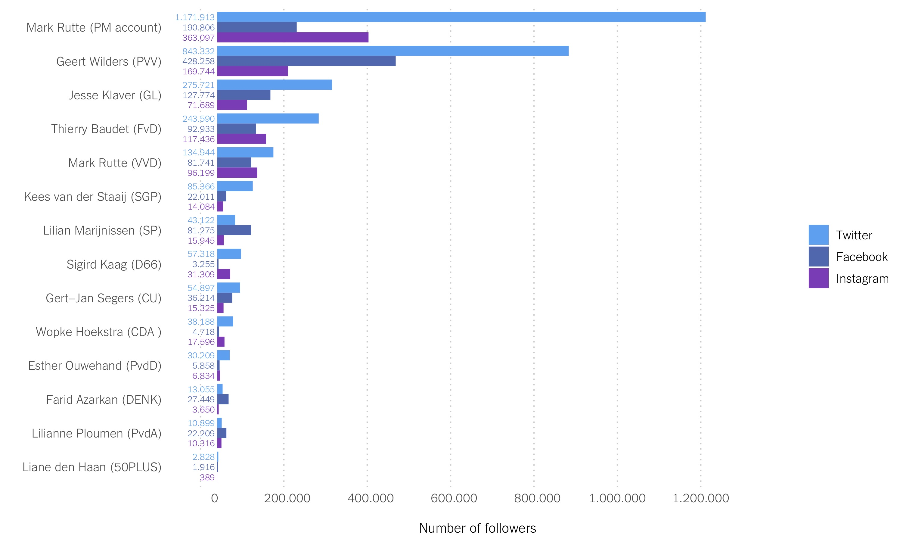
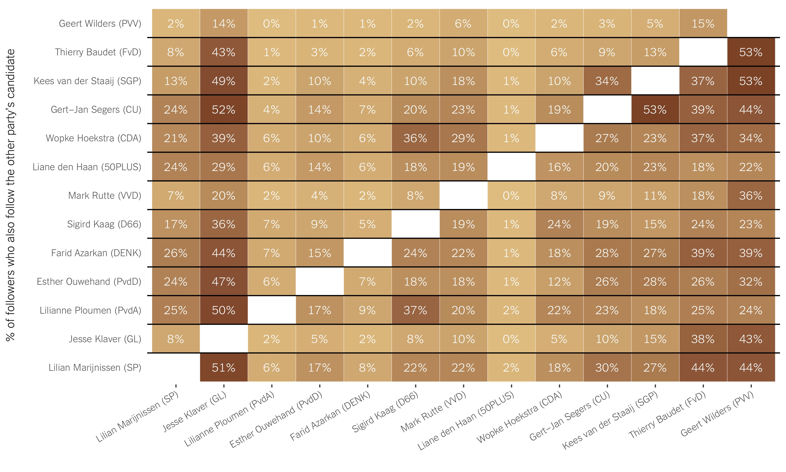
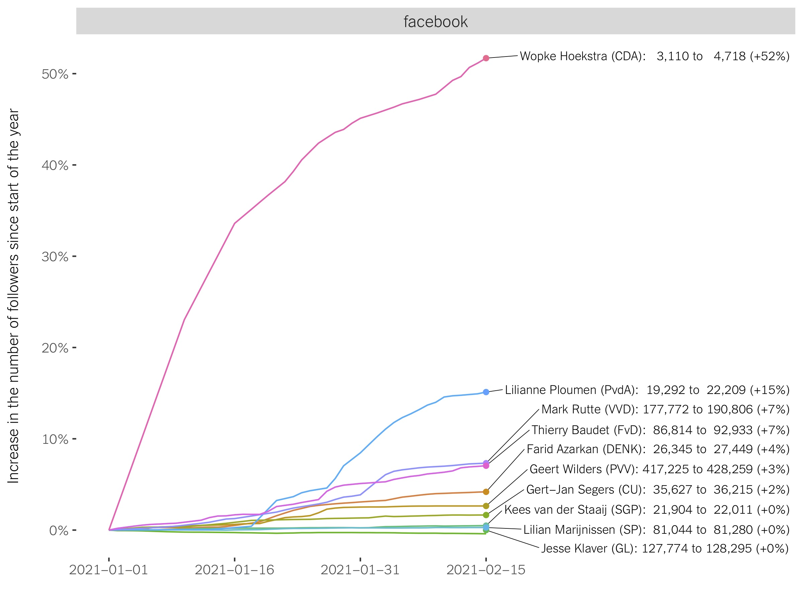
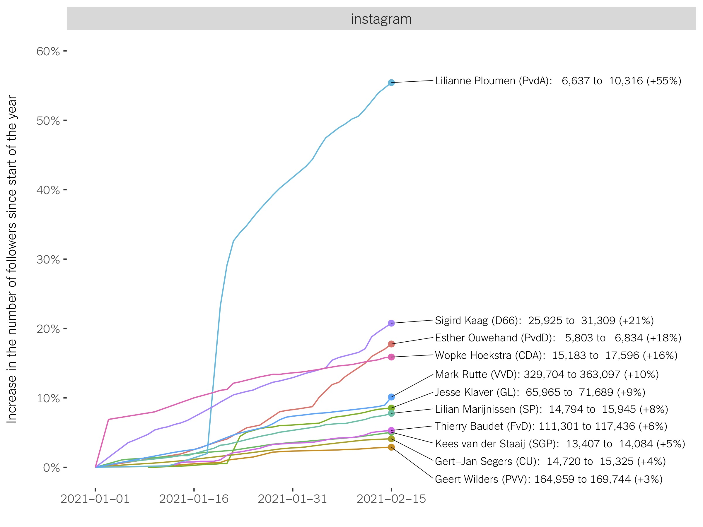
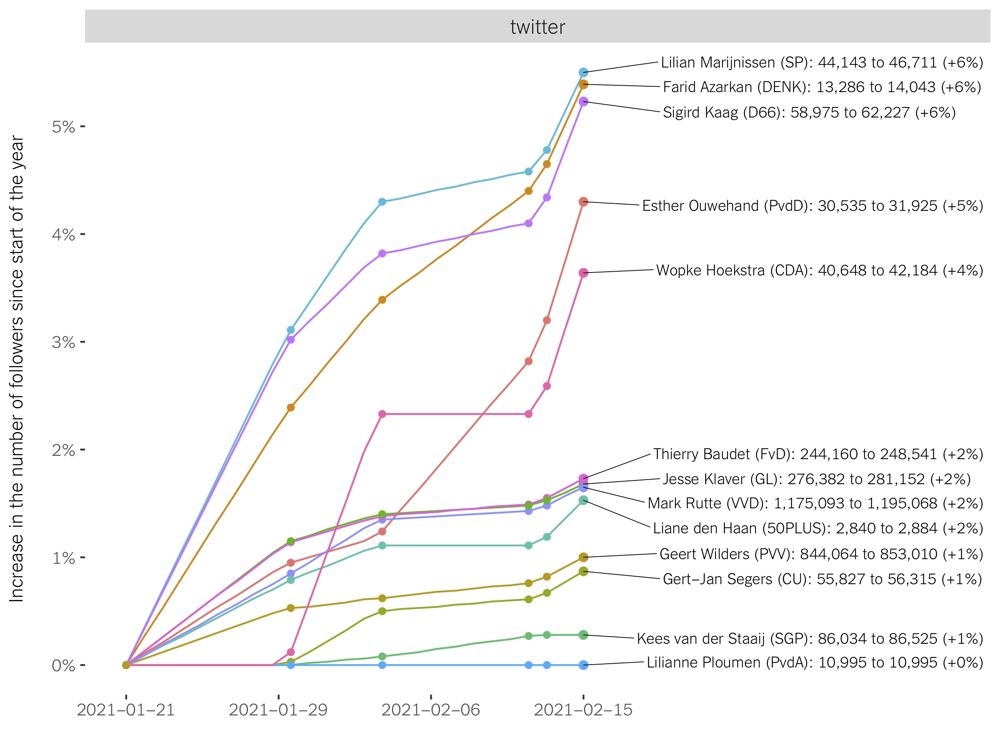

February 17, 2021 (Last edited: February 18, 2021)

**People increasingly consume news and learn about politics on social media.**  A recent [Pew Research Report](https://www.journalism.org/2021/01/12/news-use-across-social-media-platforms-in-2020/) shows that 38% of the U.S. population get their news from Facebook (still the platform with the most active users in the country), 15% from Twitter, and 11% consume news from Instagram. A [2020 Digital News Report](https://reutersinstitute.politics.ox.ac.uk/sites/default/files/2020-06/DNR_2020_FINAL.pdf) from Reuters shows a similar scenario for the Netherlands. Whereas the Dutch population consuming news on TV has decreased from 80 to 67% in the last 5 years, in 2020 77% consume their news online (including social media): 28% from Facebook, 9% from Instagram, and 7% from Twitter. Although these are not yet very large numbers, there is a clear trend. This means that political candidates running for elections need to gradually increase their social media presence and audience in order to be successful at influencing and mobilizing voters. 

In this report we provide **descriptive data about the <ins>Facebook</ins>, <ins>Twitter</ins> and <ins>Instagram</ins> followers** of these 13 candidates running to the 2021 Dutch Election:
  * Mark Rutte (VVD)
  * Farid Azarkan (DENK)
  * Thierry Baudet (FvD)
  * Jesse Klaver (GL)
  * Lilian Marijnissen (SP)
  * Esther Ouwehand (PvdD)
  * Gert-Jan Segers (CU)
  * Kees van der Staaij (SGP)
  * Sigird Kaag (D66)
  * Liane den Haan (50PLUS)
  * Wopke Hoekstra (CDA)
  * Lilianne Ploumen (PvdA)
  * Geert Wilders (PVV)

In particular, we touch on:
  * **How many followers do each candidate have in each platform?** We learn about the size of each candidates' audience in these platforms (Facebook, Twitter and Instagram), gaining insides about the amount of people to which they can easily communicate their message, and potentially mobilize to turn out to vote for their party in March. 
  * **What proportion of the followers do they share?** We learn about which candidates have the most followers in common on Twitter, gaining insides on which candidates may be appealing to similar parts of the electorate, and so compete for similar (or even the same) electors.
  * **How many followers have they gained since the start of 2021?** We learn about who has "recruited" the most new followers in the last couple months on Facebook, Twitter and Instagram, gaining insides on which candidate may be having a momentum and increasing public support.

## Number of Followers

#### Geert Wilders (PVV) is killing it

With the exception of Rutte's Prime Minister account, Geert Wilders (PVV) has the most followers of all candidates on Twitter (\~ 850.000), Facebook (\~ 430.000) and Instagram (\~ 170.000). According to the mentioned [2020 Digital News Report](https://reutersinstitute.politics.ox.ac.uk/sites/default/files/2020-06/DNR_2020_FINAL.pdf), 60% of the Dutch population uses Facebook, 32% Instagram and 14% Twitter, which roughly translates into 10, 5,5, and 2,5 million people respectively. If we put the two pieces of data together, we observe (methdological limitations aside) that about 10% of the users in these 3 social media platforms follow Geert Wilders. The leader of the PVV has become a social media _guru_ and these platforms allow him to easily communicate and spread their message to many.

#### The candidates of other extreme parties (FvD and GL) also have a large social media audience

Extreme parties on the right and on the left are known for having a younger voter, and so their voters are probably more likely to be on social media and to use these platform to consume news and engage in politics. In line with this train of thought, we observe the leader of GroenLinks (Jesse Klaver) to be third place in terms of Twitter (\~275.000) and Facebook followers (\~ 130.000), and fifth on Instagram followers (\~ 70.000). The FvD leader, Thierry Baudet, is fourth on Twitter (\~ 245.000) and Facebook followers (\~ 95.000), and third on Instgram audience (\~ 120.000). 

#### All other candidates have a relatively small social media presence

The rest of the party leaders running in this election have a small social media audience, less than 90.000 followers in each platform. The candidate with the least number of followers is Liane den Haan (50+), with only about 3.000 followers on Twitter, 2.000 on Facebook, and 400 on Instagram. Although when compared to the average voter, the likely voters of this party are older and probably less likely to be on social media, [research](https://www.journalism.org/2021/01/12/news-use-across-social-media-platforms-in-2020/) shows high levels of social media usage even among those > 50 years. Hence, Liane den Haan, may be missing on a great opportunity to spread her word and support.

#### And the Oscar goes to... Twitter

Overall, we see Twitter to be the platform where these candidates have the most followers, with Facebook and Instagram taking second/third place depending on the candidate. This is to some extent puzzling, as Twitter is the one with the least Dutch users, 14% of the Dutch population compared to 60% and 32% for Facebook and Instagram. However, it is probably an indication that people are more likely to use Twitter for political engagement.

<a href="data-plots/SM-report-followers-by-candidate-by-platform.csv" target="_blank">Download data</a>

## Who Shares a Similar Audience on Twitter?

We used the Twitter API to collect (on Jan. 19, 2021) the list of followers of each of the 13 candidates. Then, for each possible pair of candidates, we checked the amount of users who follows both candidates. We report the findings in the figure below, which should be read as follows: _the percentages in each cell indicate the % of followers of the candidate on left, that also follows the candidate at the bottom_. The same type of analysis cannot be conducted with the data publicly available from Facebook and Instagram, so we had to stick to Twitter for this one. Here is what we learned. For this analysis, we use Mark Rutte's personal acocunt rather than his Prime Minister account.

#### There is a big overlap between the followers of GL and all the other parties

Jesse Klaver (GL) is the second candidate with the most Twitter followers (\~ 275.000). Interestingly, with the exception of Wilder's followers, we see > 20% of the followers of all other candidates to also follow Klaver. The numbers go up to > 40% for the followers of the leaders of FvD, SGP, CU, CDA, D66, DENK, PvdD, and SP. These numbers indicate that the GL has a diverse pool of supporters who also have links and attachements to many other Dutch parties. This can be a double-edge sword, as it means that Klaver (GL) has the potential to recruit from other parties but also to lose support to them. 

#### A common pool of followers on the (far) right

The leaders of (far) right-wing parties share an important chunk of Twitter followers. About 53% of those who follow Thierry Baudet (FvD), and 53% of those who follow Kees van der Staaij (SGP), also follow the PVV leader Geert Wilders. However, only 15% and 5% of Wilders' followers also follow Baudet and van der Staaij, indicating that although these parties have a common pool of followers, Geert Wilders seems to dominate this ideological Twitter space. 

#### Everybody shares a substantive amount of followers with Geert Wilders (PVV)

Although Thierry Baudet (FvD) and Kees van der Staaij (SGP) share the most followers with Wilders (PVV), we still see all the other candidates to share at least 22% of their voters with the leader of the PVV. Similar to Klaver (GL), Wilkers (PVV) is connected to a wide range of followers who also have links to many other political forces on social media, which gives him a clear advantage when it comes to appealing and mobilizing a broad audience.

#### A few additional clear connections

Apart from the main patterns described above, we also observe some additional pairs of candidates to share a large chunk of followers. Around 36% of Wopke Hoektra's (CDA) followers also follow Sigird Kaag (D66); 34% of Kees van der Staaij's (SGP) followers also follow Gert-Jan Segers (CU); and 37% of Lilianne Ploumen's (PvdA) followers also follow Sigird Kaag (D66). 

<a href="data-plots/SM-report-followers-shared-by-candidate-on-twitter.csv" target="_blank">Download data</a>

## Who Has Gained the Most Followers Recently?

We collected all the Facebook, Instagram, and Twitter messages sent by these party leaders in the last few months (stay tuned to our future analysis of these messages!). Every time we collected a Facebook and Instagram message, we got information about the number of followers of that candidate at the moment of sending the message, allowing us to track changes in followership in detail. Things are a little bit different with Twitter; instead, we collected the number of followers for all the accounts at 6 different points in time, ranging from Jan. 21 to Feb. 15. Here is what we learned about the amount of new followers these accounts have gained in the last couple of months. For the subsequent analysis, we go back to using Mark Rutte's Prime Minister accounts, as he has not been active on his personal accounts/pages. 

**Disclaimer (Feb. 18, 2021)**: **[A]** In this section we are currently missing Facebook data for 3 candidates: Farid Azarkan (DENK), Esther Ouwehand (PvdD), and Sigird Kaag (D66); Instagram data for 2 candidates: Farid Azarkan (DENK), Liane den Haan (50PLUS). We are working on addressing the issue and on adding them to the analysis below.

#### Facebook: Wopke Hoekstra (CDA) is late to the game but catching up quickly

Hoekstra (CDA) has the least Facebook followers of all candidates (4.718), with the exception of Liane den Haan (50+). However, at the end of last year he only had 3.110, which makes for a +52% increase in the last couple of months. 

#### Facebook: Lilianne Ploumen (PvdA) is also strongly gaining ground

Ploumen (PvdA) has gone from 19.292 to 22.209 Facebook followers, for a +15% increase. This is also a notable gain given that she already had a non-trivial amount of followers on the platform. For example, another candidate with a similar number of followers at the end of 2020, Kees van der Staaij (SGP), has barely "recruited" new followers: from 21.904 to 22.011 (close to a 0% increase). 

#### Facebook: Out of those with most followers, Mark Rutte (VVD) has increased followership the most

The three candidates with most Facebook followers by the end of 2020 were Geert Wilders (417.225), Mark Rutte (177.772), and Jesse Klaver (127.774). In 2021 Rutte (VVD) has increased his followership by 7%, whereas Wilders has only done so by 3% (probably due to a ceiling effect, he already has _a lot_ of followers), and Klaver (GL) by less than 1%.

<a href="data-plots/SM-report-follower-increase-FB.csv" target="_blank">Download data</a>

#### Instagram: Lilianne Ploumen (PvdA) is also going strong on Instagram

Similar to her substantive increase on Facebook followers, since the end of 2020 until now, Lilianne Ploumne (PvdA) has increased his Instagram followership by 55%, from 6.637 to 10.316. 

#### Instagram: Kaag (D66), Ouwehand (PvdD), and Hoekstra (CDA) also experienced a substantive increase

Sigird Kaag (D66) increased her number of Instagram followers by 21% (from 25.925 to 31.309), Esther Ouwehand (PvdD) by 18% (from 5.803 to 6.834), and Wopke Hoekstra (CDA) by 16% (from 15.183 to 17.596).

#### Instagram: Rutte (VVD) also beats the top Instagramers (Wilders, Baudet, and Klaver) in followership increase

The Prime Minister Instagram account of Mark Rutte has increased the numbers of followers by 10% (from 329.704 to 363.097), whereas Klaver (GL) has done so by 9% (from 65.965 to 71.689), Baudet (FvD) by 6% (from 111.301 to 117.436), and Wilders (PVV) by 3% (from 164.959 to 169.774). Actually, out of all candidates, Wilders (PVV) has increased his followership the least, which is surprising given his strong social media presence. 

<a href="data-plots/SM-report-follower-increase-IG.csv" target="_blank">Download data</a>

#### Twitter: A two peloton race

In terms of followership increase on Twitter, there seems to be two groups moving at different paces. A "slow" group that has only gained between 0 and 2% of followers since the end of 2020: Baudet (FvD), Klaver (GL), den Haan (50+), Wilders (PVV), Segers (CU), van der Staaij (SGP), and Ploumen (PvdA). And then, a "faster" group that has gained between 4 and 6% of followers: Marijnissen (SP), Azarkan (DENK), Kaag (D66), Ouwehand (PvdD), and Hoekstra (CDA).

#### Twitter: No big hit

We don't observe any big increase in followership in the same way we observed on Instagram and Facebook, with a few increases > 20 and > 50%. 

<a href="data-plots/SM-report-follower-increase-TW.csv" target="_blank">Download data</a>

