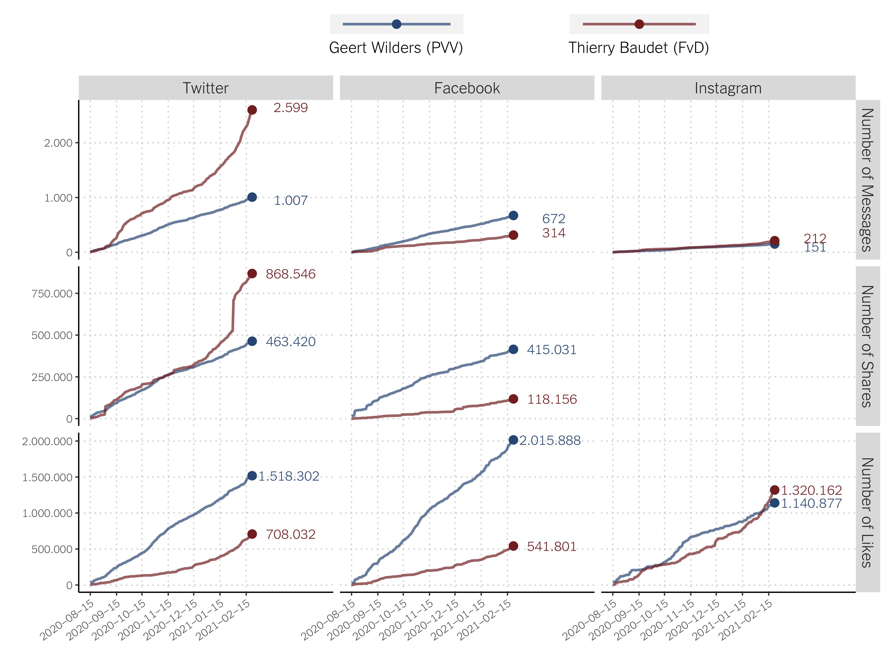
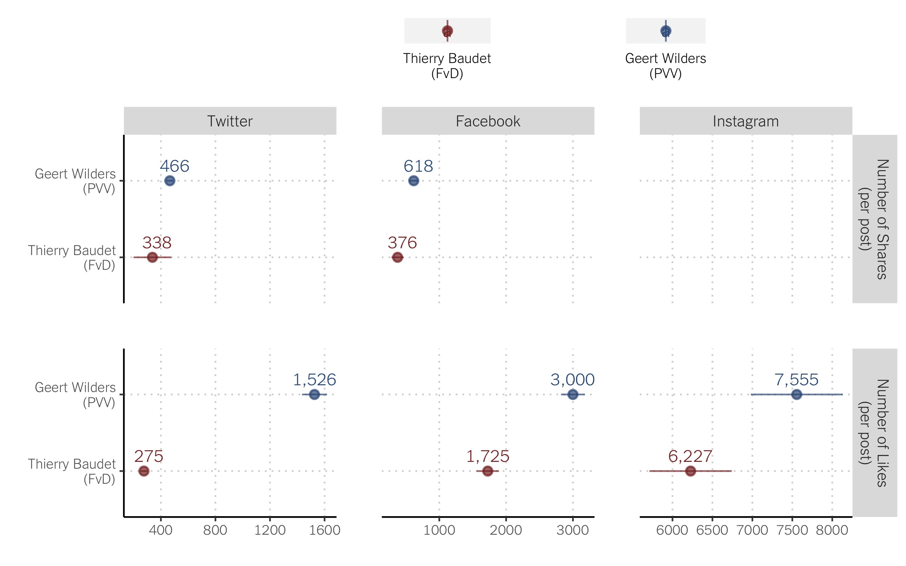
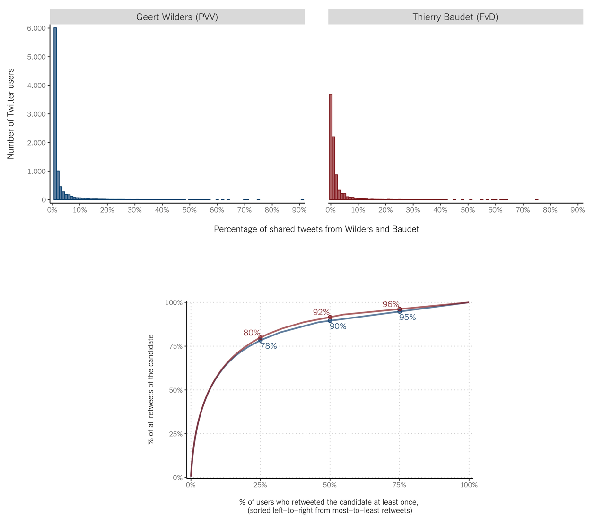
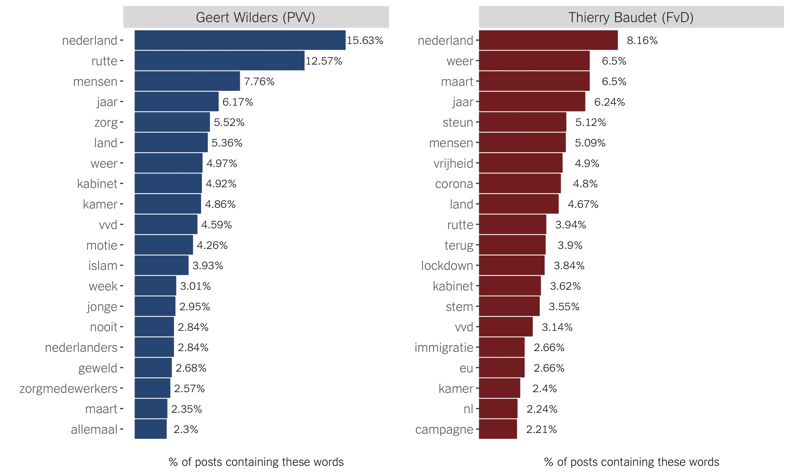
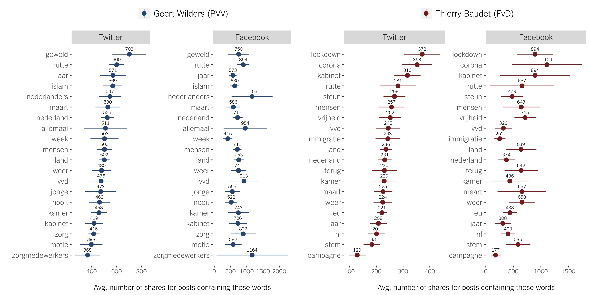

February 25, 2021

In a [previous data report](https://tk2021.vupolcom.nl/reports/SM-report-followers/SM-followers-dutch-candidates.html) we observed the leaders of the two right-wing populist parties in the Netherlands, Geert Wilders (PVV) and Thierry Baudet (FvD), to be the candidates with the strongest social media presence, with the exception of Mark Rutte's (VVD) Prime Minister official account. Wilders (PVV) has \~ 850.000 followers on Twitter, \~ 430.000 on Facebook, and \~ 170.000 on Instagram, and Baudet (FvD) has \~ 250.000 on Twitter, \~ 95.000 on Facebook, and \~120.000 on Instagram. Most of the other party leaders running in the upcoming March 17th election don't even hit the 100.000 follower mark for any of these three platforms. Social media is gaining relevance as a battle ground for elections and political discussions more broadly, and the right-wing populist parties seem to dominate the scene in the Netherlands. In this report we dig deeper into the social media dynamics of these two candidates. 

In this report we explore the <ins>Twitter</ins>, <ins>Facebook</ins> and <ins>Instagram</ins> activity of Geert Wilders (PVV) and Thierry Baudet (FdV) and provide descriptive data about:
  * How active they are in these three social media platforms
  * How much other users engage with (share and like) their messages
  * What issues do these candidates discuss on social media
  * What issues get more traction among (so are more often shared by) other users

## How often do they post?

We have collected all the messages they posted on these three social media platforms for about 6 months: from August 15th 2020 to February 22nd 2021. 

Takeaways [see top three plots in Figure 1]:
  * Twitter is the platform they use most often (1.007 tweets by Wilders and  2.599 by Baudet), followed by Facebook (672 Wilders, 314 Baudet), and then by Instagram (151 Wilders, 212 Baudet).
  * Baudet is twice as active on Twitter compared to Wilders, but Wilders is twice as active on Facebook. The are similarly active on Instagram.

## How often other users share and like their messages?

We have also collected data about how often other users shared and liked the messages we gathered during this time period. There is no Instagram equivalent to sharing, so we don't take into account this Instagram dimension in the analysis.

Takeaways:
  * In absolute terms, Baudet had a larger number of shares on Twitter (868.546 v. 463.420 for Wilders) but Wilders bit him on Facebook (415.031 v. 118.156 for Baudet) [see three middle plots in Figure 1].
  * In absolute terms, Baudet had a larger number of likes on Twitter (1.518.302 v. 708.032 for Wilders) and Facebook (2.015.888 v. 541.801 for Wilders), but Wilders had a slightly larger number on Instagram (1.320.162 v. 1.140.877) [see three bottom plots in Figure 1].
  * We observed however that these two candidates didn't send the same number of messages on these platforms, which may be driving the two previous takeaways (the candidate posting more has more chances to get more shares/likes). When we look at number of shares/likes per post, Wilders bits Baudet on the three platforms. This can be a reflection of Wilders having more followers in all these platforms. But it also reflects a stronger ability to spread his message around [see Figure 2].
  * When looking at the number of shares/likes per post, we actually observe these two candidates to have the most engagement in the platforms they have the least number of followers. For example, although they both have more Twitter than Facebook followers (and they both sent more messages on Twitter than on Facebook), on average their Facebook messages are shared more often (618 times for Wilders, 376 for Baudet) than their tweets (466 times for Wilders, 338 for Baudet). We observe the same pattern when looking at likes. This may be related to their loyal and engaged supporters to be more likely to be active Facebook (rather than Twitter) users. 

## How much do they rely on their core (Twitter) supporters to spread their message around?

For Twitter, we can get detailed data as to which particular user shared the messages sent by Wilders and Baudet. We used the data to explore the pool of Wilders and Baudet's retweeters. First, for those who retweeted at least one tweet, we calculated (a) the percentage of all messages from each candidate that each user retweeted [two top plots in Figure 3]; and (b) for what percentage of the retweets are the most active users responsible [bottom plot in Figure 3]. The analysis helps us understand whether these party leaders rely on a small group of engaged users, _versus_ a large crowd, to spread their word.

Takeaways:
  * For both candidates we see that most of their followers shared < 10% of their tweets, with the largest group sharing only < 1% of them [two top plots in Figure 3].
  * For both candidates we also observe a few highly engaged followers, sharing > 50% and even > 90% of their tweets [two top plots in Figure 3].
  * The most active users (the ones in the top 25% in terms of number of retweets) account for around 78% of Wilders's retweets, and 80% of Baudet's; indicating that both candidates do indeed rely on a small engaged group of users to get their word around.

## What issues do they discuss?

We looked at some of the words Wilders and Baudet use most often in their Twitter, Facebook, and Instagram posts. Then we calculated the percentage of message containing each of these workds [see Figure 4].

Takeaways:
  * They love to mention the country. The word _nederland_ appears in \~ 16% of Wilders' messages, and on 8% of Baudet's. The word _land_ is also mention quite often by both (in \~ 5% of the posts).
  * They often pick fights with Rutte (\~ 13% Wilders' tweets, \~ 4% Baudet) and the Kabinet (\~5% Wilders, \~ 4% Baudet).
  * They both often mention coron-related words (e.g. _zorg_, _zorgmedewerkers_, _corona_, _lockdown_), although Baudet seems to do so at a slightly higher rate.
  * They both touch on immigration: \~ 4% of Wilders' tweets mention _islam_, and \~ 3% of Baudet's tweets use the word _immigratie_. 

## What issues get more traction on social media?

We also looked into how often the posts containing those words are shared on Twitter and Facebook.

Takeaways:
  * For Wilders, the tweets mentioning violence (_geweld_) are the ones shared the most (703 times on average). The Facebook posts on _geweld_ also do fairly well (shared 750 times on average). Tweets and Facebook posts mentioning Rutte are also shared at a very high rate in both platforms. Although _islam_ was only mentioned in 4% of Wilders' posts, both the tweets and Facebook posts on this topic are shared at a very high rate (569 times on Twitter and 630 times on Facebook on average)
  * For Baudet, the tweets mentioning the government and the coronavirus crisis (_lockdown_, _corona_, _kabinet_, and _rutte_) are the ones that are shared the most. Messages mentioning _immigratie_ get a decent amount of shares on Twitter but do not do very well on Facebook. 

