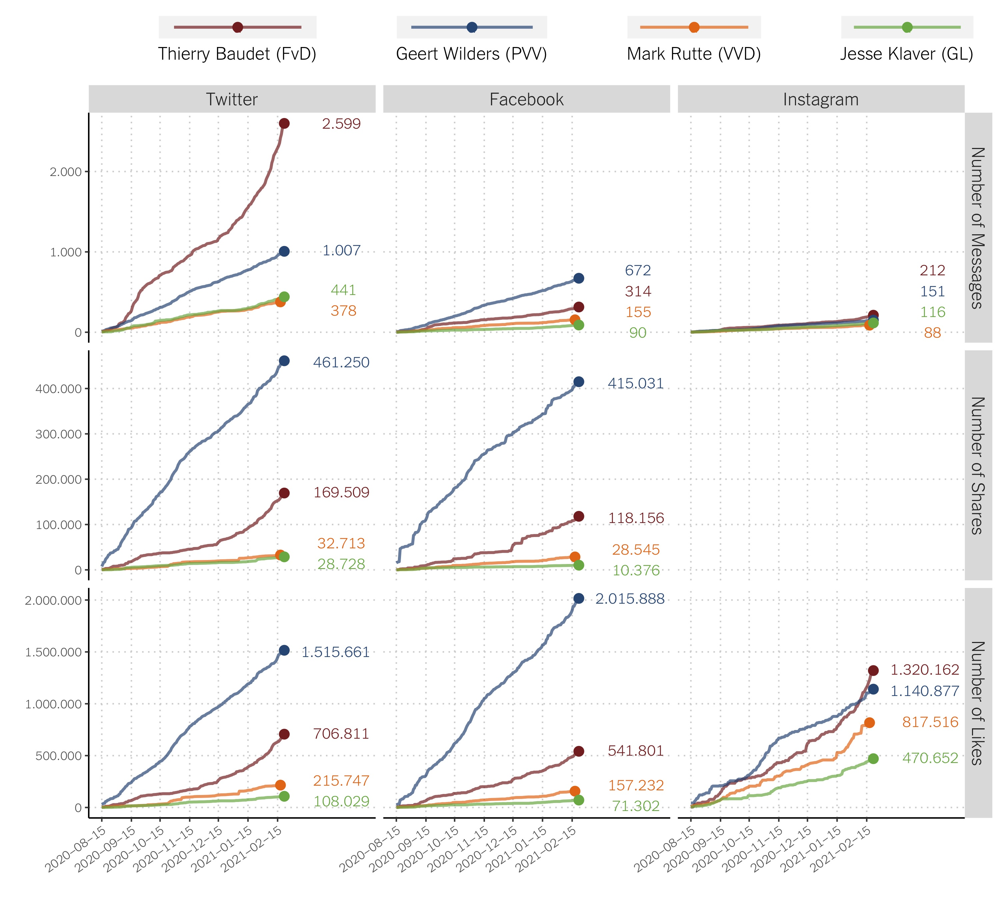
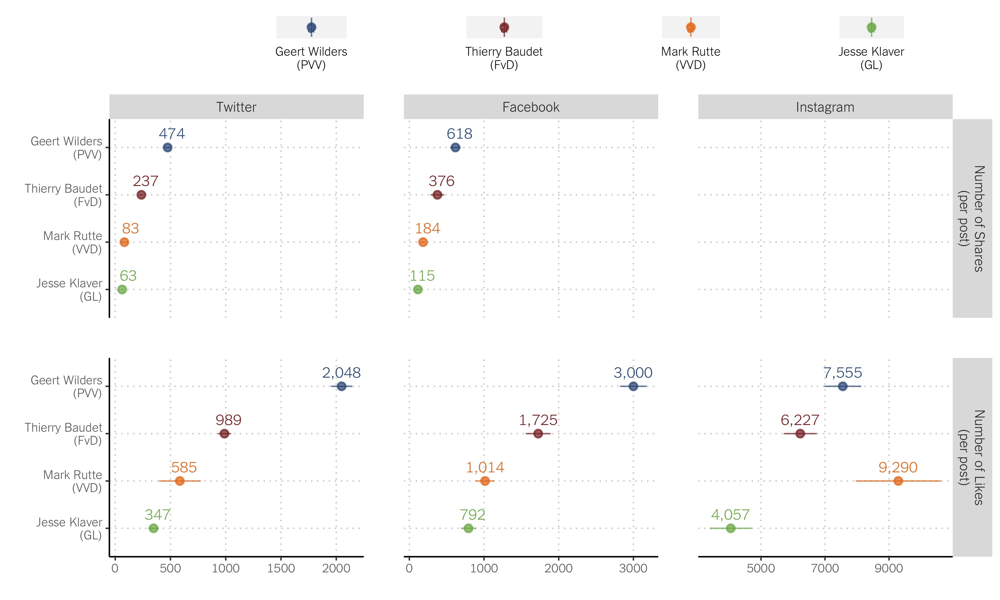
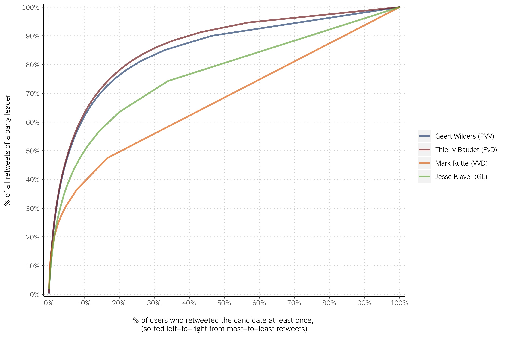
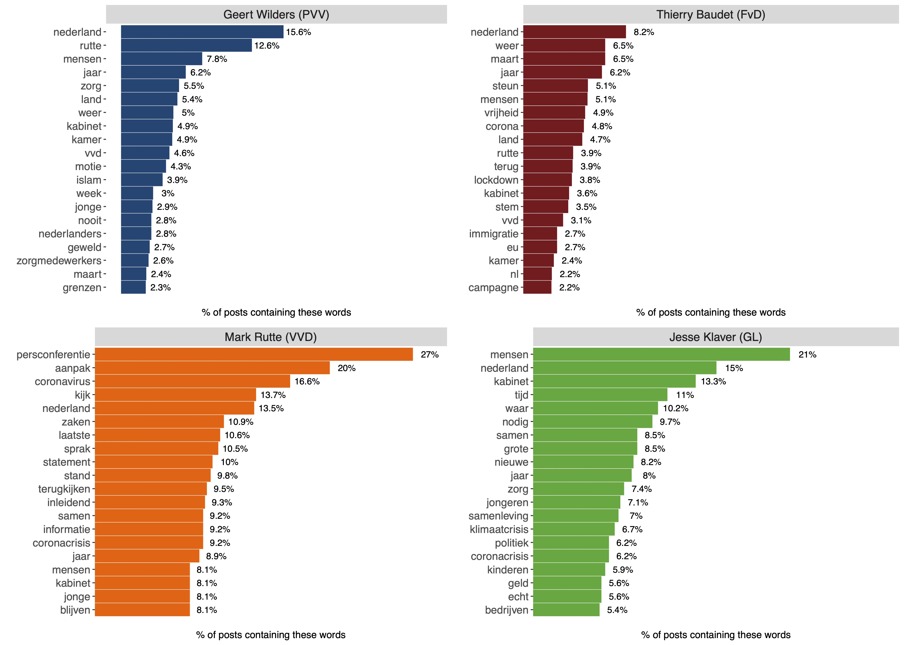
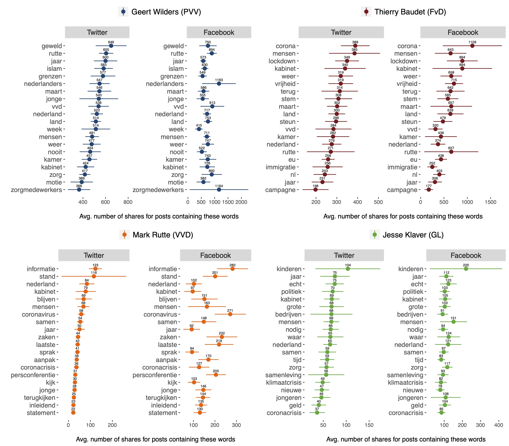

February 25, 2021 (Last edited: March 7)

In a [previous data report](https://tk2021.vupolcom.nl/reports/SM-report-followers/SM-followers-dutch-candidates.html) we observed the leaders of the two right-wing populist parties in the Netherlands, Geert Wilders (PVV) and Thierry Baudet (FvD), to be the candidates with the strongest social media presence, with the exception of Mark Rutte's (VVD) Prime Minister official account. Wilders (PVV) has \~ 850.000 followers on Twitter, \~ 430.000 on Facebook, and \~ 170.000 on Instagram, and Baudet (FvD) has \~ 250.000 on Twitter, \~ 95.000 on Facebook, and \~120.000 on Instagram. Most of the other party leaders running in the upcoming March 17th election don't even hit the 100.000 follower mark for any of these three platforms. Social media is gaining relevance as a battle ground for elections and political discussions more broadly, and the right-wing populist parties seem to dominate the scene in the Netherlands. In this report we dig deeper into the social media dynamics of these two candidates.

In this report we explore the <ins>Twitter</ins>, <ins>Facebook</ins> and <ins>Instagram</ins> activity of Geert Wilders (PVV) and Thierry Baudet (FdV). For comparision, we also explore the activity of Mark Rutte's Prime Minister accounts, as well as Jesse Klaver's (GL). In particular, we explore:
  * How active they are in these three social media platforms
  * How much other users engage with (share and like) their messages
  * What issues do these candidates discuss on social media
  * What issues get more traction among (so are more often shared by) other users

## How often do they post?

We have collected all the messages they posted on these three social media platforms for about 6 months: from August 15th 2020 to February 22nd 2021. 

Takeaways:
  * Twitter is the platform they use most often (1.007 tweets by Wilders and  2.599 by Baudet), followed by Facebook (672 Wilders, 314 Baudet), and then by Instagram (151 Wilders, 212 Baudet).
  * Baudet is twice as active on Twitter compared to Wilders, but Wilders is twice as active on Facebook. They are similarly active on Instagram.
  * Both Wilders and Baudet are substantially more active on social media than the other two candidates with also large number of followers (Rutte and Klaver). For example, during this time period Baudet sent about 6.5 times the number of Facebook messages that Rutte sent.

## How often other users share and like their messages?

We have also collected data about how often other users shared and liked the messages we gathered during this time period. 

Note: For Twitter, we only take into account the shares and likes for original messages (and not retweets). There is no Instagram equivalent to sharing, so we don't take into account this Instagram dimension in the analysis. 

Takeaways:
  * Wilders had a larger number of shares both on Facebook (415.031 v. 118.156 Baudet) and Twitter (461.250 v. 169.509 for Baudet), despite Baudet being substantially more active on Twitter. 
  * A similar patterns emerges for the number of likes on Facebook and Twitter (Wilders outperforms Baudet), but on Instagram Baudet shows slightly higher numbers than Wilders.
  * Wilders and Baudet achieve substantially higher engagement rates than Rutte and Klaver on Twitter and Facebook. They are all much more similary active (and get a much more similar amount of likes) on Instagra, although Baudet and Wilders still come on top.
  * When accounting for the fact that some of these candidates are more active than others (and so end up with more opportunities to get shares/likes than others), we still see a very similar picture. In terms of shares and likes per post, Wilders comes first, Baudet second, and then Rutte and Klaver. With one interesting exception: Rutte outperforms all candidates on Instagram likes.

## How much do they rely on their core (Twitter) supporters to spread their message around?

For Twitter, we can get detailed data as to which particular user shared the messages sent by Wilders and Baudet. We used this data to explore the pool of retweeters of Wilders, Baudet, Rutte, and Klaver. For those who retweeted at least one tweet from a given candidate, we calculated for what percentage of all the retweets of that candidate they are responsible. In the figure below we sorted the retweeters (x-axis) from most to least active, and in the y-axis we looked at the cumulative number of retweets for a given candidate. The figure indicates for what percentage of the retweets the most active e.g. 1% or 10% (etc.) of retweeters are responsible for.

Takeaways:
  * We see Baudet and Wilders to heavily rely on a small but very active subset of their followers to spread their message around. For example, their 20% most active retweeters are responsible for close to 80%.
  * We observe a substantial different story for Klaver and Rutte. The 20% most active Klaver's retweeters account for about 65% of the retweets, and the 20% most active Rutter's retweeters account for 50% of the shares. This indicates that Klaver and Rutte rely on a much broader base to spread their message.

## What issues do they discuss?

We looked at some of the words these four candidates use most often in their Twitter, Facebook, and Instagram posts. Then we calculated the percentage of message containing each of these words.

Takeaways:
  * The corona crisis takes on a substantial number of messages of all candidates
  * Wilders and Baudet touch on immigration (\~ 4% of Wilders' tweets mention _islam_, and \~ 3% of Baudet's tweets use the word _immigratie_)
  * Baudet focuses more than Wilders on criticizing the government for how they managed the corona crisis
  * Rutte takes on a managerial role, often using social media to communicate about corona and government measures
  * Klaver touches on many issues, including human rights and climate change

## What issues get more traction on social media?

We also looked into how often the posts containing those words are shared on Twitter and Facebook.

