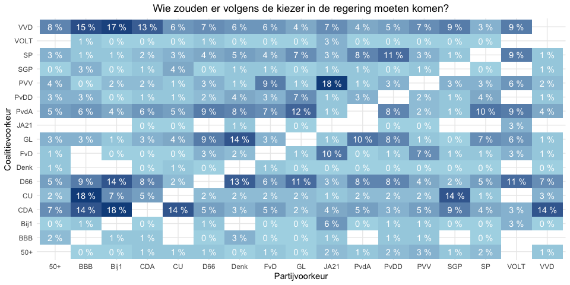

Voorkeuren voor coalities
=========================

\[Download data: [Coalitievoorkeuren](Coalitievoorkeuren.csv)\]

*Opvallend*:

-   *Populariteit VVD*: VVD meest geliefde coalitiepartner voor mensen
    die 50Plus, CDA, PVV stemmen
-   *Linkerblok*: GL stemmers wilen coalitie met D66, PvdA en evt. PvdD,
    D66 stemmers willen ook een coalitie met GL en PvdA maar ipv PvdD
    willen zij met de VVD, PvdA-stemmers willen ook een coalitie met GL
    en D66, maar willen de SP daarbij, Denk stemmers willen coalitie met
    D66 en GL, maar worden niet vaak door die partijen genoemd
-   *Rechterblok*: VVD stemmers willen dat er verder geregeerd wordt met
    CDA en D66. JA21 stemmers willen een coalitie met FvD en PVV,
    Forum-stemmers willen ook dat hun partij gaat regeren met de PVV,
    maar hier minder sterke voorkeuren, ook PvdA doet het bijv. redelijk
    goed; PVV stemmers willen het vaakst dat hun partij met de VVD en
    FvD samen gaat regeren.
-   *Nieuwe Partijen*: Voor mensen die BBB stemmen CU meest geliefde
    coalitiepartner; voor Bij1 stemmers was een coalitie met CDA, D66 en
    VVD het meest geliefd, voor VOLT-stemmers heeft een grand-coalitie
    met PvdA, D66, SP, en VVD de voorkeur
-   *Christelijke partijen*: CDA favoriete coalitiepartner voor CU en
    SGP stemmers, CDA-stemmers daarentegen willen het liefst dat er met
    de VVD en D66 geregeerd wordt

 \[Download data:
[Stabiliteit Coalitievoorkeuren](Stabiliteit_Coalitievoorkeuren.csv)\]

*Opvallend*: - *Rechterblok*: voor CDA stemmers is D66 een populaire
coalitiepartner geworden sinds eind-februari; voor VVD-stemmers is de
populariteit van D66 als partner sterk gestegen na de verkiezigen, en
die van het CDA sterk gedaald; de populariteit van de VVD als
coalitiepartner is alleen bij het CDA en 50Plus partij gestegen over de
duur van de campagne; voor de PVV was tijdens de campagne de FvD de
enige grote coalitiepartner waarmee de stemmers wilden dat de partij zou
gaan regeren, maar na de uitslag, is dit gewisseld voor CDA, D66 en VVD.
- *Linkerblok* : Voor GL stemmers is de populariteit van de PvdA als
coalitie partner na de verkiezingsuitslag sterk gedaald, dit geldt ook
voor de SP-stemmers en de D66 stemmers
