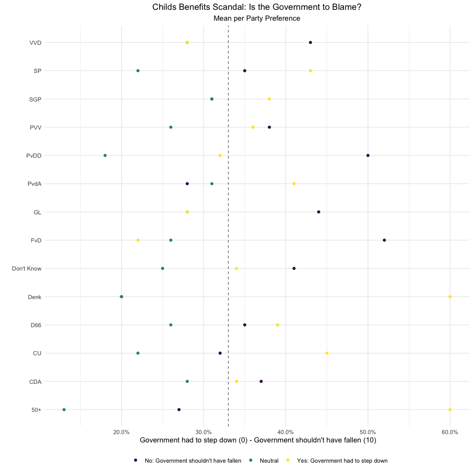
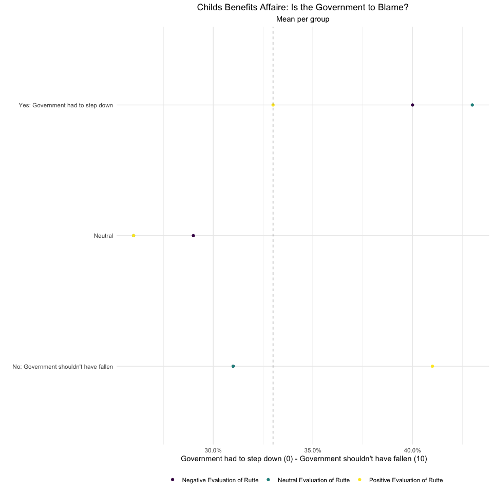
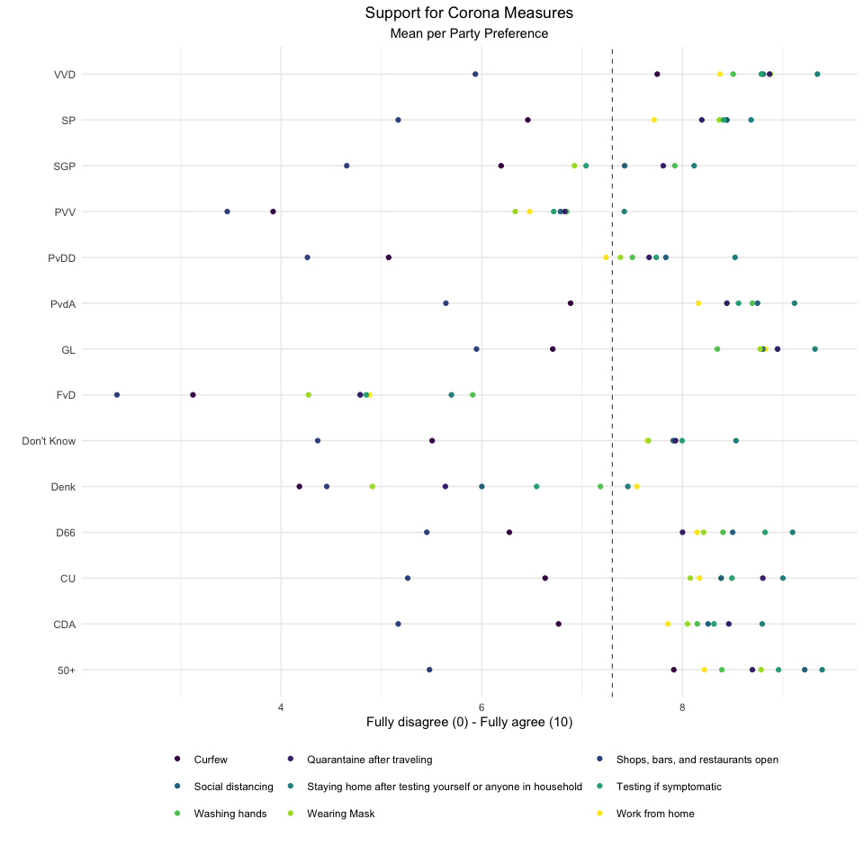
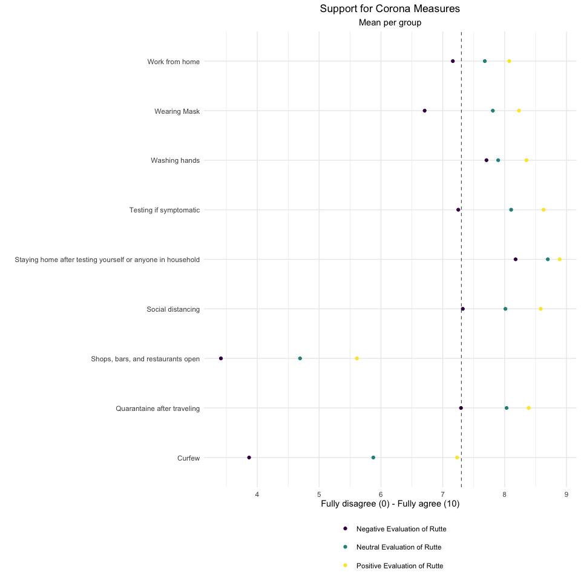

-   [Child Benefits Scandal in the Dutch
    Elections](#child-benefits-scandal-in-the-dutch-elections)
-   [Covid-19 in the Dutch Elections](#covid-19-in-the-dutch-elections)

Child Benefits Scandal in the Dutch Elections
=============================================

On average 33% of the respondents thought that the government had to
step down over the child benefits scandal (visualized by the dashed line
in the figure below). If you intend to vote for VVD or CDA (two of the
current (interim) government parties), you are more likely to say that
the government should not have fallen over this. If you intent to vote
for the smaller (interim) government parties, CU or D66, you are more
likely to say that the government was right to step down of the child
benefits scandal. Other than current interim government parties, people
intending to vote for the animal rights party (PvdD), the greens (GL),
or Baudet’s party (FvD) were less in favor of the government stepping
down. If you intend to vote for the socialist party (SP), Denk, the
orthodox christian party (SGP), or the elderly party (50+), you are more
likely to say that the government was right to step down of the child
benefits scandal.

Download data: \[[Figure Childs Benefits Scandal -
Party](Figure_Childs_Benefits_Scandal_Party.csv)\]

Looking at how the Child Benefits Scandal affects the evaluation of
Rutte, we see that – as expected – if you positively evaluate Rutte, you
are more likely to say that the government shouldn’t have fallen and
vice versa.

Download data: \[[Figure Childs Benefits Scandal -
Rutte](Figure_Childs_Benefits_Scandal_Rutte.csv)\]

Covid-19 in the Dutch Elections
===============================

The most important issue in the elections of 2021 is Covid-19. Accross
the board, people do support the Corona measures (average of 7.3 on a
scale from 0-10), visualized by the dashed line in the figure below. 77%
of the Dutch populatation support the Corona measures. The figure below
also shows some variations over parties and between measures. On
average, there’s least support for the curfew and for opening shops,
bars, and restaurants accross all parties. Moreover, between parties, if
you intend to vote Baudet’s party (FvD), Wilders’ party (PVV) or Denk,
you’re least supportive of the Corona measures. If you intend to vote
for any of the other parties, you are quite supportive of the measures,
with unsurpisingly people voting for the elderly party (50+) to be most
supportive.

Support Corona Measures

Download data: \[[Figure Support Corona Measures -
Party](Figure_Support_Corona_Measures_Party.csv)\]

Looking at the evaluation for PM Rutte based on the Corona measures (see
figure below), we see that there are hardly differences between your
support for the Corona measures and how well you evaluate Rutte, except
for the measures *Curfew*, *Opening of Shops, Bars and Restaurants*, and
*Wearing Masks*.

Support Corona Measures

Download data: \[[Figure Support Corona Measures -
Rutte](Figure_Support_Corona_Measures_Rutte.csv)\]
