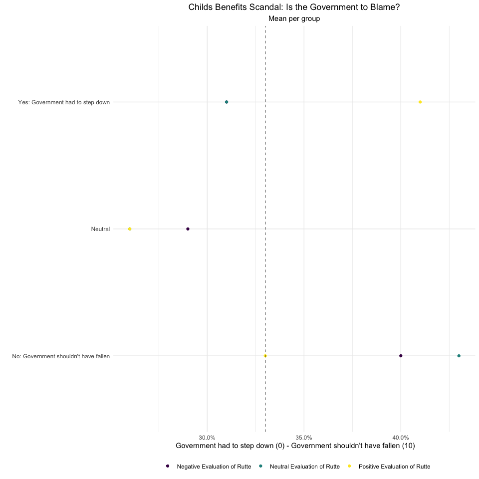

-   [Child Benefits in the Dutch
    Elections](#child-benefits-in-the-dutch-elections)
-   [Covid-19 in the Dutch Elections](#covid-19-in-the-dutch-elections)

Child Benefits in the Dutch Elections
=====================================

Should the Cabinet Fall over the Child Benefits Affaire?

Should the Cabinet Fall over the Child Benefits Affaire?

Covid-19 in the Dutch Elections
===============================

Support Corona Measures

Support Corona Measures

<table>
<thead>
<tr class="header">
<th style="text-align: left;">A2</th>
<th style="text-align: right;">aan_houden</th>
</tr>
</thead>
<tbody>
<tr class="odd">
<td style="text-align: left;">50+</td>
<td style="text-align: right;">4.7</td>
</tr>
<tr class="even">
<td style="text-align: left;">CDA</td>
<td style="text-align: right;">4.3</td>
</tr>
<tr class="odd">
<td style="text-align: left;">CU</td>
<td style="text-align: right;">4.3</td>
</tr>
<tr class="even">
<td style="text-align: left;">D66</td>
<td style="text-align: right;">4.3</td>
</tr>
<tr class="odd">
<td style="text-align: left;">Denk</td>
<td style="text-align: right;">3.6</td>
</tr>
<tr class="even">
<td style="text-align: left;">Don’t Know</td>
<td style="text-align: right;">4.3</td>
</tr>
<tr class="odd">
<td style="text-align: left;">FvD</td>
<td style="text-align: right;">3.7</td>
</tr>
<tr class="even">
<td style="text-align: left;">GL</td>
<td style="text-align: right;">4.3</td>
</tr>
<tr class="odd">
<td style="text-align: left;">PvdA</td>
<td style="text-align: right;">4.5</td>
</tr>
<tr class="even">
<td style="text-align: left;">PvDD</td>
<td style="text-align: right;">4.2</td>
</tr>
<tr class="odd">
<td style="text-align: left;">PVV</td>
<td style="text-align: right;">3.9</td>
</tr>
<tr class="even">
<td style="text-align: left;">SGP</td>
<td style="text-align: right;">4.3</td>
</tr>
<tr class="odd">
<td style="text-align: left;">SP</td>
<td style="text-align: right;">4.5</td>
</tr>
<tr class="even">
<td style="text-align: left;">VVD</td>
<td style="text-align: right;">4.5</td>
</tr>
<tr class="odd">
<td style="text-align: left;">NA</td>
<td style="text-align: right;">NaN</td>
</tr>
</tbody>
</table>
