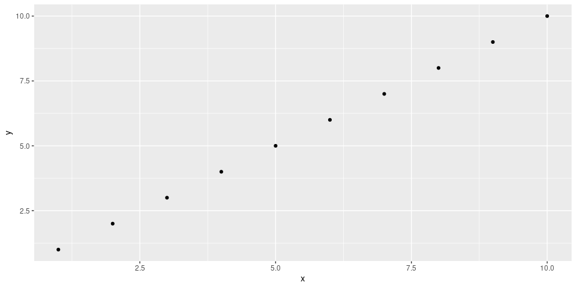

-   [Option 1: Plot as normal, and use inline code for
    data](#option-1-plot-as-normal-and-use-inline-code-for-data)
-   [Option 2: Explicitly print both plot and
    export:](#option-2-explicitly-print-both-plot-and-export)

Option 1: Plot as normal, and use inline code for data
------------------------------------------------------

Download data: \[[Example plot 1](Example_plot_1.csv)\]

Reference to @ref{}

Option 2: Explicitly print both plot and export:
------------------------------------------------

Download data: [Example plot
data](Example_plot_data.csv)
