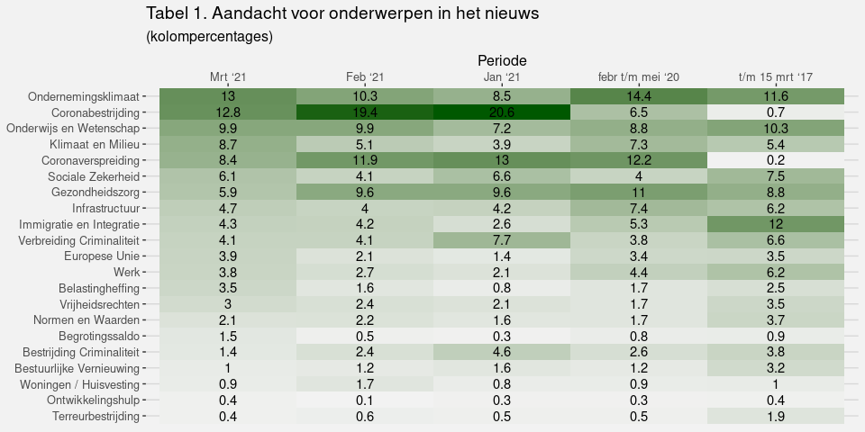
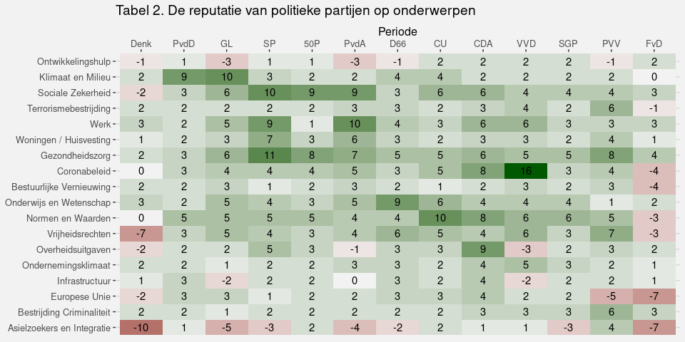
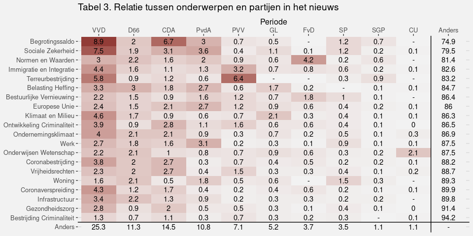

Klimaat en ondernemingsklimaat heroveren de nieuwsagenda
--------------------------------------------------------

Welke onderwerpen krijgen in de context van de verkiezingscampagne meer
of minder aandacht in het nieuws? Deze vraag is belangrijk omdat de
meeste mensen hun informatie over wat er speelt en waar partijen voor
staan, direct of indirect baseren op het nieuws. Partijen die een sterke
reputatie hebben op onderwerpen die in het nieuws centraal komen te
staan winnen vaak bij de eerstvolgende verkiezingen winnen. Een partij
een sterke reputatie heeft op een onderwerp, is die partij als het ware
‘eigenaar’ van dat onderwerp. Dat geldt voor linkse partijen bij sociale
zekerheid, voor rechtse partijen bij het ondernemingsklimaat, en voor
anti-immigratiepartijen bij de toestroom van immigranten.

Het verloop van de onderwerpen die op de journalistieke nieuwsagenda
wordt in Tabel 1 samengevat. De aandachtsverdeling in het politieke
nieuws over verschillende onderwerpen in de eerste drie maanden van 2021
wordt langs dezelfde meetlat gelegd als de aandachtsverdeling in de
eerste maanden van de coronacrisis (februari-mei 2020) en die in de
maanden voorafgaande aan de Tweede Kamerverkiezingen van 2017. Tabel 1
is gebaseerd op nieuwsprogramma’s van de publieke omroep (Goedemorgen
Nl, EenVandaag, De Vooravond, M, het NOS Journaal van 20:00 uur,
Nieuwsuur en Op1), online nieuwsmedia (Nu.nl, Nieuwsuur, NOS nieuws en
NOS liveblog), en van vijf landelijke dagbladen (het Algemeen Dagblad,
het NRC Handelsblad, De Telegraaf, Trouw en de Volkskrant). De
vergelijking met 2020 en 2021 is gebaseerd op dagbladen. De rangordening
van onderwerpen in de tabel is gebaseerd op de media-aandacht begin
maart (van 1 tot 11 maart).

Sinds het voorjaar van 2020 bepaalt corona het nieuws. In de tabel wordt
onderscheid gemaakt tussen nieuws dat primair gaat over de omvang, de
verspreiding en het verloop van de pandemie (‘coronaverspreiding’) en de
bestrijding van de pandemie (‘coronabestrijding’) – en van virussen en
maatregelen die ook in 2017 genoemd werden. In 2020 gaat het over de
verspreiding van corona. Vrees laat beseffen dat maatregelen nodig zijn.
Dat vergroot de steun voor de regering, en dus de premierbonus voor de
VVD – het “rally behind the flag” effect. In 2021 is de aandacht
verschoven naar de bestrijding van corona. Over afzonderlijke
bestrijdingsmaatregelen valt altijd te twisten. CDA-minister De Jonge
krijgt het zwaar. Tabel 1 laat zien dat met de verkiezingen en het
voorjaar in het vooruitzicht het oud nieuws wordt: de media-aandacht
voor de coronaverspreiding daalt van 13.0% in januari tot 8.4% in maart,
de aandacht voor coronaverspreiding van 20.6% naar 12.8%. Het gevaar
lijkt minder groot, het wordt weer drukker op de weg, en het wordt de
vraag of Rutte zijn premierbonus als leider in bange tijden kan
vasthouden. Voor ‘gezondheidszorg’, een onderwerp dat sterk samenhangt
met de coronacrisis, geldt iets soortgelijks. In maart is de aandacht
voor dit onderwerp duidelijk lager ten opzichte van februari en januari.
Het aantal ziekenhuisopnames met corona patiënten is tamelijk stabiel –
tenminste van code zwart is geen sprake geweest – en de gezondheidszorg
als zodanig is geen allesbepalend thema in het politieke nieuws in
maart. Duidelijke stijgers zijn er ook. Het thema ‘onderwijs en
wetenschap’ krijgt in maart veel meer aandacht dan in de voorafgaande
maanden. Het onderwerp ‘klimaat en milieu’ krijgt nu zelfs meer aandacht
dan in 2017 – van 5.4% in 2017 naar 8.7% in de afgelopen anderhalve
week. Dat biedt kansen aan GroenLinks en D66 om nog in de buurt te komen
van hun zetelaantallen in 2017, en aan de radicalere Partij van de
Dieren om de winst te behouden. De premierbonus voor de VVD wordt
onzeker omdat VVD-kiezers door klimaatnieuws weer een oor krijgen voor
de boodschap van partijen zoals Ja21 en de FvD over ongewenste
klimaatmaatregelen: landschapsbederf, bossen kappen voor biogas, hoge
energiekosten. En de winnaar is het thema ‘ondernemingsklimaat’. Dit
onderwerp krijgt in maart de meeste aandacht in het nieuws. Het thema
omvat nieuws over het bedrijfsleven, de economie, maar ook
steunmaatregelen en steunpakketten die de overheid heeft ingesteld om de
gevolgen van de coronacrisis te bestrijden. Daarvan kan de VVD wel
profiteren. Het CDA kan het verlies ten opzichte van 2017 nog beperken
als de kiezers de “diepe zakken” van Hoekstra niet vergeten zijn. Alle
steunmaatregelen leiden tot een grotere overheidsschuld, een
traditioneel anathema voor beide partijen, maar dat is geen
campagnethema geworden. Opvallend is ook de aandacht voor de issues
‘verbreiding criminaliteit’ en ‘sociale zekerheid’. De grote aandacht in
januari voor de verbreiding van criminaliteit in januari betrof de
rellen die uitbraken na invoering van de avondklok. De aandacht in
januari voor sociale zekerheid betrof het aftreden van het kabinet naar
aanleiding van de toeslagenaffaire. Gezien de omvang en de impact van de
toeslagenaffaire is het toch opvallend te noemen dat in februari en
maart de SP, de PvdA en de CDA-ers Omtzigt en Van Dam het ongekende
onrecht toch niet bovenaan de nieuwsagenda hebben weten te houden. Ter
vergelijking: na het aftreden van het kabinet-Kok over Srebrenica
verzilverden het CDA met Jan-Peter Balkenende en de LPF met Pim Fortuyn
wel hun kansen. Een hierna te presenteren vervolganalyse laat overigens
zien dat de politieke partijen zelf wel zijn blijven hameren op de drie
traditionele thema’s uit de Nederlandse politiek, het begrotingssaldo en
belastingen, sociale zekerheid, en normen en waarden. Klaarblijkelijk
hebben de media dat in hun eigen berichtgeving slechts ten dele
overgenomen.

Het immigratie- en integratiethema is qua aandacht nog lang niet terug
op het niveau van 2017. De kiezers die toen van de PVV naar de VVD
getrokken werden met “pleur op” en met de uitzetting van de Turkse
minister Kaja met politiepaarden en politiehonden in het weekend voor de
verkiezingen kunnen nu thuisblijven, of toch weer terugkeren naar de PVV
– ook al blijkt dat niet uit opinipeilingen. Door politieke
versplintering – BIJ1, leiderschapsstrijd Denk – lijkt het vele nieuws
over \#BlackLivesMatter-beweging en eerder over \#MeToo vooralsnog geen
politieke vertaling te krijgen. In de coronamaanden is het Europese
beleid geen nieuwsthema geworden. Het Europees MedicijnAgentschap dat
met zoveel trots naar Amsterdam gehaald was bleef buiten schot. Dat
Israel, het VK en de VS voortvarender waren bleef losstaand nieuws. Dat
bleef zo in de afgelopen weken, waarin D66 en Volt Europese samenwerking
op de nieuwsagenda brachten. De tabel laat onderwerpen zien die weinig
aandacht krijgen. Over ‘terreurbestrijding’ en ‘ontwikkelingshulp’ wordt
nauwelijks bericht. Ook thema’s als ‘bestuurlijke vernieuwing’, ‘normen
en waarden’, overheidsfinanciën (‘begrotingssaldo’ en
‘belastingheffing’) en zelfs ‘bestrijding criminaliteit’ zijn geen
belangrijke thema’s in de campagne.

De eigen onderwerpen van partijen
---------------------------------

De bovenstaande interpretaties zijn gebaseerd op onderzoek om te
achterhalen welke partijen begin januari 2021 eigenaar waren van welk
onderwerp. Dat is onderzocht met een representatief VU
panelsurveyonderzoek uitgevoerd door IPSOS onder meer dan 2000
Nederlanders. Aan kiezers is gevraagd waaraan ze dachten bij elk van de
politieke partijen – bijvoorbeeld bij de PVV aan immigratie en
integratie. Bij onderwerpen waarmee een partij voor een kiezer op het
netvlies stond, is doorgevraagd of de kiezer het eens of juist oneens
was met het standpunt van de partij. In tabel 2 wordt met een fletse of
juist helle kleur weergegeven welk onderwerp kiezers bij welke partij op
het netvlies krijgen. Met een groene of juist rode kleur is aangegeven
of kiezers instemmend of afwijzend staan ten opzichte van die
partijstandpunten. Flets levert doorgaans geen kiezers op. Helgroen
doorgaans minder dan gehoopt, omdat kiezers het dan vaak ook eens zijn
met concurrerende partijen die hetzelfde populaire standpunt innemen.
Bij de gezondheidszorg hebben de SP en de PVV de sterkste reputatie,
maar omdat er geen enkele partij is waarmee ze het oneens zijn bij
gezondheidszorg (de gehele rij voor gezondheidszorg is groen), kunnen
die partijen daar toch minder van profiteren dan gehoopt. Hetzelfde
geldt voor de ChristenUnie en het CDA met betrekking tot normen en
waarden – uitsluitend FvD maakt zich op dat punt onmogelijk. Helrood kan
toch kiezers opleveren, omdat kritiek van tegenstanders voor trouwe
kiezers het signaal is dat het nodig blijft hun partij te steunen.

Tabel 2 hierboven laat de opbouw van de premierbonus voor de VVD
duidelijk zien. De VVD spring eruit als de partij die in de loop van
2020 een sterke reputatie heeft opgebouwd op het thema ‘coronabeleid’ –
duidelijk de meest helgroene cel in de tabel. Zij heeft ook een sterke
reputatie op de thema’s ‘ondernemingsklimaat’ en ‘overheidsuitgaven en
belasting’. Die eerste twee thema’s zijn ook de dominante thema’s in het
nieuws. Goed voor de VVD dus, en in mindere mate ook voor het CDA. De
partijen Groenlinks en de Partij voor de Dieren hebben een sterke
reputatie op het onderwerp klimaat en milieu. Voor hen is het dus
gunstig dat dit thema toch doorbreekt op de nieuwsagenda. D66 had bij de
eerste golf van het panelonderzoek (waar deze gegevens op gebaseerd
zijn) niet een heel uitgesproken profiel. D66 profileert zich
uitdrukkelijk als ‘groene’ partij, maar zal vermoedelijk eerder kiezers
trekken omdat zij een redelijk sterke reputatie heeft behouden als de
onderwijspartij. Voor de rechtse partijen PVV en FvD geldt dat zij een
duidelijke (maar omstreden) reputatie hebben op de thema’s ‘asielzoekers
en migranten’ (of immigratie) en de ‘Europese Unie’.. Sociale zekerheid
is het thema dat ‘eigendom’ is van de linkse partijen als de PvdA en de
SP. ‘Sociale zekerheid’ en werk of werkgelegenheid zijn niet de meest
besproken onderwerpen. Het is voor deze partijen daarom des te
belangrijker dat deze onderwerpen in maart in aandacht stijgen.

In tabel 2 zijn onderwerpen en partijen zo geordend, dat de diagonaal
goed gevuld wordt. De tabel laat daarom in een oogopslag zien dat de
belangrijkste tegenstelling in de Nederlandse politiek niet die tussen
sociaal-economisch links (SP en PvdA) en rechts (VVD) is, maar dat
voorstanders en tegenstanders van immigratie en klimaatmaatregelen
(Denk, PvdD versus PVV,FvD) de uiteinden van het politiek spectrum zijn
gaan vormen. Mede door interne ruzies zijn de meeste kiezers het oneens
met alle standpunten van Denk aan de ene kant en FvD aan de andere kant.

Issuestandpunten van partijen in het nieuws
-------------------------------------------

In het voorgaande hebben we besproken welke onderwerpen meer en minder
aandacht kregen in het nieuws en waarom dit voor bepaalde partijen
gunstig is. Daarmee is nog niet gezegd dat die partijen ook in het
nieuws zelf met die onderwerpen aan het woord komen. In de derde tabel
kijken we naar nieuwsfragmenten – zinnen – waarin wordt weergegeven wat
het standpunt van een politieke partij over een onderwerp is. Voor de
overzichtelijkheid zijn alleen die partijen geselecteerd met enige
aandacht voor issuestandpunten. Wat allereerst opvalt is dat in de
meeste zinnen waarin een onderwerp wordt benoemd, dit onderwerp niet
direct (althans niet binnen de zin) gekoppeld wordt aan een partij. In
de laatste kolommen, is te zien dat in 91%, resp 94 % van de zinnen
waarin het gaat over de gezondheidszorg, respectievelijk de bestrijding
van criminaliteit er geen politieke partij voorkomt. Dit zijn de
terreinen waarop Ernst Kuipers, Diederik Gommers, Andy Kraag en tal van
anderen tot nationale helden zijn uitgegroeid.

De VVD komt het vaakst in het nieuws met standpunten. In 25% van de
zinnen waarin de VVD voorkomt, gaat het over issues en het vaakst gaat
het dan over het ‘begrotingssaldo’. Ook de andere regeringspartijen (CDA
en D66) komen met relatief veel issuestandpunten in het nieuws. Maar
aanzienlijk minder dan de VVD. Dat geldt niet zo voor die andere
regeringspartij, de Christen Unie. Maar je ziet wel dat het kan helpen
om een minister op een beleidsterrein te hebben om nieuwsaandacht te
krijgen voor je standpunten (minister Slob van de Christen Unie en het
thema ‘onderwijs en wetenschap’). De PvdA probeert wel aandacht te
vestigen op de voor haar belangrijke thema’s als ‘sociale zekerheid’ en
‘werk’. Wilders (PVV) trekt aandacht met zijn standpunten over
‘immigratie en integratie’ en ‘terreurbestrijding’, Baudet (FvD) met
‘normen en waarden’.

De thema’s bovenaan de tabel, ‘begrotingssaldo’, ‘sociale zekerheid’,
‘normen en waarden’ en ‘immigratie en integratie’ worden het vaakst door
politieke partijen zelf naar voren gebracht (in zo’n 20 tot 25 % van de
zinnen over die onderwerpen in de geselecteerde politieke artikelen).
Maar het meest opvallende van deze tabel is dat we zien dat als we
inzoomen op de standpunten waarmee politieke partijen zelf aan het woord
komen in het nieuws, de aloude ‘rechtse’ en ‘linkse’ issues
(‘begrotingssaldo’ en ‘sociale zekerheid’) de boventoon voeren, gevolgd
door de normen en waarden die christelijke partijen voorop stellen –
maar waarmee nu de FvD zich, veelal negatief, in de kijker speelt. De
voorzichtige conclusie is dus dat dagbladen, televisie en online media
bij veel onderwerpen te rade gaan bij andere bronnen dan de politieke
partijen met hun eigen onderwerpen.
