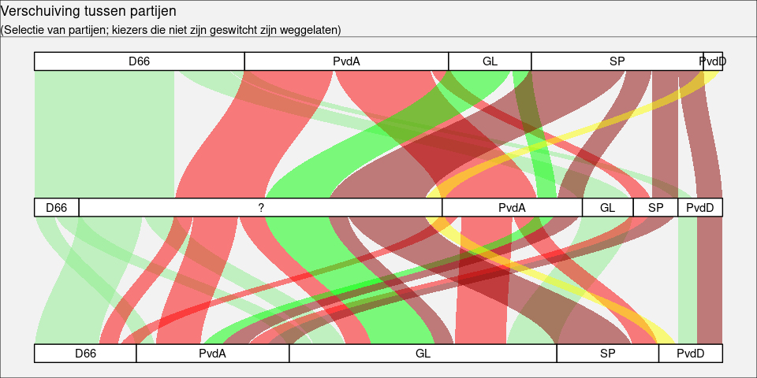
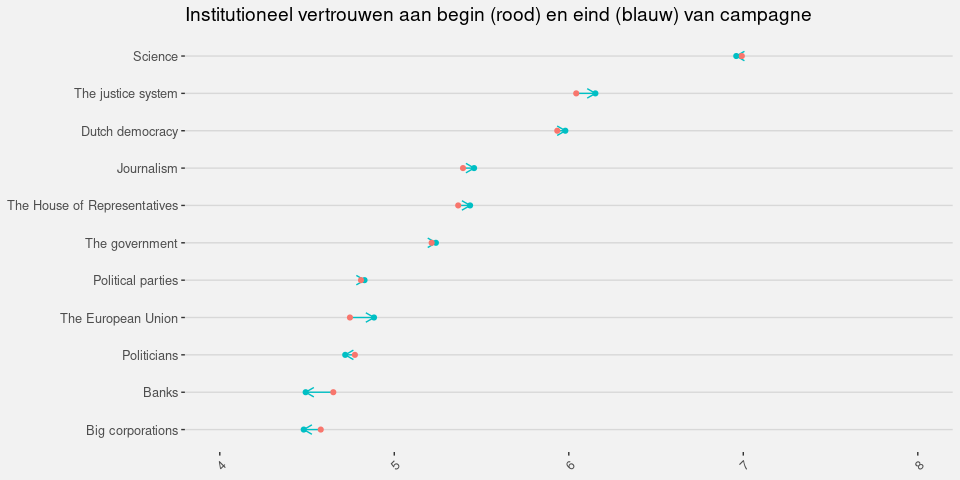
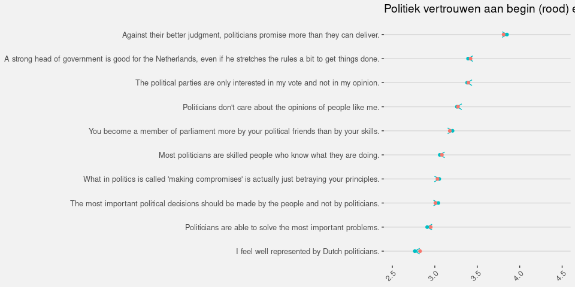
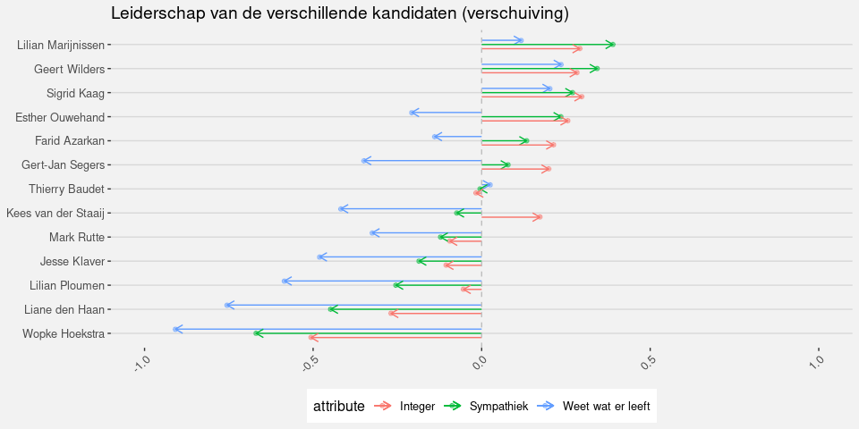
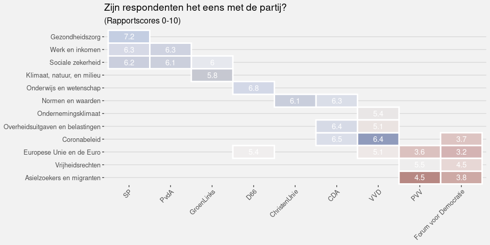

Verschuivingen in de Publieke Opinie
====================================

De stoelendans op links
-----------------------

De figuur hierboven laat zien hoe kiezers zijn verschoven tussen de
verleden verkiezingen (onder), het begin van de campagne (midden), en de
stem in 2021 (boven). Hierbij is ingezoomd op een selectie van linkse
partijen (inclusief D66), en kiezers die niet zijn gewisseld zijn
weggelaten. Wat hier goed te zien is dat D66 relatief veel winst heeft
behaald ten koste van de linkse partijen, en dat die winst vooral
tijdens de campagne is behaald. Veel groenlinks stemmers die bij D66
zijn uitgekomen hebben die beslissing pas tijdens de campagne gemaakt.
Veel D66 stemmers die voorafgaand aan de campagne zijn gaan twijfelen
zijn uiteindelijk weer bij D66 terecht gekomen. Verder zijn er vooral
veel uitwisselingen tussen de verschillende linkse partijen, maar zonder
grote netto verschuivingen.

Verschuivingen op rechts
------------------------

Ook op rechts (met wederom ook D66 meegenomen) zijn een aantal beweingen
duidelijk zichtbaar. D66 wint kiezers van VVD, en deze winst komt weer
pas tijdens de campagne: Deze kiezers dachten aan het begin van de
campagne nog VVD te gaan stemmen, terwijl veel D66 kiezers juist waren
gaan twijfelen. Uiteindelijk zijn deze groepen tijdens de campagne toch
bij D66 uitgekomen.

Alhoewel VVD dus kiezers verliest aan D66, winnen ze er nog meer van
CDA, zovel voorafgaand als tijdens de campagne. Ook duidelijk is dat FvD
na de perikelen rond de appjes en de afsplitsing van JA21 veel kiezers
zijn gaan twijfelen, die uiteindelijk vooral bij de PVV zijn uitgekomen.
Tegelijkertijd zijn veel PVV stemmers juist naar FvD gewisseld.

Institutioneel Vertrouwem
-------------------------

Bovenstaande figuur geeft de verschuiving in institutioneel vertrouwen
weer. Alhoewel hier geen grote verschuivingen in te verwachten waren,
valt het toch op dat vertrouwen in de meeste politieke instituties
(licht) is toegenomen. Vertrouwen in banken en in mindere mate grote
bedrijven en individuele politici is juist iets afgenomen.

Bij de stellingen over politiek vertrouwen zijn de verschuivingen nog
kleiner. Alleen het gevoel dat politici teveel beloven is iets
toegenomen, terwijl het gevoel goed vertegenwoordigd te zijn juist is
afgenomen.

Leiderschap
-----------

    ## <ScaleContinuous>
    ##  Range:  
    ##  Limits:    0 --    1

Bovenstaand figuur geeft aan hoe de verschillende lijsttrekkers als
leider worden geevalueerd. Wellicht opvallende eerste is Marijnissen,
gevolgd door Rutte en Kaag Opvallend genoeg scoort Rutte het beste op
daadkracht, maar hebben mensen twijfel of hij zijn beloftes wel nakomt
(een twijfel die ook bij Klaver sterk leeft).

Ook Wilders wordt als daadkrachtig gezien, en men denkt vooral dat hij
goed weet wat er leeft, maar hij wordt niet integer of sympathiek
gevonden. Hij scoort wel oever de hele linie ruim beter dan zijn directe
concurrent Baudet.

De lijsttrekkers van nieuwe partijen scoren gemiddeld niet heel hoog,
mogelijk door onbekendheid. Vooral Simons scoort zeer slecht op
leiderschap.

    ## <ggproto object: Class ScaleDiscrete, Scale, gg>
    ##     aesthetics: shape
    ##     axis_order: function
    ##     break_info: function
    ##     break_positions: function
    ##     breaks: waiver
    ##     call: call
    ##     clone: function
    ##     dimension: function
    ##     drop: TRUE
    ##     expand: waiver
    ##     get_breaks: function
    ##     get_breaks_minor: function
    ##     get_labels: function
    ##     get_limits: function
    ##     guide: FALSE
    ##     is_discrete: function
    ##     is_empty: function
    ##     labels: waiver
    ##     limits: NULL
    ##     make_sec_title: function
    ##     make_title: function
    ##     map: function
    ##     map_df: function
    ##     n.breaks.cache: NULL
    ##     na.translate: TRUE
    ##     na.value: NA
    ##     name: waiver
    ##     palette: function
    ##     palette.cache: NULL
    ##     position: left
    ##     range: <ggproto object: Class RangeDiscrete, Range, gg>
    ##         range: NULL
    ##         reset: function
    ##         train: function
    ##         super:  <ggproto object: Class RangeDiscrete, Range, gg>
    ##     rescale: function
    ##     reset: function
    ##     scale_name: shape_d
    ##     train: function
    ##     train_df: function
    ##     transform: function
    ##     transform_df: function
    ##     super:  <ggproto object: Class ScaleDiscrete, Scale, gg>

Bovenstaande figuren geven aan hoe tijdens de campagne
leiderschapsevaluaties zijn verschoven. Omdat niet aan het begin van de
campagne duidelijk was welke partijen in de kamer zouden komen, zijn in
de eerste enquete alleen de lijsttrekkers meegenomen van partijen met
zetels in de vorige Tweede Kamer. Ook zijn vooraf alleen de
eigenschappen integriteit (rood), sympathie (groen) en ‘weet wat er
leeft’ (blauw) gevraagd.

Bij veel leiders is de vershuiving tijdens de campagne beperkt tot
minder dan een half “rapportpunt”. Grote stijgers zijn de vrouwelijke
lijsttrekkers Ouwehand, Kaag, en Marijnissen. Ook voor Wilders’
beoordeling als leider was de campagne positief, alhoewel hij (evenals
Ouwehand) nog steeds relatief laag scoort.

Rutte’s leiederschap heeft geen baat gehad bijde campagne, evanals
Klaver en Ploemen heeft men vooral weinig vertrouwen dat zij weten wat
er leeft. Grote verliezer is echter Hoekstra, die op alle eigenschappen
een forse veer moet laten.

De campagne in de media
=======================

Zichtbaarheid van de partijen en lijsttrekkers
----------------------------------------------

Bovenstaande grafieken geven de zichtbaarheid van de meest zichtbare
partijen weer, uitgedrukt als het percentage van politieke artikelen
waarbinnen de partij aanwezig was of genoemd werd. VVD domineert hier
duidelijk, gevolgd door coalitiepartijen CDA en D66. Wat ook opvalt is
dat naarmate de verkiezingen dichterbij komen de kleinere partijen aan
zichtbaarheid winnen, omdat er meer nieuws is waar verschillende
partijen genoemd worden.

Vooral de partijen PVV en FvD lijken hier sterk van te profiteren,
vooral op TV doen zij het relatief goed, ook al moeten ze hier ook de
coalitiepartijen voor laten gaan. Verder is de rangorde aan het eind van
de campagne niet wezenlijk anders dan aan het begin.

Mediagebruik van kiezers
------------------------

Uit eerdere analyse bleek dat kiezers vooral TV gebruiken om politieke
informatie te verkrijgen, vooral kiezers boven de 35. Hoogopgeleide
kiezers gebruiken daarnaast veel kranten, en hoogopgeleidere jongeren
ook veel online nieuws.

Wat we zien is dat tijdens de campagne in eerste instantie de
hoeveelheid nieuws die wordt gevolgd toeneemt. De laatste weken gaat het
echter juist omlaag: kennelijk treedt er een zekere campagnemoeheid op.

Zichtbaarheid volgens de kiezers
--------------------------------

Bovenstaande figuur laat aan de linkerkant zien in hoeverre de
verschillende partijen (en hun lijsttrekkers) de kiezer zijn opgevallen
in de media. Wat hierin opvalt is dat naast VVD ook PVV en FvD sterk
opvallen, meer dan je zou verwachten op basis van hun zichtbaarheid in
de media. Daarnaast valt op dat waar VVD en CDA in de laatste periode
minder opvallen dan daarvoor, D66 juist steeds meer in het oog springt.

Van de partijen die op zijn gevallen is de kiezer vervolgens gevraagd of
dat op een positieve of negatieve manier was. Hier valt direct op dat
FvD en Denk extreem slecht scoren, en ook PVV en GroenLinks niet
positief in het oog springen. CDA gaat over tijd steeds slechter scoren,
terwijl D66 vooral in de laatste periode erg goed scoort. Ook SP en CU
komen positief over op de kiezer.

Issues
======

De grafiek hierboven geeft de aandacht voor de belangrijkste thema’s in
het politieke nieuws weer. Het mag niet verbazen dat corona de agenda
domineert, met daaran gekoppeld de thema’s zorg (vooral op TV) en (de
gevolgen voor) het bedrijfsleven en het onderwijs.

Wat ook opvalt is dat er naar het eind van de campagne wel iets meer
aandacht komt voor andere thema’s zoals sociale zekerheid, het klimaat,
en integratie, maar die thema’s blijven veel minder belangrijk dan
corona en de direct daaraan gerelateerde thema’s.

Issue ownership
---------------

De tabel hierboven laats zien in hoeverre de verchillende issues worden
geassocieerd met de politieke partijen. De theorie van ‘issue ownership’
zegt dat als een partij eigenaar is van een issue, deze partij kan
profiteren van nieuws over het issue. Als mensen bijvoorbeeld veel
nieuws over klimaatverandering krijgen, zullen zij dat onderwerp
belangrijk vinden, en geneigd zijn te stemmen op een partij met een
goede reputatie op dit thema, zoals GroenLinks.

In de tabel zien we dat SP en PvdA allebei geassocieerd wroden met de
klassieke linkse thema’s sociale zekerheid en werk en inkomen, en SP
profileert zich daarnaast op gezondheidszorg. GroenLinks wordt veel
minder met deze thema’s geassocieerd, en wordt vooral gezien als de
klimaatpartij. D66 heeft het minst uitgesproken profiel, met een matige
associate met zowel onderwijs als de EU. De ChristenUnie lijkt het thema
van Normen en Waarden grotendeels te hebben overgenomen van het CDA, die
sterker geassocieerd wordt met het meer klassiek rechtse thema van
overheidsuitgaven en belasting. VVD heeft nog steeds een sterke
associatie met zowel financien als ondernemingsklimaat, maar wordt
vooral heel sterk met het coronabeleid geassocieerd.

Dan blijven over de PVV en FvD, die vooral met integratie worden
geassocieerrd, en in mindere mate met vrijheid en de EU.

Als kiezers een partij associeerden met een onderwerp hebben we
vervolgens gevraagd of ze het hierop ook eens zijn met de partij. Dit is
hierboven als rapportcijfer weergegeven, waarbij alleen cellen met een
associatie van minimaal 10% worden weergegevn.

Wat we hier zien is dat kiezers het zeer sterk eens zijn met de SP op
het gebied van gezondheidszorg, terwijl de PVDD en FvD slecht scoren op
hun thema’s. De meeste andere partijen scoren voldoende tot ruim
voldoende op hun eigen themas.

Opvallend genoeg is met het met de VVD eigenlijk alleen eens op
coronabeleid: hun meer ‘rechtse’ thema’s leiden tot meer verdeeldheid,
net als het thema EU voor D66. Ook opvallend is dat GroenLinks relatief
slecht scoort op klimaatbeleid.
