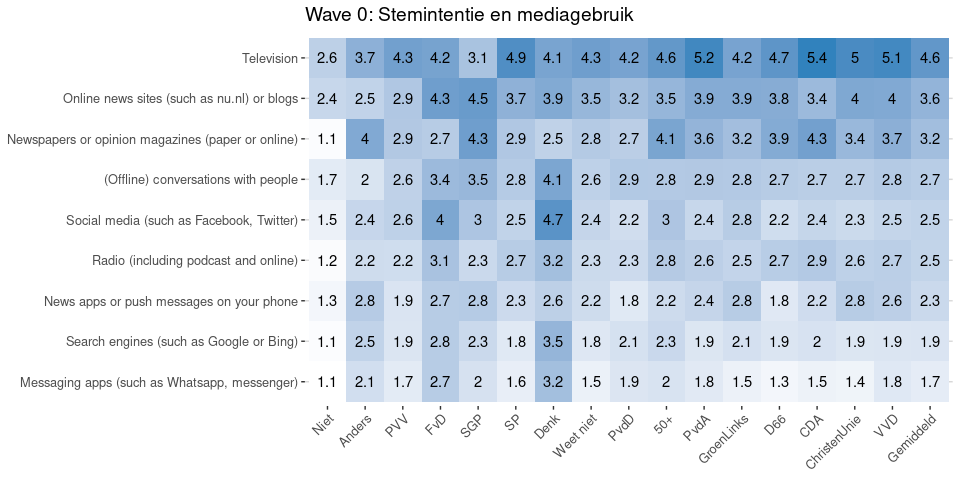
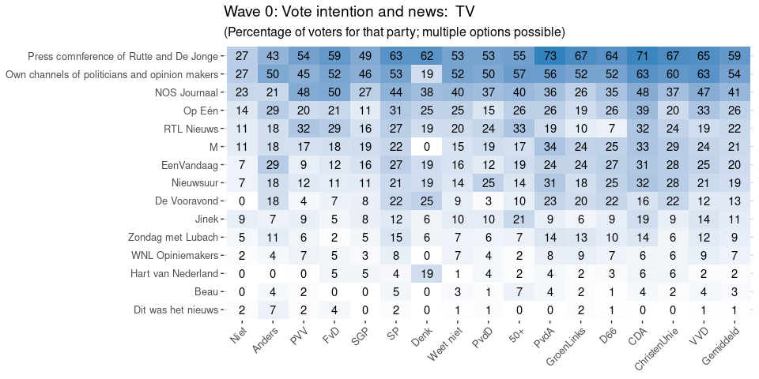
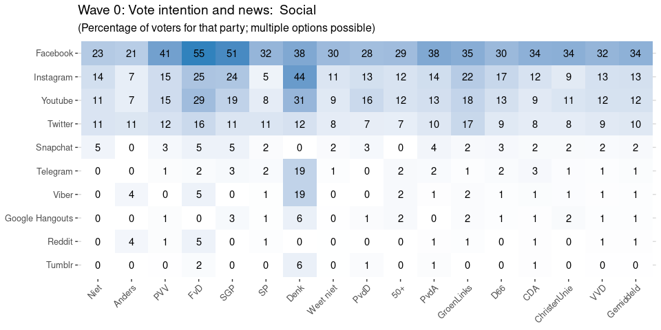
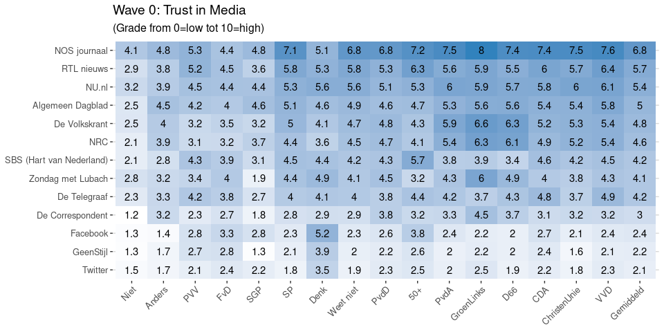

Exploration of media and trust before the campaign
================
Wouter van Atteveldt, Nel Ruigrok, Mariken van der Velden

  - [Media Use by Vote Intention](#media-use-by-vote-intention)
  - [Trust in Media](#trust-in-media)
  - [Trust in Institutions](#trust-in-institutions)
      - [Trust in democracy](#trust-in-democracy)

# Media Use by Vote Intention

<!-- -->Download data: [Wave 0:
Stemintentie en
mediagebruik](figures/Wave_0_Stemintentie_en_mediagebruik.csv)

<!-- -->Download data:
[Wave 0: Vote intention and news:
Newspapers](figures/Wave_0_Vote_intention_and_news_Newspapers.csv)<!-- -->Download
data: [Wave 0: Vote intention and news:
TV](figures/Wave_0_Vote_intention_and_news_TV.csv)<!-- -->Download
data: [Wave 0: Vote intention and news:
Online](figures/Wave_0_Vote_intention_and_news_Online.csv)<!-- -->Download
data: [Wave 0: Vote intention and news:
Social](figures/Wave_0_Vote_intention_and_news_Social.csv)<!-- -->Download
data: [Wave 0: Vote intention and news:
Apps](figures/Wave_0_Vote_intention_and_news_Apps.csv)

# Trust in Media

<!-- -->Download data: [Wave 0:
Trust in Media](figures/Wave_0_Trust_in_Media.csv)

# Trust in Institutions

<!-- -->Download data: [Wave
0: Trust in Instituties](figures/Wave_0_Trust_in_Instituties.csv)

<!-- -->Download data: [Wave 0:
Trust in Institutions
(grouped)](figures/Wave_0_Trust_in_Institutions_grouped_.csv)

## Trust in democracy

<!-- -->

<!-- -->Download data: [Wave 0: Trust
in democracy](figures/Wave_0_Trust_in_democracy.csv)
