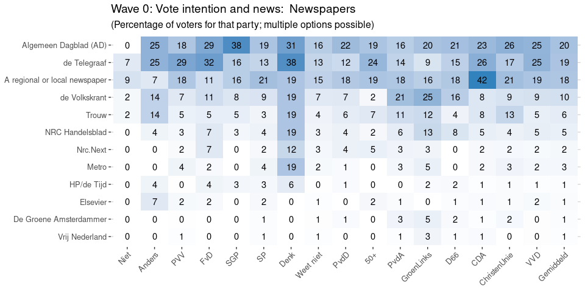
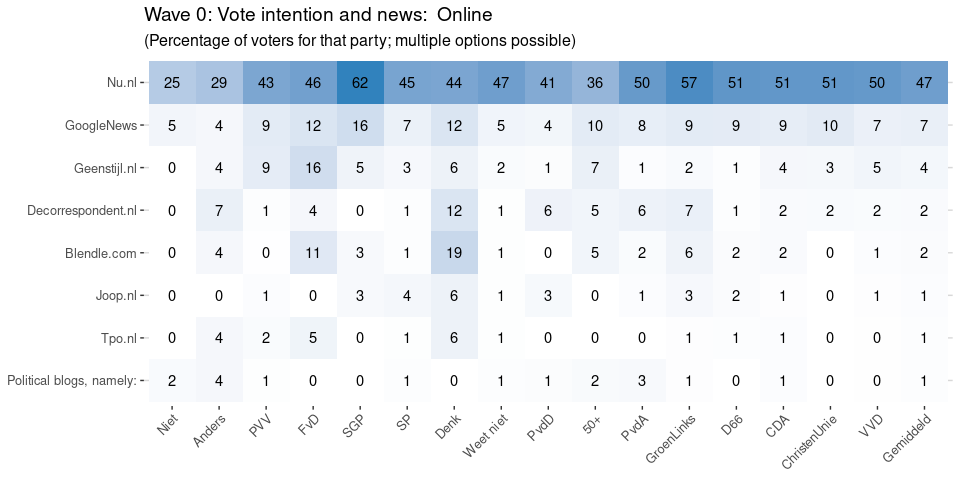
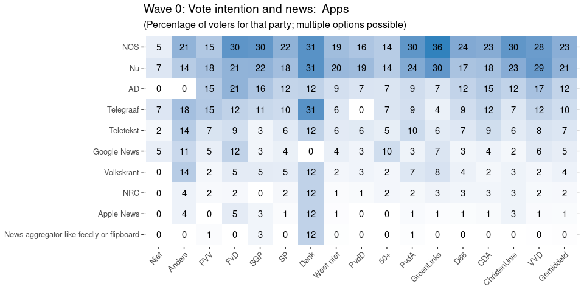
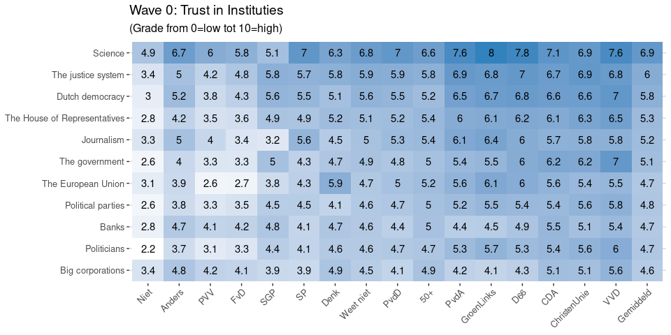
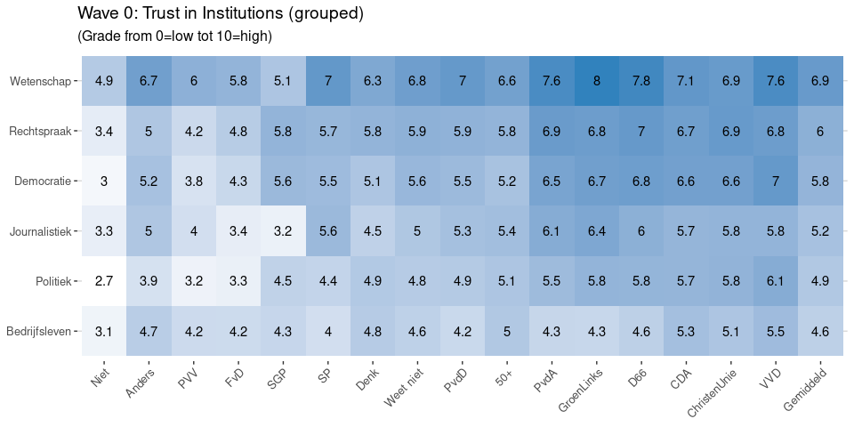

VU 2021 Election Study: Exploration of media use and vote intention
before the campaign
================
Wouter van Atteveldt, Nel Ruigrok, Mariken van der Velden

  - [Media Use by Vote Intention](#media-use-by-vote-intention)
  - [Trust in Media](#trust-in-media)
  - [Trust in Institutions](#trust-in-institutions)
      - [Negativo’s vs Positivo’s](#negativos-vs-positivos)

# Media Use by Vote Intention

<!-- -->Download data: [Wave0:
Stemintentie en
mediagebruik](figures/Wave0_Stemintentie_en_mediagebruik.csv)

<!-- --><!-- --><!-- --><!-- --><!-- -->

# Trust in Media

<!-- -->

# Trust in Institutions

<!-- -->

<!-- -->

## Negativo’s vs Positivo’s

If we categorize people by sufficient trust in democracy (\>5.5) or not,
what do we get?

<!-- --><!-- -->
