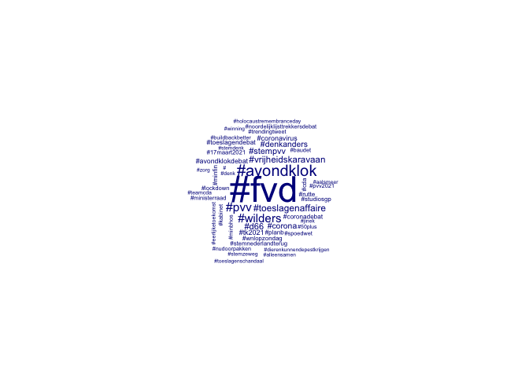

-   [Verspreiden van Informatie](#verspreiden-van-informatie)

Verspreiden van Informatie
==========================

In onderstaande figuur is te zien welke woorden Mark Rutte (zowel
persoonlijk als ambtsaccount), Wopke Hoekstra, Gert-Jan Segers en Sigrid
Kaag sinds het begin van de verkiezingscampagne het meest voorkomen. Hoe
groter de woorden, hoe vaker Duidelijk wordt dat op basis van deze
woorden er

Regeringspartijleiders op Twitter

Regeringspartijleiders op Twitter

