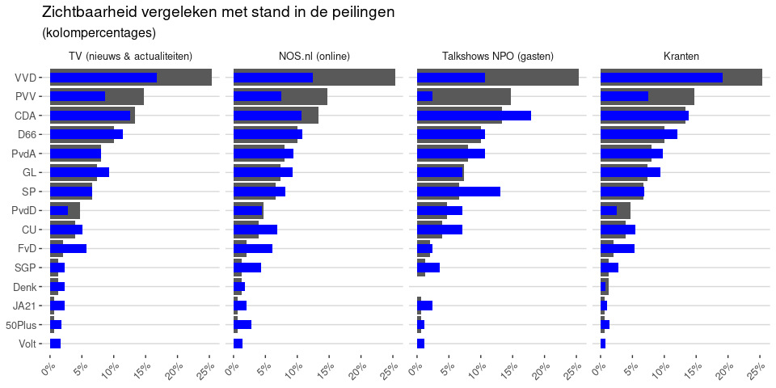
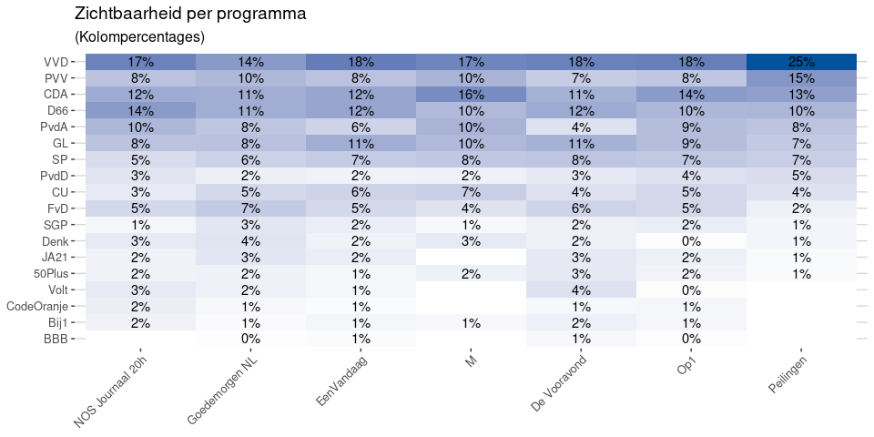
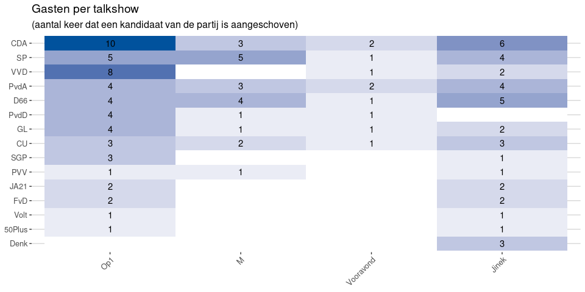

Zichtbaarheid per kanaal
========================

Onderstaande grafieken geven de zichtbaarheid van de partijen weer
vergeleken met de stand in de peilingen een maand voor de verkiezingen
(peilingwijzer van 17 februari). Bij de eerste twee grafieken wordt
weergegeven hoe vaak een partij of lijsttrekker genoemd wordt in nieuws-
en actualiteitenprogramma’s van de NPO (inclusief talkshows),
respectievelijk online op `nos.nl`.  
De derde grafiek geeft weer hoe vaak een kandidaat van de partij te gast
was bij een van de talkshows van NPO. Ter vergelijking geeft de laatste
grafiek de zichtbaarheid van de partijen en lijsttrekkers in de
landelijke kranten.

De zichtbaarheid is hier uitgedrukt als kolompercentage, dus per grafiek
telt het op tot 100%. Leesvoorbeeld: Van alle keren dat op TV in een
programma een partij of lijsttrekker genoemd werd, was dat in 17% van de
gevallen de VVD. Dit wordt vergeleken met hun percentage in de peilingen
van 25% (38 van de 150 zetels).

\[Download data: [Zichtbaarheid van
partijen](Zichtbaarheid_van_partijen.csv)\]

Opvallend is dat VVD op TV en online wel het meest zichtbaar was, maar
dat de zichtbaarheid toch relatief laag was vergeleken met de peilingen.
Ook PVV is relatief weinig zichtbaar geweest op TV tijdens de campagne.
PvdA, Christenunie en de kleine/nieuwe partijen FvD, Volt en JA21 kregen
daarentegen percentueel meer aandacht dan hun stand in de peilingen.
Hierin maakt de NPO keuzes die redelijk lijken op die van de kranten:
ook daar was er relatief weinig aandacht voor PVV en VVD, en meer voor
de kleinere partijen.

Als we kijken naar talkshows vallen daar twee dingen nog sterk op: de
PVV is vrijwel afwezig, terwijl het CDA juist heel sterk
vertegenwoordigd is.

Zichtbaarheid in verschillende programma’s
==========================================

\[Download data: [Zichtbaarheid in verschillende
programmas](Zichtbaarheid_in_verschillende_programmas.csv)\]

De tabel hierboven laat zien hoe vaak de partijen en lijsttrekkers
genoemd worden in de verschillende nieuws- en actualiteitenprogramma’s.
Hierin valt vooral op dat de agenda’s van de verschillende nieuws- en
actualiteitenprogramma’s niet ver van elkaar afwijken. Grootste
uitzondering lijkt Goedemorgen NL, die de aandacht meer gelijkmatig
verspreidt over de verschillende partijen.

Talkshows
=========

Hieronder staat weergegeven hoe vaak een kandidaat van elke partij per
talkshow is aangeschoven. Ter vergelijking is hier ook Jinek weergegeven
in de laatste kolom.

\[Download data: [Talkshowgasten](Talkshowgasten.csv)\]

Duidelijk te zien hier dat de talkshows wel andere keuzes maken in wie
ze uitnodigen, of dat gasten andere keuzes maken in welke uitnodigingen
ze accepteren. Waar kandidaten van CDA relatief vaak in alle talkshows
zaten, was VVD eigenlijk alleen bij Op1 sterk vertegenwoordigd. Bij M
kwam VVD uberhaubt niet voor, terwijl SP er heel vaak aan is geschoven.
Zie voor meer duiding ook het artikel [Wie het beeld heeft heeft de
macht](https://www.groene.nl/artikel/wie-het-beeld-heeft-heeft-de-macht)
in de Groene.

Data en verantwoording
======================

De zichtbaarheid op TV, NOS.nl en kranten is gebaseerd op het noemen van
de partij of lijsttrekker in de inhoud van het item. Voor TV is hiervan
gebruik gemaakt van de ondertitels van TT888, voor nos.nl en de kranten
is dit gebaseerd op de inhoud zoals gepubliceerd op de website. Voor
elke partij is gezocht naar de partijnaam of (waar van toepassing)
afkorting, dus bijvoorbeeld `pvda` of `partij van de arbeid`. Alleen bij
Denk is hierop een uitzondering gemaakt, daar is gezocht naar het woord
`denk` binnen 5 woorden van het woord `partij`. Voor de lijsttrekker is
gekeken naar de volledige naam (bv. `Wopke Hoekstra`) of de achternaam
met daarin binnen 10 woorden de functie (b.v. `bewindspersoon`,
`lijsttrekker`, etc).

Voor de talkshows is de lijst met gasten verkregen via de sites van
Beeld en Geluid en de afzonderlijke programma’s. Deze lijst is
vervolgens door Nel Ruigrok en studenten van de EUR handmatig
gecontroleerd en opgeschoond.

Voor alle kanalen zijn de gegevens vanaf 1 januari 2021 meegenomen. De
peilingen zijn afkomstig van de Politieke Barometer zoals gepubliceerd
op de site van Ipsos. Hierbij is gebruik gemaakt van de peilingen van 27
februari omdat dit een goede graadmeter is van de stand in de peilingen
aan het begin van de campagne.

Alle tekst, figuren en gegevens uit dit rapport zijn (c)
[CC-BY](https://creativecommons.org/licenses/by/4.0/nl/) en mogen worden
gedeeld en hergebruikt, ook voor commerciele doeleinden, zolang de bron
duidelijk wordt vermeld.
