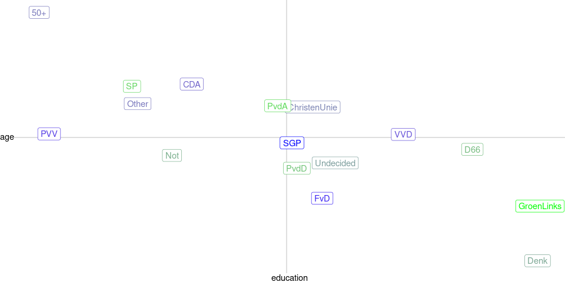

This report gives an overview of the political and media landscape at
the start of the campaign for the Dutch 2021 Parliamentary Elections.
This analysis is based on the first wave of our panel survey with in
total 2.400 respondents. We asked them what their vote intention is for
this election, how they voted in the previous election, how well they
trust various media and institutions, and what media they consumed in
the past weeks.

Demographics
============

Let’s start this exploration by a look at the demographics of the
voters, especially age and education.

Media use by Age and Education
------------------------------

As we can see, Television is the most widely consumed news channel for
all age and education groups, but with a clear smaller share for
respondents under 35, except for those in the lowest education group.
Unsurprisingly, print newspapers ad opinion magazines are mostly
consumed by highly educated older voters, while younger voters prefer
online news channels, especially the highly educated voters younger than
55. Social media and news apps are seen as a news source especially for
young people, regardless of education.

Vote intention per Age and Education
------------------------------------

The figure above shows how the age and education for the respondents
planning to vote for each party. There are some clear patterns. On the
right, the VVD mostly appeals to young and highly educated voters, while
CDA and PVV are more popular with older and less highly educated voters.
On the left, D66 and GroenLinks appeal to the young and educated class,
while PVdA apd SP appeal more to the older and less educated voter.

Demographics per intended party
-------------------------------

    ##    [1] Female Male   Female Female Female Male   Female Male   Female Female
    ##   [11] Female Male   Female Male   Female Female Male   Female Female Male  
    ##   [21] Female Male   Female Female Male   Male   Male   Female Male   Male  
    ##   [31] Male   Female Male   Female Female Female Female Female Female Female
    ##   [41] Female Female Female Female Female Female Female Female Female Female
    ##   [51] Female Female Female Female Female Female Female Female Female Female
    ##   [61] Female Female Female Female Female Female Female Female Female Female
    ##   [71] Female Female Female Female Female Female Female Female Female Female
    ##   [81] Female Female Male   Female Female Female Female Male   Female Female
    ##   [91] Female Male   Female Female Female Male   Female Female Female Male  
    ##  [101] Female Female Female Female Female Male   Female Male   Female Female
    ##  [111] Female Female Female Male   Female Female Female Female Female Female
    ##  [121] Female Female Female Male   Female Female Female Female Female Female
    ##  [131] Female Female Female Female Female Female Female Female Female Female
    ##  [141] Female Female Female Female Female Female Female Female Female Female
    ##  [151] Female Female Male   Female Male   Female Female Female Female Female
    ##  [161] Female Female Female Female Female Female Female Female Female Female
    ##  [171] Female Male   Female Female Female Female Female Female Female Female
    ##  [181] Female Female Female Female Female Female Female Female Female Female
    ##  [191] Female Female Female Female Female Female Female Female Female Male  
    ##  [201] Female Female Male   Female Female Female Female Male   Male   Female
    ##  [211] Female Female Female Female Female Female Female Female Female Female
    ##  [221] Female Female Female Female Female Male   Female Female Female Male  
    ##  [231] Female Female Female Female Male   Female Male   Female Male   Female
    ##  [241] Female Female Female Female Male   Female Male   Female Female Male  
    ##  [251] Male   Male   Female Male   Male   Male   Female Female Female Male  
    ##  [261] Male   Female Female Female Male   Female Female Female Female Female
    ##  [271] Male   Male   Female Male   Male   Female Female Female Male   Female
    ##  [281] Female Male   Female Male   Male   Male   Male   Female Male   Female
    ##  [291] Female Female Male   Male   Male   Female Male   Female Male   Male  
    ##  [301] Male   Male   Female Male   Male   Female Female Female Female Male  
    ##  [311] Male   Female Female Male   Female Male   Female Female Male   Male  
    ##  [321] Male   Female Male   Female Female Female Male   Male   Female Female
    ##  [331] Male   Male   Male   Female Male   Male   Male   Female Female Female
    ##  [341] Male   Male   Male   Male   Female Male   Male   Male   Female Male  
    ##  [351] Male   Male   Female Male   Male   Male   Female Female Male   Female
    ##  [361] Female Male   Male   Female Female Female Male   Male   Female Female
    ##  [371] Male   Female Female Female Female Female Male   Female Female Male  
    ##  [381] Male   Male   Female Male   Female Male   Female Male   Male   Female
    ##  [391] Male   Female Male   Female Female Female Female Male   Female Male  
    ##  [401] Male   Male   Male   Male   Female Male   Female Male   Female Male  
    ##  [411] Female Female Male   Male   Male   Male   Male   Male   Male   Female
    ##  [421] Female Female Female Female Male   Female Female Male   Male   Male  
    ##  [431] Female Male   Male   Male   Male   Female Male   Female Male   Female
    ##  [441] Female Male   Female Male   Female Male   Male   Male   Male   Female
    ##  [451] Male   Male   Female Female Male   Female Male   Male   Male   Male  
    ##  [461] Female Female Female Female Male   Female Female Male   Female Male  
    ##  [471] Male   Female Male   Male   Female Male   Male   Male   Female Male  
    ##  [481] Male   Male   Female Female Male   Female Female Female Male   Female
    ##  [491] Male   Male   Female Male   Female Male   Female Female Male   Male  
    ##  [501] Female Male   Male   Female Male   Male   Male   Male   Male   Male  
    ##  [511] Female Female Male   Male   Female Female Female Female Female Female
    ##  [521] Female Male   Male   Male   Female Male   Male   Female Male   Male  
    ##  [531] Male   Male   Female Male   Female Female Male   Male   Female Female
    ##  [541] Female Male   Female Female Female Male   Male   Male   Male   Male  
    ##  [551] Male   Female Female Male   Male   Male   Male   Female Male   Male  
    ##  [561] Male   Male   Female Female Female Male   Female Male   Male   Female
    ##  [571] Female Female Male   Male   Male   Male   Female Male   Female Female
    ##  [581] Male   Female Female Female Male   Male   Male   Male   Female Male  
    ##  [591] Female Male   Female Female Male   Male   Female Female Male   Male  
    ##  [601] Female Male   Female Male   Female Female Female Female Male   Male  
    ##  [611] Male   Male   Male   Female Female Female Male   Male   Male   Male  
    ##  [621] Male   Male   Female Female Male   Male   Male   Male   Female Male  
    ##  [631] Male   Male   Male   Male   Female Female Male   Female Female Female
    ##  [641] Female Female Female Male   Female Male   Male   Male   Female Female
    ##  [651] Male   Male   Male   Female Male   Female Male   Male   Male   Male  
    ##  [661] Male   Female Female Female Female Female Female Male   Female Male  
    ##  [671] Female Male   Male   Female Female Female Female Male   Female Male  
    ##  [681] Male   Female Female Female Female Male   Female Male   Male   Female
    ##  [691] Male   Male   Male   Female Male   Female Female Female Male   Male  
    ##  [701] Male   Male   Male   Female Female Female Female Female Male   Male  
    ##  [711] Male   Female Female Female Female Male   Male   Male   Male   Male  
    ##  [721] Female Male   Male   Male   Female Male   Male   Male   Male   Male  
    ##  [731] Male   Female Male   Female Male   Female Male   Male   Female Female
    ##  [741] Male   Male   Female Male   Male   Male   Male   Female Male   Female
    ##  [751] Male   Male   Male   Male   Male   Female Male   Female Male   Male  
    ##  [761] Female Female Female Male   Male   Male   Male   Female Female Female
    ##  [771] Male   Male   Male   Male   Male   Male   Female Female Male   Male  
    ##  [781] Male   Male   Female Male   Male   Male   Male   Male   Male   Male  
    ##  [791] Female Female Male   Female Male   Male   Female Male   Male   Female
    ##  [801] Male   Female Female Male   Female Male   Male   Female Male   Male  
    ##  [811] Male   Male   Male   Male   Male   Male   Female Male   Male   Male  
    ##  [821] Male   Male   Male   Female Male   Female Female Female Male   Female
    ##  [831] Female Male   Male   Female Male   Female Male   Male   Male   Female
    ##  [841] Female Male   Male   Female Female Male   Male   Female Female Male  
    ##  [851] Male   Female Male   Female Female Female Female Female Male   Male  
    ##  [861] Male   Male   Female Female Female Female Female Female Male   Female
    ##  [871] Female Male   Male   Female Female Male   Male   Male   Female Male  
    ##  [881] Female Male   Female Male   Female Male   Male   Male   Female Female
    ##  [891] Female Male   Male   Male   Female Female Male   Female Female Female
    ##  [901] Female Female Female Male   Male   Female Male   Male   Female Female
    ##  [911] Male   Female Male   Male   Female Male   Female Female Female Female
    ##  [921] Male   Male   Male   Male   Male   Male   Female Male   Female Female
    ##  [931] Female Female Male   Female Female Male   Female Male   Male   Female
    ##  [941] Female Female Female Female Female Male   Male   Female Female Female
    ##  [951] Male   Female Female Female Female Female Male   Female Female Male  
    ##  [961] Male   Female Female Female Female Male   Female Female Female Male  
    ##  [971] Female Female Male   Female Female Male   Female Female Female Female
    ##  [981] Female Female Female Female Female Female Female Female Female Male  
    ##  [991] Female Male   Female Female Female Female Female Female Male   Male  
    ## [1001] Female Female Female Female Female Female Female Male   Female Female
    ## [1011] Female Male   Female Female Female Female Male   Male   Female Male  
    ## [1021] Male   Female Male   Female Male   Female Female Male   Female Female
    ## [1031] Female Female Male   Male   Female Female Female Female Female Female
    ## [1041] Female Male   Female Female Male   Male   Male   Male   Male   Male  
    ## [1051] Male   Female Female Male   Male   Female Female Female Male   Male  
    ## [1061] Female Female Female Female Female Male   Male   Female Female Male  
    ## [1071] Female Female Female Male   Female Male   Female Female Male   Male  
    ## [1081] Male   Female Female Female Female Female Male   Male   Female Female
    ## [1091] Male   Female Male   Female Female Female Female Female Female Female
    ## [1101] Female Male   Male   Female Male   Male   Male   Female Male   Male  
    ## [1111] Female Female Female Male   Male   Female Female Male   Female Female
    ## [1121] Female Female Male   Female Female Female Male   Female Female Male  
    ## [1131] Male   Male   Female Male   Female Female Male   Female Male   Male  
    ## [1141] Male   Female Male   Female Male   Male   Male   Female Male   Female
    ## [1151] Male   Female Female Female Female Male   Male   Female Female Female
    ## [1161] Female Female Female Female Male   Female Female Male   Female Male  
    ## [1171] Male   Male   Male   Female Female Male   Female Male   Female Female
    ## [1181] Female Female Male   Male   Female Male   Male   Female Male   Female
    ## [1191] Male   Female Male   Female Male   Male   Male   Female Female Female
    ## [1201] Female Male   Female Female Female Male   Female Male   Male   Female
    ## [1211] Female Female Female Male   Female Male   Male   Female Male   Female
    ## [1221] Male   Female Female Male   Male   Female Female Male   Male   Male  
    ## [1231] Female Female Male   Female Male   Female Male   Male   Male   Male  
    ## [1241] Male   Male   Male   Male   Male   Male   Male   Female Female Female
    ## [1251] Male   Male   Female Female Male   Female Female Female Male   Male  
    ## [1261] Male   Female Female Female Female Male   Female Male   Male   Male  
    ## [1271] Male   Female Female Male   Female Female Female Male   Male   Male  
    ## [1281] Male   Male   Female Male   Male   Female Female Male   Female Female
    ## [1291] Male   Female Female Female Male   Female Male   Female Female Male  
    ## [1301] Male   Male   Male   Female Male   Female Male   Male   Female Male  
    ## [1311] Female Male   Female Female Male   Male   Female Female Male   Female
    ## [1321] Male   Female Female Male   Female Male   Female Female Female Male  
    ## [1331] Female Male   Male   Male   Female Female Male   Male   Male   Male  
    ## [1341] Female Male   Female Female Female Female Female Male   Male   Female
    ## [1351] Male   Female Male   Male   Male   Female Male   Female Female Male  
    ## [1361] Male   Male   Male   Male   Male   Female Female Male   Male   Male  
    ## [1371] Male   Female Female Male   Male   Male   Male   Male   Female Male  
    ## [1381] Female Female Male   Female Male   Male   Male   Female Male   Male  
    ## [1391] Female Female Female Female Female Male   Male   Female Male   Female
    ## [1401] Male   Male   Female Male   Female Male   Male   Female Male   Male  
    ## [1411] Female Male   Female Female Male   Male   Female Female Male   Female
    ## [1421] Male   Female Male   Male   Female Female Male   Male   Male   Female
    ## [1431] Male   Male   Male   Male   Male   Female Male   Male   Female Male  
    ## [1441] Male   Male   Female Male   Female Female Male   Female Male   Male  
    ## [1451] Female Male   Female Male   Male   Female Male   Male   Male   Female
    ## [1461] Male   Male   Male   Male   Male   Male   Male   Female Female Male  
    ## [1471] Female Female Female Female Female Male   Male   Female Female Male  
    ## [1481] Female Female Male   Male   Female Female Female Female Female Male  
    ## [1491] Male   Male   Male   Male   Male   Male   Male   Female Female Female
    ## [1501] Female Male   Male   Female Male   Male   Female Male   Female Female
    ## [1511] Female Female Male   Male   Male   Male   Male   Male   Female Female
    ## [1521] Female Male   Male   Male   Female Female Female Male   Female Male  
    ## [1531] Female Male   Female Female Male   Female Female Male   Female Female
    ## [1541] Female Male   Female Female Female Female Female Male   Female Female
    ## [1551] Male   Female Female Male   Male   Female Female Male   Male   Female
    ## [1561] Female Male   Female Male   Male   Male   Male   Male   Female Male  
    ## [1571] Female Female Male   Male   Male   Male   Male   Male   Male   Female
    ## [1581] Female Male   Male   Male   Female Male   Male   Male   Male   Male  
    ## [1591] Male   Male   Male   Male   Male   Male   Male   Male   Female Female
    ## [1601] Male   Male   Male   Male   Male   Male   Male   Male   Female Male  
    ## [1611] Male   Male   Female Male   Male   Male   Male   Male   Male   Male  
    ## [1621] Male   Male   Male   Male   Male   Male   Male   Male   Female Male  
    ## [1631] Male   Male   Male   Male   Male   Male   Male   Male   Male   Male  
    ## [1641] Male   Male   Male   Male   Male   Male   Male   Male   Male   Male  
    ## [1651] Male   Male   Male   Male   Male   Male   Male   Male   Female Female
    ## [1661] Female Male   Female Male   Male   Female Male   Male   Male   Female
    ## [1671] Male   Female Male   Female Female Male   Male   Male   Male   Male  
    ## [1681] Male   Male   Male   Male   Female Female Male   Male   Female Male  
    ## [1691] Female Male   Male   Female Female Male   Male   Male   Male   Male  
    ## [1701] Female Male   Male   Male   Male   Female Male   Male   Male   Male  
    ## [1711] Female Male   Male   Male   Male   Male   Female Male   Female Female
    ## [1721] Male   Male   Female Female Male   Male   Female Male   Male   Male  
    ## [1731] Male   Female Female Female Male   Male   Male   Male   Male   Female
    ## [1741] Male   Male   Male   Male   Male   Male   Female Male   Male   Male  
    ## [1751] Male   Male   Male   Male   Male   Male   Male   Male   Female Female
    ## [1761] Male   Male   Male   Female Male   Male   Male   Female Male   Male  
    ## [1771] Male   Male   Female Male   Male   Male   Male   Female Male   Female
    ## [1781] Male   Male   Male   Female Male   Male   Female Male   Male   Female
    ## [1791] Male   Male   Male   Female Male   Female Female Female Male   Female
    ## [1801] Female Male   Female Female Male   Female Male   Male   Male   Male  
    ## [1811] Male   Male   Male   Male   Male   Female Male   Male   Male   Female
    ## [1821] Male   Male   Male   Male   Female Male   Male   Female Female Female
    ## [1831] Male   Female Female Female Female Male   Male   Female Female Male  
    ## [1841] Female Male   Female Male   Female Male   Male   Male   Male   Male  
    ## [1851] Male   Female Female Female Female Male   Female Male   Female Female
    ## [1861] Male   Male   Male   Male   Female Male   Male   Female Male   Male  
    ## [1871] Female Male   Female Female Female Male   Female Male   Male   Female
    ## [1881] Male   Male   Male   Female Female Female Female Male   Male   Male  
    ## [1891] Female Male   Male   Female Male   Male   Female Female Female Female
    ## [1901] Male   Male   Female Male   Male   Female Male   Female Male   Male  
    ## [1911] Female Female Male   Female Male   Male   Male   Female Male   Male  
    ## [1921] Female Female Male   Male   Male   Male   Female Male   Male   Male  
    ## [1931] Male   Female Male   Male   Male   Male   Female Female Male   Male  
    ## [1941] Female Male   Male   Male   Male   Female Female Female Female Male  
    ## [1951] Male   Female Female Male   Female Male   Male   Male   Male   Female
    ## [1961] Male   Male   Male   Female Female Male   Female Male   Female Male  
    ## [1971] Male   Male   Male   Male   Male   Male   Female Female Male   Female
    ## [1981] Female Male   Female Male   Male   Female Male   Male   Male   Male  
    ## [1991] Male   Female Male   Male   Female Male   Female Male   Male   Female
    ## [2001] Male   Male   Female Male   Female Male   Male   Female Male   Female
    ## [2011] Male   Male   Male   Female Female Female Male   Male   Male   Female
    ## [2021] Male   Female Female Female Male   Female Male   Male   Male   Male  
    ## [2031] Male   Male   Female Female Female Female Male   Male   Male   Female
    ## [2041] Female Female Female Female Female Male   Male   Male   Female Male  
    ## [2051] Male   Male   Male   Male   Male   Male   Female Male   Female Male  
    ## [2061] Male   Male   Male   Male   Male   Male   Female Male   Female Male  
    ## [2071] Male   Female Male   Male   Female Female Male   Male   Female Male  
    ## [2081] Male   Male   Female Female Female Female Female Female Female Male  
    ## [2091] Male   Male   Female Male   Male   Male   Male   Male   Male   Male  
    ## [2101] Male   Female Male   Male   Male   Male   Male   Male   Male   Male  
    ## [2111] Male   Male   Female Male   Male   Male   Female Male   Female Male  
    ## [2121] Male   Male   Male   Male   Male   Female Male   Male   Male   Female
    ## [2131] Male   Female Male   Male   Female Male   Male   Female Male   Male  
    ## [2141] Male   Female Female Female Female Female Male   Male   Male   Male  
    ## [2151] Male   Male   Male   Male   Male   Male   Male   Male   Female Male  
    ## [2161] Female Male   Male   Male   Male   Female Male   Female Male   Male  
    ## [2171] Male   Male   Male   Male   Male   Female Male   Male   Female Male  
    ## [2181] Female Male   Female Male   Male   Female Female Male   Male   Male  
    ## [2191] Male   Male   Male   Male   Female Male   Male   Female Male   Male  
    ## [2201] Male   Female Male   Male   Male   Male   Male   Female Female Female
    ## [2211] Female Female Male   Female Male   Male   Male   Male   Male   Male  
    ## [2221] Male   Male   Female Female Male   Male   Male   Male   Female Male  
    ## [2231] Female Female Male   Male   Male   Female Female Male   Female Male  
    ## [2241] Female Male   Male   Male   Male   Male   Female Male   Female Female
    ## [2251] Female Male   Female Male   Female Male   Female Male   Male   Male  
    ## [2261] Female Female Male   Female Male   Female Male   Male   Male   Male  
    ## [2271] Male   Male   Female Male   Male   Male   Female Female Female Male  
    ## [2281] Male   Female Female Male   Male   Male   Male   Female Male   Male  
    ## [2291] Male   Male   Male   Male   Male   Male   Female Male   Female Male  
    ## [2301] Male   Male   Male   Male   Male   Female Male   Male   Female Male  
    ## [2311] Male   Female Male   Female Male   Male   Male   Male   Male   Male  
    ## [2321] Male   Male   Male   Male   Male   Male   Male   Male   Male   Male  
    ## [2331] Male   Female Male   Male   Female Female Male   Female Male   Male  
    ## [2341] Male   Male   Male   Female Female Female Female Female Female Male  
    ## [2351] Male   Female Male   Male   Female Male   Female Female Male   Male  
    ## [2361] Female Male   Male   Male   Male   Male   Male   Male   Male   Male  
    ## [2371] Male   Female Female Male   Male   Male   Male   Male   Male   Female
    ## [2381] Male   Male   Male   Male   Female Male   Male   Male   Male   Male  
    ## [2391] Male   Male   Male   Male   Male   Male   Male   Male   Male   Male  
    ## Levels: Male Female

    ## Download data: [{Mean Demographics per Vote Intention}]({Mean_Demographics_per_Vote_Intention.csv})

The able above shows the “mean voter” for each party, where each
demographic is rescaled to range from 0 to 1. Voters for centrist
parties have on average a bit more political knowledge, while the
smaller parties D66, GroenLinks and Denk have the highest level of
education.

Interestingly, undecided voters are more likely to be male, younger,
slightly better educated, but less knowledgeable about politics than the
average voter.

Placing each party by the demographic of its mean voter, we get an
alternative electoral compass: (color indicating average position of
respondent on left-right scale)

Vote change
-----------

The above shows changes between current vote intention and the
self-reported previous vote (ignoring undecided voters). Interestingly,
PVV does not draw new voters from existing parties apart from the
(imploded) 50+ and FvD, but mostly draws on voters that did not vote in
the previous election, either from choice or because they were
inelibible (i.e. new voters). VVD also draws from both groups and from
50+, while also drawing from the coalition parties CDA and D66.
Non-voters in 2017 also now consider SP and PvdD. Thus, while VVD and
PVV do not compete directly, both do draw from the same pool of new and
disgruntled voters.

Media Use by Vote Intention
---------------------------

In the competition for voters the media play a crucial role. The table
above shows overall media use by current vote intention. As seen before,
TV is the most frequently used channel, followed by online nad print
news. Overall, voters for the centrist parties consume more news, while
non-voters and voters for especially PVV consume signifianctly less news
in all channels. Both FvD and Denk voters rely more heavily on social
media and especially less on print media.

See the last part of this report for data on use of particular titles or
sites within each category.

Trust
=====

One crucial question is whether people have trust in media and
democracy. We have asked respondents to rank their trust in a number of
institutions on a scale of 0 to 10, and we also asked them to rank a
list of specific media channels.

Trust in Institutions
---------------------

Download data: [{Wave 0: Trust in
Instituties}](%7BWave_0_Trust_in_Instituties.csv%7D)

The table above shows the trust in a number of institutions. Most
respondents have relatively high trust in science, the justice system,
and democracy. When looking at journalism and specific political
institutions, trust is lower, and trust in banks and corporations is
even lower.

Looking at the trust of voters for the various parties, we see that
again voters for the centrist parties have highest trust, while
non-voters and voters for more fringe parties have less trust in media
and politics, and non-voters also have very low trust in science.

Trust in Media
--------------

Download data: [{Wave 0: Trust in
Media}](%7BWave_0_Trust_in_Media.csv%7D)

Looking at trust in specific channels, overall the TV news broadcasts
and mainstream media channels such as nu.nl and AD score best, and
social media score worst. We also see the same breakdown between
high-trust centrist voters and low-trust fringe voters. Interestingly,
Denk voters have relatively high trust in social media dn low trust in
(Dutch) TV channels and newspapers.

Trust in democracy
------------------

Download data: [{Wave 0: Trust in
democracy}](%7BWave_0_Trust_in_democracy.csv%7D)

Use of particular media titles / sites
======================================

### Use of Newspapers

Download data: [{Wave 0: Vote
intention and news:
Newspapers}](%7BWave_0_Vote_intention_and_news_Newspapers.csv%7D)

### Use of TV

Download data: [{Wave 0: Vote
intention and news: TV}](%7BWave_0_Vote_intention_and_news_TV.csv%7D)

### Use of Online

Download data: [{Wave 0: Vote
intention and news:
Online}](%7BWave_0_Vote_intention_and_news_Online.csv%7D)

### Use of Social

Download data: [{Wave 0: Vote
intention and news:
Social}](%7BWave_0_Vote_intention_and_news_Social.csv%7D)

### Use of Apps

Download data: [{Wave 0: Vote
intention and news:
Apps}](%7BWave_0_Vote_intention_and_news_Apps.csv%7D)
