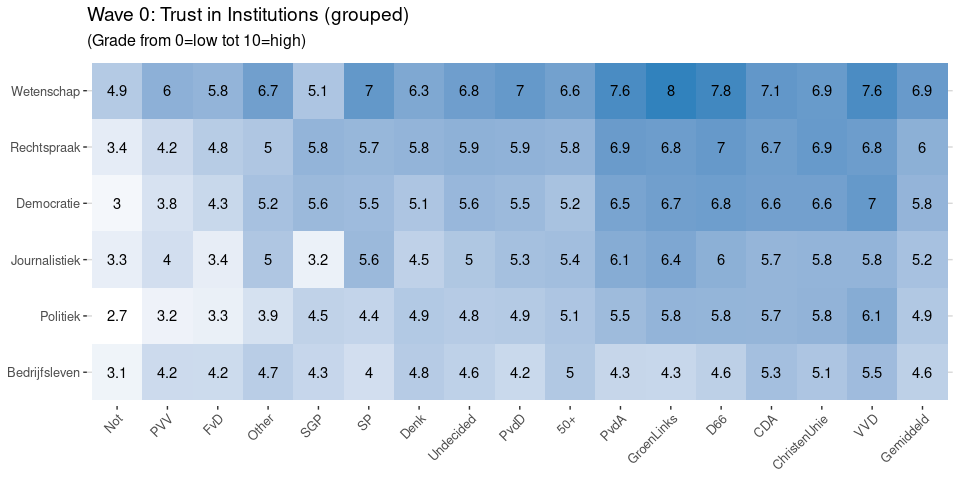

-   [Current Vote Intention](#current-vote-intention)
    -   [Demographics](#demographics)
    -   [Media Use by Vote Intention](#media-use-by-vote-intention)
    -   [Use of particular channels](#use-of-particular-channels)
        -   [Use of Newspapers](#use-of-newspapers)
        -   [Use of TV](#use-of-tv)
        -   [Use of Online](#use-of-online)
        -   [Use of Social](#use-of-social)
        -   [Use of Apps](#use-of-apps)
-   [Trust](#trust)
    -   [Trust in Media](#trust-in-media)
    -   [Trust in Institutions](#trust-in-institutions)
    -   [Trust in democracy](#trust-in-democracy)

Current Vote Intention
======================

Demographics
------------

Media Use by Vote Intention
---------------------------

Use of particular channels
--------------------------

### Use of Newspapers

Download data: [{Wave 0: Vote
intention and news:
Newspapers}](%7BWave_0_Vote_intention_and_news_Newspapers.csv%7D)

### Use of TV

Download data: [{Wave 0: Vote
intention and news: TV}](%7BWave_0_Vote_intention_and_news_TV.csv%7D)

### Use of Online

Download data: [{Wave 0: Vote
intention and news:
Online}](%7BWave_0_Vote_intention_and_news_Online.csv%7D)

### Use of Social

Download data: [{Wave 0: Vote
intention and news:
Social}](%7BWave_0_Vote_intention_and_news_Social.csv%7D)

### Use of Apps

Download data: [{Wave 0: Vote
intention and news:
Apps}](%7BWave_0_Vote_intention_and_news_Apps.csv%7D)

Trust
=====

Trust in Media
--------------

Download data: [{Wave 0: Trust in
Media}](%7BWave_0_Trust_in_Media.csv%7D)

Trust in Institutions
---------------------

Download data: [{Wave 0: Trust in
Instituties}](%7BWave_0_Trust_in_Instituties.csv%7D)

Download data: [{Wave 0: Trust in
Institutions
(grouped)}](%7BWave_0_Trust_in_Institutions_grouped_.csv%7D)

Trust in democracy
------------------

Download data: [{Wave 0: Trust in
democracy}](%7BWave_0_Trust_in_democracy.csv%7D)
