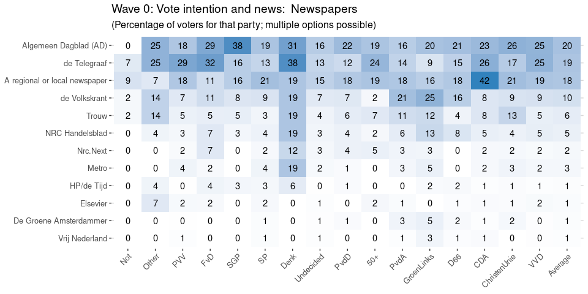
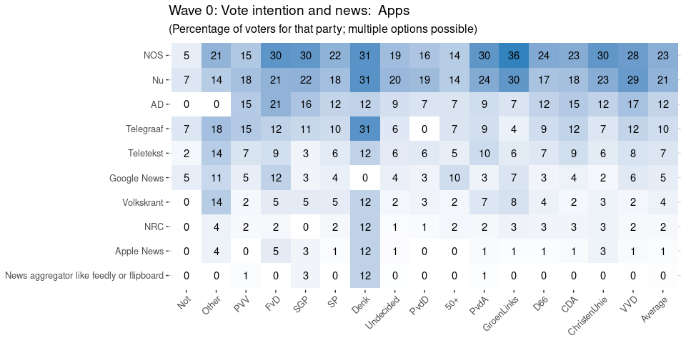
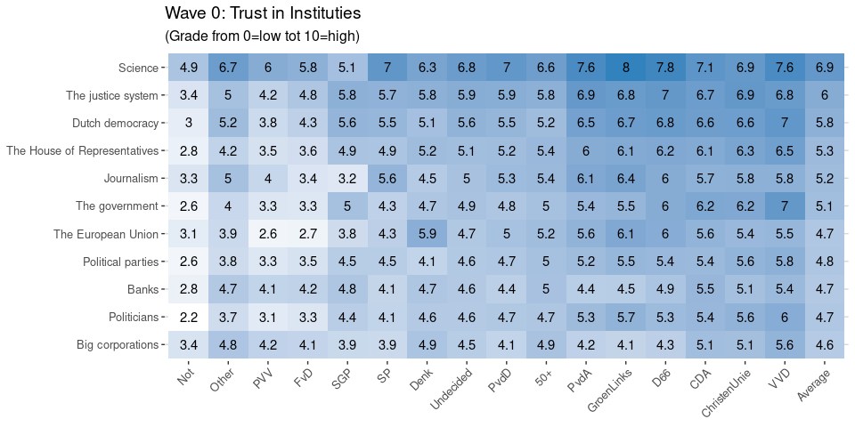

This report gives an overview of the political and media landscape at
the start of the campaign for the Dutch 2021 Parliamentary Elections.
This analysis is based on the first wave of our panel survey with in
total 2.400 respondents. We asked them what their vote intention is for
this election, how they voted in the previous election, how well they
trust various media and institutions, and what media they consumed in
the past weeks.

Media use by Age and Education
------------------------------

As we can see, Television is the most widely consumed news channel for
all age and education groups, but with a clear smaller share for
respondents under 35, except for those in the lowest education group.
Unsurprisingly, print newspapers ad opinion magazines are mostly
consumed by highly educated older voters, while younger voters prefer
online news channels, especially the highly educated voters younger than
55. Social media and news apps are seen as a news source especially for
young people, regardless of education.

Political Shifts
================

Vote intention per Age and Education
------------------------------------

The figure above shows how the age and education for the respondents
planning to vote for each party. There are some clear patterns. On the
right, the VVD mostly appeals to young and highly educated voters, while
CDA and PVV are more popular with older and less highly educated voters.
On the left, D66 and GroenLinks appeal to the young and educated class,
while PVdA apd SP appeal more to the older and less educated voter.

Placing each party by the demographic of its mean voter, we get an
alternatieve electoral compass: (color indicating average position of
respondent on left-right scale)

Media Use by Vote Intention
---------------------------

Use of particular channels
--------------------------

### Use of Newspapers

Download data: [{Wave 0: Vote
intention and news:
Newspapers}](%7BWave_0_Vote_intention_and_news_Newspapers.csv%7D)

### Use of TV

Download data: [{Wave 0: Vote
intention and news: TV}](%7BWave_0_Vote_intention_and_news_TV.csv%7D)

### Use of Online

Download data: [{Wave 0: Vote
intention and news:
Online}](%7BWave_0_Vote_intention_and_news_Online.csv%7D)

### Use of Social

Download data: [{Wave 0: Vote
intention and news:
Social}](%7BWave_0_Vote_intention_and_news_Social.csv%7D)

### Use of Apps

Download data: [{Wave 0: Vote
intention and news:
Apps}](%7BWave_0_Vote_intention_and_news_Apps.csv%7D)

Trust
=====

Trust in Media
--------------

Download data: [{Wave 0: Trust in
Media}](%7BWave_0_Trust_in_Media.csv%7D)

Trust in Institutions
---------------------

Download data: [{Wave 0: Trust in
Instituties}](%7BWave_0_Trust_in_Instituties.csv%7D)

Download data: [{Wave 0: Trust in
Institutions
(grouped)}](%7BWave_0_Trust_in_Institutions_grouped_.csv%7D)

Trust in democracy
------------------

Download data: [{Wave 0: Trust in
democracy}](%7BWave_0_Trust_in_democracy.csv%7D)
