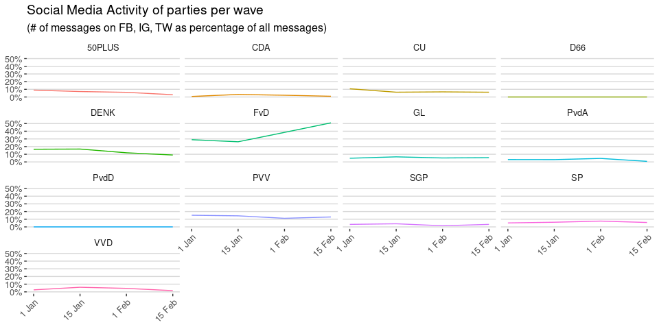
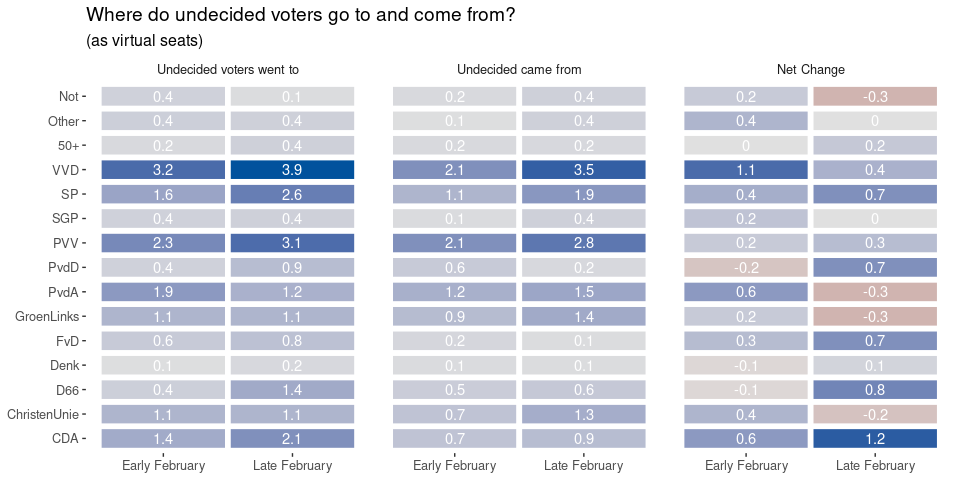

Visibility of parties
=====================

No large shifts in visibility in the newspapers. VVD and coalition
parties VDA and D66 are most visible. Groenlinks, SP, and FvD are
increasing in visibility, while PvdA remains mostly constant.

On television (subtitles of NPO news and current affairs shows) we see
the same overall pattern, but while D66 and VVD make gains, PvdA,
GroenLinks, SP and CU all lose visibility. In contrast, PVV and
especially FvD gain visibility.

Here we do see a clear shift, with D66 even overtaking VVD and CDA,
while the other leftist parties lose some of their gains. PVV and the
Smaller parties get more visibility, but GL, and FvD actually become
less visible.

Visibility and engagement on social media
-----------------------------------------

These two graphs show a very clear picture: although all parties are
active on social media, FvD wins hands down in terms of their activity,
and FvD and PVV are the only parties with substantial engagement on
social media (likes, shares, mentions)

Does the voter take notice?
===========================

\[TODO\]

The Undecided Voter
===================

The number of undecided voters (and non-voters) is becoming smaller as
the election draws near:

<table>
<thead>
<tr class="header">
<th style="text-align: left;">name</th>
<th style="text-align: right;">January</th>
<th style="text-align: right;">Early February</th>
<th style="text-align: right;">Late February</th>
</tr>
</thead>
<tbody>
<tr class="odd">
<td style="text-align: left;">Not</td>
<td style="text-align: right;">1.8</td>
<td style="text-align: right;">1.7</td>
<td style="text-align: right;">1.3</td>
</tr>
<tr class="even">
<td style="text-align: left;">Undecided</td>
<td style="text-align: right;">24.4</td>
<td style="text-align: right;">17.0</td>
<td style="text-align: right;">14.2</td>
</tr>
</tbody>
</table>

Media use of undecided voters
-----------------------------

Last month, we saw that undecided voters were on average less interested
in news and politics. If we look at the group of voters that were
undecided at the start of the campaign, how did their media use change?

\[Download data: [Media use of (un)decided
voters](Media_use_of_un_decided_voters.csv)\]

These results are quite striking: much more than the voters that had
already made up their mind, these undecided voters started consuming
more media, both newspapers and TV, and at the end of February even
consume more news.

Who are the undecided voters?
-----------------------------

As undecided voters make up their mind, and other voters start doubting
their choices, the group of undecided voters changes. Let’s look at some
of the demographics:

### Education of undecided voters per wave

<table>
<thead>
<tr class="header">
<th style="text-align: left;">education</th>
<th style="text-align: right;">w0</th>
<th style="text-align: right;">w1</th>
<th style="text-align: right;">w2</th>
</tr>
</thead>
<tbody>
<tr class="odd">
<td style="text-align: left;">High</td>
<td style="text-align: right;">36</td>
<td style="text-align: right;">35</td>
<td style="text-align: right;">35</td>
</tr>
<tr class="even">
<td style="text-align: left;">Medium</td>
<td style="text-align: right;">43</td>
<td style="text-align: right;">38</td>
<td style="text-align: right;">39</td>
</tr>
<tr class="odd">
<td style="text-align: left;">Low</td>
<td style="text-align: right;">21</td>
<td style="text-align: right;">27</td>
<td style="text-align: right;">26</td>
</tr>
</tbody>
</table>

A small shift from medium to lower education.

### Age of undecided voters per wave

<table>
<thead>
<tr class="header">
<th style="text-align: left;">age</th>
<th style="text-align: right;">w0</th>
<th style="text-align: right;">w1</th>
<th style="text-align: right;">w2</th>
</tr>
</thead>
<tbody>
<tr class="odd">
<td style="text-align: left;">&lt;24</td>
<td style="text-align: right;">21</td>
<td style="text-align: right;">11</td>
<td style="text-align: right;">8.8</td>
</tr>
<tr class="even">
<td style="text-align: left;">25-34</td>
<td style="text-align: right;">13</td>
<td style="text-align: right;">18</td>
<td style="text-align: right;">18.2</td>
</tr>
<tr class="odd">
<td style="text-align: left;">35-44</td>
<td style="text-align: right;">18</td>
<td style="text-align: right;">15</td>
<td style="text-align: right;">14.4</td>
</tr>
<tr class="even">
<td style="text-align: left;">45-54</td>
<td style="text-align: right;">17</td>
<td style="text-align: right;">18</td>
<td style="text-align: right;">15.5</td>
</tr>
<tr class="odd">
<td style="text-align: left;">55-64</td>
<td style="text-align: right;">15</td>
<td style="text-align: right;">15</td>
<td style="text-align: right;">17.7</td>
</tr>
<tr class="even">
<td style="text-align: left;">&gt;64</td>
<td style="text-align: right;">16</td>
<td style="text-align: right;">23</td>
<td style="text-align: right;">25.4</td>
</tr>
</tbody>
</table>

Here is a clear shift: where the undecided voters at the start of the
campaign were relatively young, by late February the group is older,
with almost a quarter being 65 or older and much fewer being younger
than 25.

### Other demographics of undecided voters per wave

<table>
<thead>
<tr class="header">
<th style="text-align: left;">Measure</th>
<th style="text-align: right;">w0</th>
<th style="text-align: right;">w1</th>
<th style="text-align: right;">w2</th>
</tr>
</thead>
<tbody>
<tr class="odd">
<td style="text-align: left;">rile_self</td>
<td style="text-align: right;">5.06</td>
<td style="text-align: right;">5.23</td>
<td style="text-align: right;">5.32</td>
</tr>
<tr class="even">
<td style="text-align: left;">polknow</td>
<td style="text-align: right;">5.73</td>
<td style="text-align: right;">6.98</td>
<td style="text-align: right;">7.00</td>
</tr>
<tr class="odd">
<td style="text-align: left;">education</td>
<td style="text-align: right;">0.14</td>
<td style="text-align: right;">0.08</td>
<td style="text-align: right;">0.09</td>
</tr>
<tr class="even">
<td style="text-align: left;">age</td>
<td style="text-align: right;">3.40</td>
<td style="text-align: right;">3.76</td>
<td style="text-align: right;">3.91</td>
</tr>
</tbody>
</table>

The top rows shows the self-placement on a left-right scale, which shows
that the group of undecided voters has shifted mostly towards the mean
of left-right placement of 5.4. Interestingly, even though the group has
a lower overall education, they score better on political knowledge,
probably as a result of being older.

(The bottom rows show education and age as a numeric value, mirroring
the shift towards an older and slightly less educated group of voters. )

Where do undecided voters go to?
--------------------------------

\[Download data: [Undecided Voters](Undecided_Voters.csv)\]

On the left hand side, the figure above shows where undecided voters go
to when they make up their mind. Similarly, the middle columns show
where new undecided voters go to. Finally, the rightmost two columns
show the difference between the two: was a party able to attract more
undecided voters they lost?

The first thing that is very striking is that many party both attract a
substantial number of undecided voters, while at the same time losing
voters that become undecided. In fact, only 0.15% of undecided voters in
wave 2 were also undecided in wave 1! A lot of respondents switch in and
out of the undecided group.

Looking at which parties gain or lose from undecided voters, overall
most parties make net gains as the number of undecided voters goes down.
VVD, Groenlinks and PvdA and CU are mostly able to profit in early
February, with the latter three even making a net loss later that month.
Apparently, many voters started doubting their choice for these parties.
In contrast, CDA and D66 but also PvdD and FvD actually profited most in
the second half of February.
