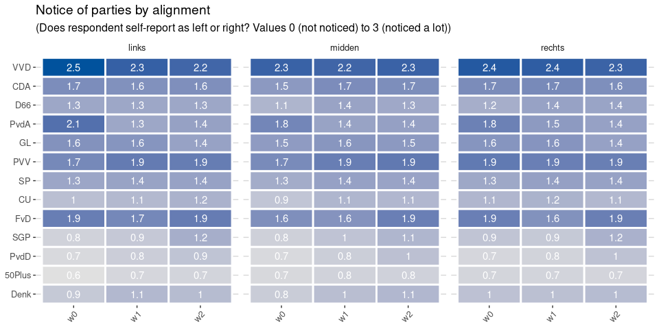
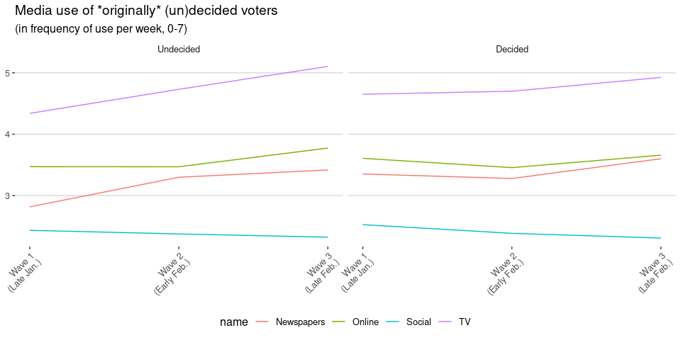
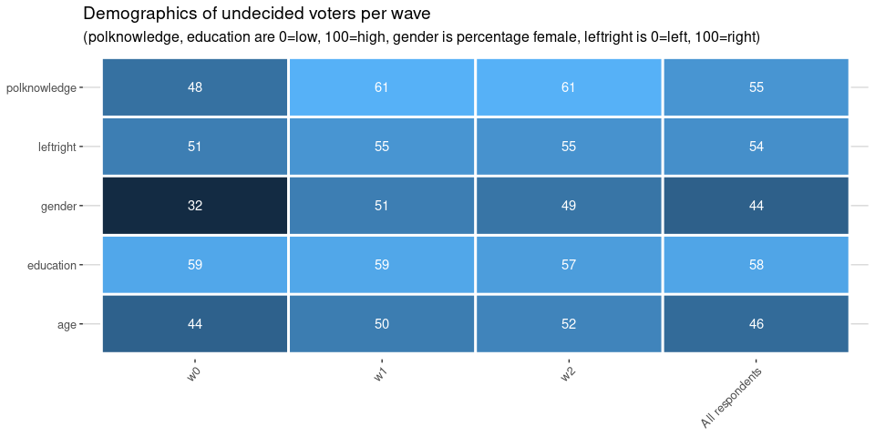

Visibility of parties
=====================

\[Download data: [Visibility of parties in the
media](Visibility_of_parties_in_the_media.csv)\]

Overall visibility on traditional media (including online) favours
coalition parties VVD, VDA, D66 followed by the main opposition parties.
Over time, Forum become much more visible on these media. PvdA, GL, and
SP become more visible in the newspapers, but less so on TV. In
contrast, PVV, VVD and FvD (and to a lesser extend D66) are much more
visible on television.

Social media also show a very clear picture: although many parties are
somewhat active on social media, FvD wins hands down in terms of their
activity, and FvD and PVV are the only parties with substantial
engagement on social media (likes, shares, mentions)

Does the voter take notice?
===========================

 \[Download data: [Media performance according to
respondents](Media_performance_according_to_respondents.csv)\]

Looking at whether respondents noticed the various parties, overall we
see that VVD, PVV and FvD are most noticed. The latter two are
interesting since they are less visible in the mainstream media. So,
either they are more noticeable when they are present, or the notice is
(also) based on social media presence.

Most parties are not evaluated particularly positive or negative, with a
clear exception for PVV, FvD and Denk, whose media performance is
evaluated very negatively by the respondents. This confirms the
possibility that PVV and FvD are more noticeable when present, but
clearly mostly in a negative way.

Looking at change over time, we see that PvdA and GL become less
noticeable, matching their decreasing visibility on TV. PvdA is
evaluated clearly more positively, while VVD, CDA and D66 are evaluated
slightly more negatively.

Does notice depend on alignment of repondent?
---------------------------------------------

 

\[Download data: [Media performance by
alignment](Media_performance_by_alignment.csv)\]

Notice of parties (visibility) does not really depend on the ideological
alignment of the respondent. Evaluation of their media performance does
differ: leftist voters are overall more critical of rightist parties.
Rightist voters were a bit more critical of GL, SP, D66 and PvdA, but
this has mostly converged.

The Undecided Voter
===================

The number of undecided voters (and non-voters) is becoming smaller as
the election draws near:

<table>
<thead>
<tr class="header">
<th style="text-align: left;">name</th>
<th style="text-align: right;">January</th>
<th style="text-align: right;">Early February</th>
<th style="text-align: right;">Late February</th>
</tr>
</thead>
<tbody>
<tr class="odd">
<td style="text-align: left;">Not</td>
<td style="text-align: right;">1.5</td>
<td style="text-align: right;">1.7</td>
<td style="text-align: right;">1.3</td>
</tr>
<tr class="even">
<td style="text-align: left;">Undecided</td>
<td style="text-align: right;">19.7</td>
<td style="text-align: right;">17.0</td>
<td style="text-align: right;">14.2</td>
</tr>
</tbody>
</table>

Very importantly, the group of undecided voters is also changing. Of the
undecided voters at the start, only 14% is still undecided. Conversely,
of the current undecided voters, 82% did have a preference at the start.

Media use of undecided voters
-----------------------------

Last month, we saw that undecided voters were on average less interested
in news and politics. If we look at the group of voters that were
undecided at the start of the campaign, how did their media use change?

\[Download data: [Media use of originally (un)decided
voters](Media_use_of_originally_un_decided_voters.csv)\]

These results are quite striking: much more than the voters that had
already made up their mind, these undecided voters started consuming
more media, both newspapers and TV, and at the end of February even
consume more news.

\[Download data: [Media use of currently (un)decided
voters](Media_use_of_currently_un_decided_voters.csv)\]

If we look at *currently* undecided voters, the picture is strikingly
different. This group (85% of which did have a preference at the start)
actually consume less media across the board, even as the other
respondents are increasing their (political) media use.

Who are the undecided voters?
-----------------------------

As undecided voters make up their mind, and other voters start doubting
their choices, the group of undecided voters changes. Let’s look at some
of the demographics:

The table above shows average score on left-right self placement,
political knowledge, education, age, and gender. This shows a clear
shift in who those voters are: The original undecided voters were
younger, more often male, higher educated and slighyly more leftist than
average. In constrast, the current undecided voters are centrist and
older than the average respondent. Interestingly, even though this group
has a lower overall education, they score better on political knowledge,
probably as a result of being older.

Where do undecided voters go to and come from?
----------------------------------------------

\[Download data: [Undecided Voters](Undecided_Voters.csv)\]

On the left hand side, the figure above shows where undecided voters go
to when they make up their mind. Similarly, the middle columns show
where new undecided voters go to. Finally, the rightmost two columns
show the difference between the two: was a party able to attract more
undecided voters they lost?

The first thing that is very striking is that many party both attract a
substantial number of undecided voters, while at the same time losing
voters that become undecided. In fact, only 0.15% of undecided voters in
wave 2 were also undecided in wave 1! A lot of respondents switch in and
out of the undecided group.

Looking at which parties gain or lose from undecided voters, overall
most parties make net gains as the number of undecided voters goes down.
VVD, Groenlinks and PvdA and CU are mostly able to profit in early
February, with the latter three even making a net loss later that month.
Apparently, many voters started doubting their choice for these parties.
In contrast, CDA and D66 but also PvdD and FvD actually profited most in
the second half of February.
