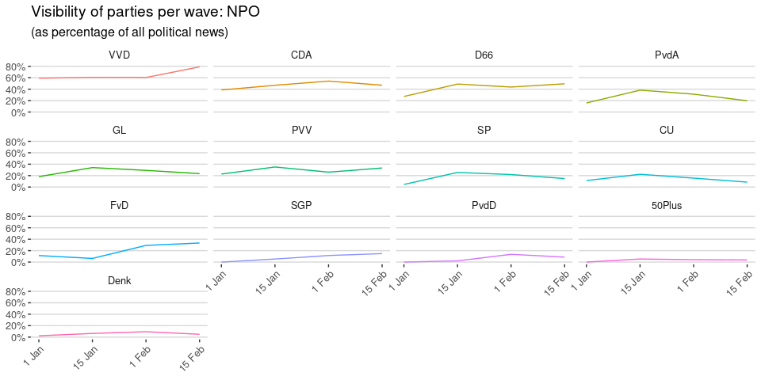

Visibility of parties
=====================

No large shifts in visibility in the newspapers. VVD and coalition
parties VDA and D66 are most visible. Groenlinks, SP, and FvD are
increasing in visibility, while PvdA remains mostly constant.

On television (subtitles of NPO news and current affairs shows) we see
the same overall pattern, but while D66 and VVD make gains, PvdA,
GroenLinks, SP and CU all lose visibility. In contrast, PVV and
especially FvD gain visibility.

Here we do see a clear shift, with D66 even overtaking VVD and CDA,
while the other leftist parties lose some of their gains. PVV and the
Smaller parties get more visibility, but GL, and FvD actually become
less visible.

Visibility and engagement on social media
-----------------------------------------

These two graphs show a very clear picture: although all parties are
active on social media, FvD wins hands down in terms of their activity,
and FvD and PVV are the only parties with substantial engagement on
social media (likes, shares, mentions)

Does the voter take notice?
===========================

\[TODO\]

The Undecided Voter
===================

The number of undecided voters (and non-voters) is becoming smaller as
the election draws near:

<table>
<thead>
<tr class="header">
<th style="text-align: left;">name</th>
<th style="text-align: right;">January</th>
<th style="text-align: right;">Early February</th>
<th style="text-align: right;">Late February</th>
</tr>
</thead>
<tbody>
<tr class="odd">
<td style="text-align: left;">Not</td>
<td style="text-align: right;">1.8</td>
<td style="text-align: right;">1.7</td>
<td style="text-align: right;">1.3</td>
</tr>
<tr class="even">
<td style="text-align: left;">Undecided</td>
<td style="text-align: right;">24.4</td>
<td style="text-align: right;">17.0</td>
<td style="text-align: right;">14.2</td>
</tr>
</tbody>
</table>

Media use of undecided voters
-----------------------------

Last month, we saw that undecided voters were on average less interested
in news and politics. If we look at the group of voters that were
undecided at the start of the campaign, how did their media use change?

\[Download data: `export_data(d, "Media use of (un)decided voters")`\]

These results are quite striking: much more than the voters that had
already made up their mind, these undecided voters started consuming
more media, both newspapers and TV, and at the end of February even
consume more news.

Who are the undecided voters?
-----------------------------

As undecided voters make up their mind, and other voters start doubting
their choices, the group of undecided voters changes. Let’s look at some
of the demographics:

### Education of undecided voters per wave

<table>
<thead>
<tr class="header">
<th style="text-align: left;">education</th>
<th style="text-align: right;">w0</th>
<th style="text-align: right;">w1</th>
<th style="text-align: right;">w2</th>
</tr>
</thead>
<tbody>
<tr class="odd">
<td style="text-align: left;">High</td>
<td style="text-align: right;">36</td>
<td style="text-align: right;">35</td>
<td style="text-align: right;">35</td>
</tr>
<tr class="even">
<td style="text-align: left;">Medium</td>
<td style="text-align: right;">43</td>
<td style="text-align: right;">38</td>
<td style="text-align: right;">39</td>
</tr>
<tr class="odd">
<td style="text-align: left;">Low</td>
<td style="text-align: right;">21</td>
<td style="text-align: right;">27</td>
<td style="text-align: right;">26</td>
</tr>
</tbody>
</table>

A small shift from medium to lower education.

### Age of undecided voters per wave

<table>
<thead>
<tr class="header">
<th style="text-align: left;">age</th>
<th style="text-align: right;">w0</th>
<th style="text-align: right;">w1</th>
<th style="text-align: right;">w2</th>
</tr>
</thead>
<tbody>
<tr class="odd">
<td style="text-align: left;">&lt;24</td>
<td style="text-align: right;">21</td>
<td style="text-align: right;">11</td>
<td style="text-align: right;">8.8</td>
</tr>
<tr class="even">
<td style="text-align: left;">25-34</td>
<td style="text-align: right;">13</td>
<td style="text-align: right;">18</td>
<td style="text-align: right;">18.2</td>
</tr>
<tr class="odd">
<td style="text-align: left;">35-44</td>
<td style="text-align: right;">18</td>
<td style="text-align: right;">15</td>
<td style="text-align: right;">14.4</td>
</tr>
<tr class="even">
<td style="text-align: left;">45-54</td>
<td style="text-align: right;">17</td>
<td style="text-align: right;">18</td>
<td style="text-align: right;">15.5</td>
</tr>
<tr class="odd">
<td style="text-align: left;">55-64</td>
<td style="text-align: right;">15</td>
<td style="text-align: right;">15</td>
<td style="text-align: right;">17.7</td>
</tr>
<tr class="even">
<td style="text-align: left;">&gt;64</td>
<td style="text-align: right;">16</td>
<td style="text-align: right;">23</td>
<td style="text-align: right;">25.4</td>
</tr>
</tbody>
</table>

Here is a clear shift: where the undecided voters at the start of the
campaign were relatively young, by late February the group is older,
with almost a quarter being 65 or older and much fewer being younger
than 25.

### Other demographics of undecided voters per wave

<table>
<thead>
<tr class="header">
<th style="text-align: left;">Measure</th>
<th style="text-align: right;">w0</th>
<th style="text-align: right;">w1</th>
<th style="text-align: right;">w2</th>
</tr>
</thead>
<tbody>
<tr class="odd">
<td style="text-align: left;">rile_self</td>
<td style="text-align: right;">5.06</td>
<td style="text-align: right;">5.23</td>
<td style="text-align: right;">5.32</td>
</tr>
<tr class="even">
<td style="text-align: left;">polknow</td>
<td style="text-align: right;">5.73</td>
<td style="text-align: right;">6.98</td>
<td style="text-align: right;">7.00</td>
</tr>
<tr class="odd">
<td style="text-align: left;">education</td>
<td style="text-align: right;">0.14</td>
<td style="text-align: right;">0.08</td>
<td style="text-align: right;">0.09</td>
</tr>
<tr class="even">
<td style="text-align: left;">age</td>
<td style="text-align: right;">3.40</td>
<td style="text-align: right;">3.76</td>
<td style="text-align: right;">3.91</td>
</tr>
</tbody>
</table>

The top rows shows the self-placement on a left-right scale, which shows
that the group of undecided voters has shifted mostly towards the mean
of left-right placement of 5.4. Interestingly, even though the group has
a lower overall education, they score better on political knowledge,
probably as a result of being older.

(The bottom rows show education and age as a numeric value, mirroring
the shift towards an older and slightly less educated group of voters. )

Where do undecided voters go to?
--------------------------------

<table>
<thead>
<tr class="header">
<th style="text-align: left;">wave</th>
<th style="text-align: right;">iisID</th>
<th style="text-align: left;">name</th>
</tr>
</thead>
<tbody>
<tr class="odd">
<td style="text-align: left;">w0</td>
<td style="text-align: right;">109</td>
<td style="text-align: left;">Undecided</td>
</tr>
<tr class="even">
<td style="text-align: left;">w0</td>
<td style="text-align: right;">374</td>
<td style="text-align: left;">Undecided</td>
</tr>
<tr class="odd">
<td style="text-align: left;">w0</td>
<td style="text-align: right;">1198</td>
<td style="text-align: left;">Undecided</td>
</tr>
<tr class="even">
<td style="text-align: left;">w0</td>
<td style="text-align: right;">1326</td>
<td style="text-align: left;">Undecided</td>
</tr>
<tr class="odd">
<td style="text-align: left;">w0</td>
<td style="text-align: right;">544</td>
<td style="text-align: left;">Undecided</td>
</tr>
<tr class="even">
<td style="text-align: left;">w0</td>
<td style="text-align: right;">349</td>
<td style="text-align: left;">Undecided</td>
</tr>
<tr class="odd">
<td style="text-align: left;">w0</td>
<td style="text-align: right;">484</td>
<td style="text-align: left;">Undecided</td>
</tr>
<tr class="even">
<td style="text-align: left;">w0</td>
<td style="text-align: right;">1185</td>
<td style="text-align: left;">Undecided</td>
</tr>
<tr class="odd">
<td style="text-align: left;">w0</td>
<td style="text-align: right;">1496</td>
<td style="text-align: left;">Undecided</td>
</tr>
<tr class="even">
<td style="text-align: left;">w0</td>
<td style="text-align: right;">1196</td>
<td style="text-align: left;">Undecided</td>
</tr>
<tr class="odd">
<td style="text-align: left;">w0</td>
<td style="text-align: right;">1306</td>
<td style="text-align: left;">Undecided</td>
</tr>
<tr class="even">
<td style="text-align: left;">w0</td>
<td style="text-align: right;">1295</td>
<td style="text-align: left;">Undecided</td>
</tr>
<tr class="odd">
<td style="text-align: left;">w0</td>
<td style="text-align: right;">1445</td>
<td style="text-align: left;">Undecided</td>
</tr>
<tr class="even">
<td style="text-align: left;">w0</td>
<td style="text-align: right;">565</td>
<td style="text-align: left;">Undecided</td>
</tr>
<tr class="odd">
<td style="text-align: left;">w0</td>
<td style="text-align: right;">793</td>
<td style="text-align: left;">Undecided</td>
</tr>
<tr class="even">
<td style="text-align: left;">w0</td>
<td style="text-align: right;">589</td>
<td style="text-align: left;">Undecided</td>
</tr>
<tr class="odd">
<td style="text-align: left;">w0</td>
<td style="text-align: right;">605</td>
<td style="text-align: left;">Undecided</td>
</tr>
<tr class="even">
<td style="text-align: left;">w0</td>
<td style="text-align: right;">570</td>
<td style="text-align: left;">Undecided</td>
</tr>
<tr class="odd">
<td style="text-align: left;">w0</td>
<td style="text-align: right;">657</td>
<td style="text-align: left;">Undecided</td>
</tr>
<tr class="even">
<td style="text-align: left;">w0</td>
<td style="text-align: right;">1488</td>
<td style="text-align: left;">Undecided</td>
</tr>
<tr class="odd">
<td style="text-align: left;">w0</td>
<td style="text-align: right;">1466</td>
<td style="text-align: left;">Undecided</td>
</tr>
<tr class="even">
<td style="text-align: left;">w0</td>
<td style="text-align: right;">1010</td>
<td style="text-align: left;">Undecided</td>
</tr>
<tr class="odd">
<td style="text-align: left;">w0</td>
<td style="text-align: right;">966</td>
<td style="text-align: left;">Undecided</td>
</tr>
<tr class="even">
<td style="text-align: left;">w0</td>
<td style="text-align: right;">737</td>
<td style="text-align: left;">Undecided</td>
</tr>
<tr class="odd">
<td style="text-align: left;">w0</td>
<td style="text-align: right;">740</td>
<td style="text-align: left;">Undecided</td>
</tr>
<tr class="even">
<td style="text-align: left;">w0</td>
<td style="text-align: right;">1060</td>
<td style="text-align: left;">Undecided</td>
</tr>
<tr class="odd">
<td style="text-align: left;">w0</td>
<td style="text-align: right;">1521</td>
<td style="text-align: left;">Undecided</td>
</tr>
<tr class="even">
<td style="text-align: left;">w0</td>
<td style="text-align: right;">1455</td>
<td style="text-align: left;">Undecided</td>
</tr>
<tr class="odd">
<td style="text-align: left;">w0</td>
<td style="text-align: right;">1438</td>
<td style="text-align: left;">Undecided</td>
</tr>
<tr class="even">
<td style="text-align: left;">w0</td>
<td style="text-align: right;">1096</td>
<td style="text-align: left;">Undecided</td>
</tr>
<tr class="odd">
<td style="text-align: left;">w0</td>
<td style="text-align: right;">1043</td>
<td style="text-align: left;">Undecided</td>
</tr>
<tr class="even">
<td style="text-align: left;">w0</td>
<td style="text-align: right;">1451</td>
<td style="text-align: left;">Undecided</td>
</tr>
<tr class="odd">
<td style="text-align: left;">w0</td>
<td style="text-align: right;">934</td>
<td style="text-align: left;">Undecided</td>
</tr>
<tr class="even">
<td style="text-align: left;">w0</td>
<td style="text-align: right;">915</td>
<td style="text-align: left;">Undecided</td>
</tr>
<tr class="odd">
<td style="text-align: left;">w0</td>
<td style="text-align: right;">963</td>
<td style="text-align: left;">Undecided</td>
</tr>
<tr class="even">
<td style="text-align: left;">w0</td>
<td style="text-align: right;">1080</td>
<td style="text-align: left;">Undecided</td>
</tr>
<tr class="odd">
<td style="text-align: left;">w0</td>
<td style="text-align: right;">767</td>
<td style="text-align: left;">Undecided</td>
</tr>
<tr class="even">
<td style="text-align: left;">w0</td>
<td style="text-align: right;">579</td>
<td style="text-align: left;">Undecided</td>
</tr>
<tr class="odd">
<td style="text-align: left;">w0</td>
<td style="text-align: right;">342</td>
<td style="text-align: left;">Undecided</td>
</tr>
<tr class="even">
<td style="text-align: left;">w0</td>
<td style="text-align: right;">720</td>
<td style="text-align: left;">Undecided</td>
</tr>
<tr class="odd">
<td style="text-align: left;">w0</td>
<td style="text-align: right;">1404</td>
<td style="text-align: left;">Undecided</td>
</tr>
<tr class="even">
<td style="text-align: left;">w0</td>
<td style="text-align: right;">1382</td>
<td style="text-align: left;">Undecided</td>
</tr>
<tr class="odd">
<td style="text-align: left;">w0</td>
<td style="text-align: right;">2295</td>
<td style="text-align: left;">Undecided</td>
</tr>
<tr class="even">
<td style="text-align: left;">w0</td>
<td style="text-align: right;">2215</td>
<td style="text-align: left;">Undecided</td>
</tr>
<tr class="odd">
<td style="text-align: left;">w0</td>
<td style="text-align: right;">749</td>
<td style="text-align: left;">Undecided</td>
</tr>
<tr class="even">
<td style="text-align: left;">w0</td>
<td style="text-align: right;">2231</td>
<td style="text-align: left;">Undecided</td>
</tr>
<tr class="odd">
<td style="text-align: left;">w0</td>
<td style="text-align: right;">1337</td>
<td style="text-align: left;">Undecided</td>
</tr>
<tr class="even">
<td style="text-align: left;">w0</td>
<td style="text-align: right;">2221</td>
<td style="text-align: left;">Undecided</td>
</tr>
<tr class="odd">
<td style="text-align: left;">w0</td>
<td style="text-align: right;">2312</td>
<td style="text-align: left;">Undecided</td>
</tr>
<tr class="even">
<td style="text-align: left;">w0</td>
<td style="text-align: right;">1340</td>
<td style="text-align: left;">Undecided</td>
</tr>
<tr class="odd">
<td style="text-align: left;">w0</td>
<td style="text-align: right;">1551</td>
<td style="text-align: left;">Undecided</td>
</tr>
<tr class="even">
<td style="text-align: left;">w0</td>
<td style="text-align: right;">1576</td>
<td style="text-align: left;">Undecided</td>
</tr>
<tr class="odd">
<td style="text-align: left;">w0</td>
<td style="text-align: right;">285</td>
<td style="text-align: left;">Undecided</td>
</tr>
<tr class="even">
<td style="text-align: left;">w0</td>
<td style="text-align: right;">642</td>
<td style="text-align: left;">Undecided</td>
</tr>
<tr class="odd">
<td style="text-align: left;">w0</td>
<td style="text-align: right;">1568</td>
<td style="text-align: left;">Undecided</td>
</tr>
<tr class="even">
<td style="text-align: left;">w0</td>
<td style="text-align: right;">2232</td>
<td style="text-align: left;">Undecided</td>
</tr>
<tr class="odd">
<td style="text-align: left;">w0</td>
<td style="text-align: right;">666</td>
<td style="text-align: left;">Undecided</td>
</tr>
<tr class="even">
<td style="text-align: left;">w0</td>
<td style="text-align: right;">347</td>
<td style="text-align: left;">Undecided</td>
</tr>
<tr class="odd">
<td style="text-align: left;">w0</td>
<td style="text-align: right;">85</td>
<td style="text-align: left;">Undecided</td>
</tr>
<tr class="even">
<td style="text-align: left;">w0</td>
<td style="text-align: right;">1590</td>
<td style="text-align: left;">Undecided</td>
</tr>
<tr class="odd">
<td style="text-align: left;">w0</td>
<td style="text-align: right;">1575</td>
<td style="text-align: left;">Undecided</td>
</tr>
<tr class="even">
<td style="text-align: left;">w0</td>
<td style="text-align: right;">367</td>
<td style="text-align: left;">Undecided</td>
</tr>
<tr class="odd">
<td style="text-align: left;">w0</td>
<td style="text-align: right;">112</td>
<td style="text-align: left;">Undecided</td>
</tr>
<tr class="even">
<td style="text-align: left;">w0</td>
<td style="text-align: right;">46</td>
<td style="text-align: left;">Undecided</td>
</tr>
<tr class="odd">
<td style="text-align: left;">w0</td>
<td style="text-align: right;">179</td>
<td style="text-align: left;">Undecided</td>
</tr>
<tr class="even">
<td style="text-align: left;">w0</td>
<td style="text-align: right;">323</td>
<td style="text-align: left;">Undecided</td>
</tr>
<tr class="odd">
<td style="text-align: left;">w0</td>
<td style="text-align: right;">836</td>
<td style="text-align: left;">Undecided</td>
</tr>
<tr class="even">
<td style="text-align: left;">w0</td>
<td style="text-align: right;">1578</td>
<td style="text-align: left;">Undecided</td>
</tr>
<tr class="odd">
<td style="text-align: left;">w0</td>
<td style="text-align: right;">961</td>
<td style="text-align: left;">Undecided</td>
</tr>
<tr class="even">
<td style="text-align: left;">w0</td>
<td style="text-align: right;">596</td>
<td style="text-align: left;">Undecided</td>
</tr>
<tr class="odd">
<td style="text-align: left;">w0</td>
<td style="text-align: right;">2243</td>
<td style="text-align: left;">Undecided</td>
</tr>
<tr class="even">
<td style="text-align: left;">w0</td>
<td style="text-align: right;">2324</td>
<td style="text-align: left;">Undecided</td>
</tr>
<tr class="odd">
<td style="text-align: left;">w0</td>
<td style="text-align: right;">650</td>
<td style="text-align: left;">Undecided</td>
</tr>
<tr class="even">
<td style="text-align: left;">w0</td>
<td style="text-align: right;">1115</td>
<td style="text-align: left;">Undecided</td>
</tr>
<tr class="odd">
<td style="text-align: left;">w0</td>
<td style="text-align: right;">229</td>
<td style="text-align: left;">Undecided</td>
</tr>
<tr class="even">
<td style="text-align: left;">w0</td>
<td style="text-align: right;">2322</td>
<td style="text-align: left;">Undecided</td>
</tr>
<tr class="odd">
<td style="text-align: left;">w0</td>
<td style="text-align: right;">1477</td>
<td style="text-align: left;">Undecided</td>
</tr>
<tr class="even">
<td style="text-align: left;">w0</td>
<td style="text-align: right;">1430</td>
<td style="text-align: left;">Undecided</td>
</tr>
<tr class="odd">
<td style="text-align: left;">w0</td>
<td style="text-align: right;">688</td>
<td style="text-align: left;">Undecided</td>
</tr>
<tr class="even">
<td style="text-align: left;">w0</td>
<td style="text-align: right;">2332</td>
<td style="text-align: left;">Undecided</td>
</tr>
<tr class="odd">
<td style="text-align: left;">w0</td>
<td style="text-align: right;">1197</td>
<td style="text-align: left;">Undecided</td>
</tr>
<tr class="even">
<td style="text-align: left;">w0</td>
<td style="text-align: right;">2250</td>
<td style="text-align: left;">Undecided</td>
</tr>
<tr class="odd">
<td style="text-align: left;">w0</td>
<td style="text-align: right;">2333</td>
<td style="text-align: left;">Undecided</td>
</tr>
<tr class="even">
<td style="text-align: left;">w0</td>
<td style="text-align: right;">2251</td>
<td style="text-align: left;">Undecided</td>
</tr>
<tr class="odd">
<td style="text-align: left;">w0</td>
<td style="text-align: right;">1609</td>
<td style="text-align: left;">Undecided</td>
</tr>
<tr class="even">
<td style="text-align: left;">w0</td>
<td style="text-align: right;">151</td>
<td style="text-align: left;">Undecided</td>
</tr>
<tr class="odd">
<td style="text-align: left;">w0</td>
<td style="text-align: right;">2253</td>
<td style="text-align: left;">Undecided</td>
</tr>
<tr class="even">
<td style="text-align: left;">w0</td>
<td style="text-align: right;">715</td>
<td style="text-align: left;">Undecided</td>
</tr>
<tr class="odd">
<td style="text-align: left;">w0</td>
<td style="text-align: right;">916</td>
<td style="text-align: left;">Undecided</td>
</tr>
<tr class="even">
<td style="text-align: left;">w0</td>
<td style="text-align: right;">736</td>
<td style="text-align: left;">Undecided</td>
</tr>
<tr class="odd">
<td style="text-align: left;">w0</td>
<td style="text-align: right;">909</td>
<td style="text-align: left;">Undecided</td>
</tr>
<tr class="even">
<td style="text-align: left;">w0</td>
<td style="text-align: right;">521</td>
<td style="text-align: left;">Undecided</td>
</tr>
<tr class="odd">
<td style="text-align: left;">w0</td>
<td style="text-align: right;">1322</td>
<td style="text-align: left;">Undecided</td>
</tr>
<tr class="even">
<td style="text-align: left;">w0</td>
<td style="text-align: right;">1072</td>
<td style="text-align: left;">Undecided</td>
</tr>
<tr class="odd">
<td style="text-align: left;">w0</td>
<td style="text-align: right;">1049</td>
<td style="text-align: left;">Undecided</td>
</tr>
<tr class="even">
<td style="text-align: left;">w0</td>
<td style="text-align: right;">758</td>
<td style="text-align: left;">Undecided</td>
</tr>
<tr class="odd">
<td style="text-align: left;">w0</td>
<td style="text-align: right;">1311</td>
<td style="text-align: left;">Undecided</td>
</tr>
<tr class="even">
<td style="text-align: left;">w0</td>
<td style="text-align: right;">780</td>
<td style="text-align: left;">Undecided</td>
</tr>
<tr class="odd">
<td style="text-align: left;">w0</td>
<td style="text-align: right;">1126</td>
<td style="text-align: left;">Undecided</td>
</tr>
<tr class="even">
<td style="text-align: left;">w0</td>
<td style="text-align: right;">912</td>
<td style="text-align: left;">Undecided</td>
</tr>
<tr class="odd">
<td style="text-align: left;">w0</td>
<td style="text-align: right;">783</td>
<td style="text-align: left;">Undecided</td>
</tr>
<tr class="even">
<td style="text-align: left;">w0</td>
<td style="text-align: right;">746</td>
<td style="text-align: left;">Undecided</td>
</tr>
<tr class="odd">
<td style="text-align: left;">w0</td>
<td style="text-align: right;">846</td>
<td style="text-align: left;">Undecided</td>
</tr>
<tr class="even">
<td style="text-align: left;">w0</td>
<td style="text-align: right;">2272</td>
<td style="text-align: left;">Undecided</td>
</tr>
<tr class="odd">
<td style="text-align: left;">w0</td>
<td style="text-align: right;">135</td>
<td style="text-align: left;">Undecided</td>
</tr>
<tr class="even">
<td style="text-align: left;">w0</td>
<td style="text-align: right;">709</td>
<td style="text-align: left;">Undecided</td>
</tr>
<tr class="odd">
<td style="text-align: left;">w0</td>
<td style="text-align: right;">2273</td>
<td style="text-align: left;">Undecided</td>
</tr>
<tr class="even">
<td style="text-align: left;">w0</td>
<td style="text-align: right;">576</td>
<td style="text-align: left;">Undecided</td>
</tr>
<tr class="odd">
<td style="text-align: left;">w0</td>
<td style="text-align: right;">1165</td>
<td style="text-align: left;">Undecided</td>
</tr>
<tr class="even">
<td style="text-align: left;">w0</td>
<td style="text-align: right;">53</td>
<td style="text-align: left;">Undecided</td>
</tr>
<tr class="odd">
<td style="text-align: left;">w0</td>
<td style="text-align: right;">2347</td>
<td style="text-align: left;">Undecided</td>
</tr>
<tr class="even">
<td style="text-align: left;">w0</td>
<td style="text-align: right;">1351</td>
<td style="text-align: left;">Undecided</td>
</tr>
<tr class="odd">
<td style="text-align: left;">w0</td>
<td style="text-align: right;">1564</td>
<td style="text-align: left;">Undecided</td>
</tr>
<tr class="even">
<td style="text-align: left;">w0</td>
<td style="text-align: right;">1603</td>
<td style="text-align: left;">Undecided</td>
</tr>
<tr class="odd">
<td style="text-align: left;">w0</td>
<td style="text-align: right;">1030</td>
<td style="text-align: left;">Undecided</td>
</tr>
<tr class="even">
<td style="text-align: left;">w0</td>
<td style="text-align: right;">290</td>
<td style="text-align: left;">Undecided</td>
</tr>
<tr class="odd">
<td style="text-align: left;">w0</td>
<td style="text-align: right;">1544</td>
<td style="text-align: left;">Undecided</td>
</tr>
<tr class="even">
<td style="text-align: left;">w0</td>
<td style="text-align: right;">381</td>
<td style="text-align: left;">Undecided</td>
</tr>
<tr class="odd">
<td style="text-align: left;">w0</td>
<td style="text-align: right;">769</td>
<td style="text-align: left;">Undecided</td>
</tr>
<tr class="even">
<td style="text-align: left;">w0</td>
<td style="text-align: right;">1561</td>
<td style="text-align: left;">Undecided</td>
</tr>
<tr class="odd">
<td style="text-align: left;">w0</td>
<td style="text-align: right;">233</td>
<td style="text-align: left;">Undecided</td>
</tr>
<tr class="even">
<td style="text-align: left;">w0</td>
<td style="text-align: right;">885</td>
<td style="text-align: left;">Undecided</td>
</tr>
<tr class="odd">
<td style="text-align: left;">w0</td>
<td style="text-align: right;">1591</td>
<td style="text-align: left;">Undecided</td>
</tr>
<tr class="even">
<td style="text-align: left;">w0</td>
<td style="text-align: right;">238</td>
<td style="text-align: left;">Undecided</td>
</tr>
<tr class="odd">
<td style="text-align: left;">w0</td>
<td style="text-align: right;">801</td>
<td style="text-align: left;">Undecided</td>
</tr>
<tr class="even">
<td style="text-align: left;">w0</td>
<td style="text-align: right;">1211</td>
<td style="text-align: left;">Undecided</td>
</tr>
<tr class="odd">
<td style="text-align: left;">w0</td>
<td style="text-align: right;">28</td>
<td style="text-align: left;">Undecided</td>
</tr>
<tr class="even">
<td style="text-align: left;">w0</td>
<td style="text-align: right;">2290</td>
<td style="text-align: left;">Undecided</td>
</tr>
<tr class="odd">
<td style="text-align: left;">w0</td>
<td style="text-align: right;">2087</td>
<td style="text-align: left;">Undecided</td>
</tr>
<tr class="even">
<td style="text-align: left;">w0</td>
<td style="text-align: right;">344</td>
<td style="text-align: left;">Undecided</td>
</tr>
<tr class="odd">
<td style="text-align: left;">w0</td>
<td style="text-align: right;">1965</td>
<td style="text-align: left;">Undecided</td>
</tr>
<tr class="even">
<td style="text-align: left;">w0</td>
<td style="text-align: right;">1435</td>
<td style="text-align: left;">Undecided</td>
</tr>
<tr class="odd">
<td style="text-align: left;">w0</td>
<td style="text-align: right;">1830</td>
<td style="text-align: left;">Undecided</td>
</tr>
<tr class="even">
<td style="text-align: left;">w0</td>
<td style="text-align: right;">623</td>
<td style="text-align: left;">Undecided</td>
</tr>
<tr class="odd">
<td style="text-align: left;">w0</td>
<td style="text-align: right;">1763</td>
<td style="text-align: left;">Undecided</td>
</tr>
<tr class="even">
<td style="text-align: left;">w0</td>
<td style="text-align: right;">1967</td>
<td style="text-align: left;">Undecided</td>
</tr>
<tr class="odd">
<td style="text-align: left;">w0</td>
<td style="text-align: right;">1588</td>
<td style="text-align: left;">Undecided</td>
</tr>
<tr class="even">
<td style="text-align: left;">w0</td>
<td style="text-align: right;">1259</td>
<td style="text-align: left;">Undecided</td>
</tr>
<tr class="odd">
<td style="text-align: left;">w0</td>
<td style="text-align: right;">1572</td>
<td style="text-align: left;">Undecided</td>
</tr>
<tr class="even">
<td style="text-align: left;">w0</td>
<td style="text-align: right;">1702</td>
<td style="text-align: left;">Undecided</td>
</tr>
<tr class="odd">
<td style="text-align: left;">w0</td>
<td style="text-align: right;">1352</td>
<td style="text-align: left;">Undecided</td>
</tr>
<tr class="even">
<td style="text-align: left;">w0</td>
<td style="text-align: right;">853</td>
<td style="text-align: left;">Undecided</td>
</tr>
<tr class="odd">
<td style="text-align: left;">w0</td>
<td style="text-align: right;">1969</td>
<td style="text-align: left;">Undecided</td>
</tr>
<tr class="even">
<td style="text-align: left;">w0</td>
<td style="text-align: right;">1522</td>
<td style="text-align: left;">Undecided</td>
</tr>
<tr class="odd">
<td style="text-align: left;">w0</td>
<td style="text-align: right;">1209</td>
<td style="text-align: left;">Undecided</td>
</tr>
<tr class="even">
<td style="text-align: left;">w0</td>
<td style="text-align: right;">583</td>
<td style="text-align: left;">Undecided</td>
</tr>
<tr class="odd">
<td style="text-align: left;">w0</td>
<td style="text-align: right;">1144</td>
<td style="text-align: left;">Undecided</td>
</tr>
<tr class="even">
<td style="text-align: left;">w0</td>
<td style="text-align: right;">1330</td>
<td style="text-align: left;">Undecided</td>
</tr>
<tr class="odd">
<td style="text-align: left;">w0</td>
<td style="text-align: right;">1703</td>
<td style="text-align: left;">Undecided</td>
</tr>
<tr class="even">
<td style="text-align: left;">w0</td>
<td style="text-align: right;">1766</td>
<td style="text-align: left;">Undecided</td>
</tr>
<tr class="odd">
<td style="text-align: left;">w0</td>
<td style="text-align: right;">157</td>
<td style="text-align: left;">Undecided</td>
</tr>
<tr class="even">
<td style="text-align: left;">w0</td>
<td style="text-align: right;">959</td>
<td style="text-align: left;">Undecided</td>
</tr>
<tr class="odd">
<td style="text-align: left;">w0</td>
<td style="text-align: right;">495</td>
<td style="text-align: left;">Undecided</td>
</tr>
<tr class="even">
<td style="text-align: left;">w0</td>
<td style="text-align: right;">1006</td>
<td style="text-align: left;">Undecided</td>
</tr>
<tr class="odd">
<td style="text-align: left;">w0</td>
<td style="text-align: right;">43</td>
<td style="text-align: left;">Undecided</td>
</tr>
<tr class="even">
<td style="text-align: left;">w0</td>
<td style="text-align: right;">472</td>
<td style="text-align: left;">Undecided</td>
</tr>
<tr class="odd">
<td style="text-align: left;">w0</td>
<td style="text-align: right;">893</td>
<td style="text-align: left;">Undecided</td>
</tr>
<tr class="even">
<td style="text-align: left;">w0</td>
<td style="text-align: right;">1579</td>
<td style="text-align: left;">Undecided</td>
</tr>
<tr class="odd">
<td style="text-align: left;">w0</td>
<td style="text-align: right;">2147</td>
<td style="text-align: left;">Undecided</td>
</tr>
<tr class="even">
<td style="text-align: left;">w0</td>
<td style="text-align: right;">904</td>
<td style="text-align: left;">Undecided</td>
</tr>
<tr class="odd">
<td style="text-align: left;">w0</td>
<td style="text-align: right;">808</td>
<td style="text-align: left;">Undecided</td>
</tr>
<tr class="even">
<td style="text-align: left;">w0</td>
<td style="text-align: right;">1837</td>
<td style="text-align: left;">Undecided</td>
</tr>
<tr class="odd">
<td style="text-align: left;">w0</td>
<td style="text-align: right;">2038</td>
<td style="text-align: left;">Undecided</td>
</tr>
<tr class="even">
<td style="text-align: left;">w0</td>
<td style="text-align: right;">1976</td>
<td style="text-align: left;">Undecided</td>
</tr>
<tr class="odd">
<td style="text-align: left;">w0</td>
<td style="text-align: right;">1772</td>
<td style="text-align: left;">Undecided</td>
</tr>
<tr class="even">
<td style="text-align: left;">w0</td>
<td style="text-align: right;">1710</td>
<td style="text-align: left;">Undecided</td>
</tr>
<tr class="odd">
<td style="text-align: left;">w0</td>
<td style="text-align: right;">2099</td>
<td style="text-align: left;">Undecided</td>
</tr>
<tr class="even">
<td style="text-align: left;">w0</td>
<td style="text-align: right;">1448</td>
<td style="text-align: left;">Undecided</td>
</tr>
<tr class="odd">
<td style="text-align: left;">w0</td>
<td style="text-align: right;">1983</td>
<td style="text-align: left;">Undecided</td>
</tr>
<tr class="even">
<td style="text-align: left;">w0</td>
<td style="text-align: right;">1912</td>
<td style="text-align: left;">Undecided</td>
</tr>
<tr class="odd">
<td style="text-align: left;">w0</td>
<td style="text-align: right;">1842</td>
<td style="text-align: left;">Undecided</td>
</tr>
<tr class="even">
<td style="text-align: left;">w0</td>
<td style="text-align: right;">2254</td>
<td style="text-align: left;">Undecided</td>
</tr>
<tr class="odd">
<td style="text-align: left;">w0</td>
<td style="text-align: right;">2345</td>
<td style="text-align: left;">Undecided</td>
</tr>
<tr class="even">
<td style="text-align: left;">w0</td>
<td style="text-align: right;">2226</td>
<td style="text-align: left;">Undecided</td>
</tr>
<tr class="odd">
<td style="text-align: left;">w0</td>
<td style="text-align: right;">1717</td>
<td style="text-align: left;">Undecided</td>
</tr>
<tr class="even">
<td style="text-align: left;">w0</td>
<td style="text-align: right;">1777</td>
<td style="text-align: left;">Undecided</td>
</tr>
<tr class="odd">
<td style="text-align: left;">w0</td>
<td style="text-align: right;">2104</td>
<td style="text-align: left;">Undecided</td>
</tr>
<tr class="even">
<td style="text-align: left;">w0</td>
<td style="text-align: right;">1524</td>
<td style="text-align: left;">Undecided</td>
</tr>
<tr class="odd">
<td style="text-align: left;">w0</td>
<td style="text-align: right;">1097</td>
<td style="text-align: left;">Undecided</td>
</tr>
<tr class="even">
<td style="text-align: left;">w0</td>
<td style="text-align: right;">1084</td>
<td style="text-align: left;">Undecided</td>
</tr>
<tr class="odd">
<td style="text-align: left;">w0</td>
<td style="text-align: right;">249</td>
<td style="text-align: left;">Undecided</td>
</tr>
<tr class="even">
<td style="text-align: left;">w0</td>
<td style="text-align: right;">1920</td>
<td style="text-align: left;">Undecided</td>
</tr>
<tr class="odd">
<td style="text-align: left;">w0</td>
<td style="text-align: right;">2046</td>
<td style="text-align: left;">Undecided</td>
</tr>
<tr class="even">
<td style="text-align: left;">w0</td>
<td style="text-align: right;">1724</td>
<td style="text-align: left;">Undecided</td>
</tr>
<tr class="odd">
<td style="text-align: left;">w0</td>
<td style="text-align: right;">1781</td>
<td style="text-align: left;">Undecided</td>
</tr>
<tr class="even">
<td style="text-align: left;">w0</td>
<td style="text-align: right;">687</td>
<td style="text-align: left;">Undecided</td>
</tr>
<tr class="odd">
<td style="text-align: left;">w0</td>
<td style="text-align: right;">1489</td>
<td style="text-align: left;">Undecided</td>
</tr>
<tr class="even">
<td style="text-align: left;">w0</td>
<td style="text-align: right;">1725</td>
<td style="text-align: left;">Undecided</td>
</tr>
<tr class="odd">
<td style="text-align: left;">w0</td>
<td style="text-align: right;">324</td>
<td style="text-align: left;">Undecided</td>
</tr>
<tr class="even">
<td style="text-align: left;">w0</td>
<td style="text-align: right;">510</td>
<td style="text-align: left;">Undecided</td>
</tr>
<tr class="odd">
<td style="text-align: left;">w0</td>
<td style="text-align: right;">1004</td>
<td style="text-align: left;">Undecided</td>
</tr>
<tr class="even">
<td style="text-align: left;">w0</td>
<td style="text-align: right;">463</td>
<td style="text-align: left;">Undecided</td>
</tr>
<tr class="odd">
<td style="text-align: left;">w0</td>
<td style="text-align: right;">302</td>
<td style="text-align: left;">Undecided</td>
</tr>
<tr class="even">
<td style="text-align: left;">w0</td>
<td style="text-align: right;">2107</td>
<td style="text-align: left;">Undecided</td>
</tr>
<tr class="odd">
<td style="text-align: left;">w0</td>
<td style="text-align: right;">1784</td>
<td style="text-align: left;">Undecided</td>
</tr>
<tr class="even">
<td style="text-align: left;">w0</td>
<td style="text-align: right;">1148</td>
<td style="text-align: left;">Undecided</td>
</tr>
<tr class="odd">
<td style="text-align: left;">w0</td>
<td style="text-align: right;">1301</td>
<td style="text-align: left;">Undecided</td>
</tr>
<tr class="even">
<td style="text-align: left;">w0</td>
<td style="text-align: right;">1727</td>
<td style="text-align: left;">Undecided</td>
</tr>
<tr class="odd">
<td style="text-align: left;">w0</td>
<td style="text-align: right;">1995</td>
<td style="text-align: left;">Undecided</td>
</tr>
<tr class="even">
<td style="text-align: left;">w0</td>
<td style="text-align: right;">2341</td>
<td style="text-align: left;">Undecided</td>
</tr>
<tr class="odd">
<td style="text-align: left;">w0</td>
<td style="text-align: right;">616</td>
<td style="text-align: left;">Undecided</td>
</tr>
<tr class="even">
<td style="text-align: left;">w0</td>
<td style="text-align: right;">1335</td>
<td style="text-align: left;">Undecided</td>
</tr>
<tr class="odd">
<td style="text-align: left;">w0</td>
<td style="text-align: right;">2112</td>
<td style="text-align: left;">Undecided</td>
</tr>
<tr class="even">
<td style="text-align: left;">w0</td>
<td style="text-align: right;">149</td>
<td style="text-align: left;">Undecided</td>
</tr>
<tr class="odd">
<td style="text-align: left;">w0</td>
<td style="text-align: right;">67</td>
<td style="text-align: left;">Undecided</td>
</tr>
<tr class="even">
<td style="text-align: left;">w0</td>
<td style="text-align: right;">1854</td>
<td style="text-align: left;">Undecided</td>
</tr>
<tr class="odd">
<td style="text-align: left;">w0</td>
<td style="text-align: right;">1855</td>
<td style="text-align: left;">Undecided</td>
</tr>
<tr class="even">
<td style="text-align: left;">w0</td>
<td style="text-align: right;">910</td>
<td style="text-align: left;">Undecided</td>
</tr>
<tr class="odd">
<td style="text-align: left;">w0</td>
<td style="text-align: right;">1857</td>
<td style="text-align: left;">Undecided</td>
</tr>
<tr class="even">
<td style="text-align: left;">w0</td>
<td style="text-align: right;">1174</td>
<td style="text-align: left;">Undecided</td>
</tr>
<tr class="odd">
<td style="text-align: left;">w0</td>
<td style="text-align: right;">2172</td>
<td style="text-align: left;">Undecided</td>
</tr>
<tr class="even">
<td style="text-align: left;">w0</td>
<td style="text-align: right;">792</td>
<td style="text-align: left;">Undecided</td>
</tr>
<tr class="odd">
<td style="text-align: left;">w0</td>
<td style="text-align: right;">483</td>
<td style="text-align: left;">Undecided</td>
</tr>
<tr class="even">
<td style="text-align: left;">w0</td>
<td style="text-align: right;">2002</td>
<td style="text-align: left;">Undecided</td>
</tr>
<tr class="odd">
<td style="text-align: left;">w0</td>
<td style="text-align: right;">667</td>
<td style="text-align: left;">Undecided</td>
</tr>
<tr class="even">
<td style="text-align: left;">w0</td>
<td style="text-align: right;">2256</td>
<td style="text-align: left;">Undecided</td>
</tr>
<tr class="odd">
<td style="text-align: left;">w0</td>
<td style="text-align: right;">1794</td>
<td style="text-align: left;">Undecided</td>
</tr>
<tr class="even">
<td style="text-align: left;">w0</td>
<td style="text-align: right;">2050</td>
<td style="text-align: left;">Undecided</td>
</tr>
<tr class="odd">
<td style="text-align: left;">w0</td>
<td style="text-align: right;">2108</td>
<td style="text-align: left;">Undecided</td>
</tr>
<tr class="even">
<td style="text-align: left;">w0</td>
<td style="text-align: right;">1491</td>
<td style="text-align: left;">Undecided</td>
</tr>
<tr class="odd">
<td style="text-align: left;">w0</td>
<td style="text-align: right;">278</td>
<td style="text-align: left;">Undecided</td>
</tr>
<tr class="even">
<td style="text-align: left;">w0</td>
<td style="text-align: right;">2118</td>
<td style="text-align: left;">Undecided</td>
</tr>
<tr class="odd">
<td style="text-align: left;">w0</td>
<td style="text-align: right;">1928</td>
<td style="text-align: left;">Undecided</td>
</tr>
<tr class="even">
<td style="text-align: left;">w0</td>
<td style="text-align: right;">1916</td>
<td style="text-align: left;">Undecided</td>
</tr>
<tr class="odd">
<td style="text-align: left;">w0</td>
<td style="text-align: right;">2285</td>
<td style="text-align: left;">Undecided</td>
</tr>
<tr class="even">
<td style="text-align: left;">w0</td>
<td style="text-align: right;">2003</td>
<td style="text-align: left;">Undecided</td>
</tr>
<tr class="odd">
<td style="text-align: left;">w0</td>
<td style="text-align: right;">471</td>
<td style="text-align: left;">Undecided</td>
</tr>
<tr class="even">
<td style="text-align: left;">w0</td>
<td style="text-align: right;">575</td>
<td style="text-align: left;">Undecided</td>
</tr>
<tr class="odd">
<td style="text-align: left;">w0</td>
<td style="text-align: right;">1860</td>
<td style="text-align: left;">Undecided</td>
</tr>
<tr class="even">
<td style="text-align: left;">w0</td>
<td style="text-align: right;">1478</td>
<td style="text-align: left;">Undecided</td>
</tr>
<tr class="odd">
<td style="text-align: left;">w0</td>
<td style="text-align: right;">223</td>
<td style="text-align: left;">Undecided</td>
</tr>
<tr class="even">
<td style="text-align: left;">w0</td>
<td style="text-align: right;">1932</td>
<td style="text-align: left;">Undecided</td>
</tr>
<tr class="odd">
<td style="text-align: left;">w0</td>
<td style="text-align: right;">2177</td>
<td style="text-align: left;">Undecided</td>
</tr>
<tr class="even">
<td style="text-align: left;">w0</td>
<td style="text-align: right;">577</td>
<td style="text-align: left;">Undecided</td>
</tr>
<tr class="odd">
<td style="text-align: left;">w0</td>
<td style="text-align: right;">392</td>
<td style="text-align: left;">Undecided</td>
</tr>
<tr class="even">
<td style="text-align: left;">w0</td>
<td style="text-align: right;">1</td>
<td style="text-align: left;">Undecided</td>
</tr>
<tr class="odd">
<td style="text-align: left;">w0</td>
<td style="text-align: right;">414</td>
<td style="text-align: left;">Undecided</td>
</tr>
<tr class="even">
<td style="text-align: left;">w0</td>
<td style="text-align: right;">2005</td>
<td style="text-align: left;">Undecided</td>
</tr>
<tr class="odd">
<td style="text-align: left;">w0</td>
<td style="text-align: right;">563</td>
<td style="text-align: left;">Undecided</td>
</tr>
<tr class="even">
<td style="text-align: left;">w0</td>
<td style="text-align: right;">819</td>
<td style="text-align: left;">Undecided</td>
</tr>
<tr class="odd">
<td style="text-align: left;">w0</td>
<td style="text-align: right;">1936</td>
<td style="text-align: left;">Undecided</td>
</tr>
<tr class="even">
<td style="text-align: left;">w0</td>
<td style="text-align: right;">2059</td>
<td style="text-align: left;">Undecided</td>
</tr>
<tr class="odd">
<td style="text-align: left;">w0</td>
<td style="text-align: right;">2123</td>
<td style="text-align: left;">Undecided</td>
</tr>
<tr class="even">
<td style="text-align: left;">w0</td>
<td style="text-align: right;">1044</td>
<td style="text-align: left;">Undecided</td>
</tr>
<tr class="odd">
<td style="text-align: left;">w0</td>
<td style="text-align: right;">1180</td>
<td style="text-align: left;">Undecided</td>
</tr>
<tr class="even">
<td style="text-align: left;">w0</td>
<td style="text-align: right;">2051</td>
<td style="text-align: left;">Undecided</td>
</tr>
<tr class="odd">
<td style="text-align: left;">w0</td>
<td style="text-align: right;">245</td>
<td style="text-align: left;">Undecided</td>
</tr>
<tr class="even">
<td style="text-align: left;">w0</td>
<td style="text-align: right;">1571</td>
<td style="text-align: left;">Undecided</td>
</tr>
<tr class="odd">
<td style="text-align: left;">w0</td>
<td style="text-align: right;">1323</td>
<td style="text-align: left;">Undecided</td>
</tr>
<tr class="even">
<td style="text-align: left;">w0</td>
<td style="text-align: right;">1274</td>
<td style="text-align: left;">Undecided</td>
</tr>
<tr class="odd">
<td style="text-align: left;">w0</td>
<td style="text-align: right;">1804</td>
<td style="text-align: left;">Undecided</td>
</tr>
<tr class="even">
<td style="text-align: left;">w0</td>
<td style="text-align: right;">1940</td>
<td style="text-align: left;">Undecided</td>
</tr>
<tr class="odd">
<td style="text-align: left;">w0</td>
<td style="text-align: right;">2182</td>
<td style="text-align: left;">Undecided</td>
</tr>
<tr class="even">
<td style="text-align: left;">w0</td>
<td style="text-align: right;">254</td>
<td style="text-align: left;">Undecided</td>
</tr>
<tr class="odd">
<td style="text-align: left;">w0</td>
<td style="text-align: right;">2032</td>
<td style="text-align: left;">Undecided</td>
</tr>
<tr class="even">
<td style="text-align: left;">w0</td>
<td style="text-align: right;">1942</td>
<td style="text-align: left;">Undecided</td>
</tr>
<tr class="odd">
<td style="text-align: left;">w0</td>
<td style="text-align: right;">1870</td>
<td style="text-align: left;">Undecided</td>
</tr>
<tr class="even">
<td style="text-align: left;">w0</td>
<td style="text-align: right;">1067</td>
<td style="text-align: left;">Undecided</td>
</tr>
<tr class="odd">
<td style="text-align: left;">w0</td>
<td style="text-align: right;">1671</td>
<td style="text-align: left;">Undecided</td>
</tr>
<tr class="even">
<td style="text-align: left;">w0</td>
<td style="text-align: right;">2065</td>
<td style="text-align: left;">Undecided</td>
</tr>
<tr class="odd">
<td style="text-align: left;">w0</td>
<td style="text-align: right;">2066</td>
<td style="text-align: left;">Undecided</td>
</tr>
<tr class="even">
<td style="text-align: left;">w0</td>
<td style="text-align: right;">1066</td>
<td style="text-align: left;">Undecided</td>
</tr>
<tr class="odd">
<td style="text-align: left;">w0</td>
<td style="text-align: right;">592</td>
<td style="text-align: left;">Undecided</td>
</tr>
<tr class="even">
<td style="text-align: left;">w0</td>
<td style="text-align: right;">498</td>
<td style="text-align: left;">Undecided</td>
</tr>
<tr class="odd">
<td style="text-align: left;">w0</td>
<td style="text-align: right;">1091</td>
<td style="text-align: left;">Undecided</td>
</tr>
<tr class="even">
<td style="text-align: left;">w0</td>
<td style="text-align: right;">327</td>
<td style="text-align: left;">Undecided</td>
</tr>
<tr class="odd">
<td style="text-align: left;">w0</td>
<td style="text-align: right;">2067</td>
<td style="text-align: left;">Undecided</td>
</tr>
<tr class="even">
<td style="text-align: left;">w0</td>
<td style="text-align: right;">1011</td>
<td style="text-align: left;">Undecided</td>
</tr>
<tr class="odd">
<td style="text-align: left;">w0</td>
<td style="text-align: right;">1134</td>
<td style="text-align: left;">Undecided</td>
</tr>
<tr class="even">
<td style="text-align: left;">w0</td>
<td style="text-align: right;">417</td>
<td style="text-align: left;">Undecided</td>
</tr>
<tr class="odd">
<td style="text-align: left;">w0</td>
<td style="text-align: right;">1744</td>
<td style="text-align: left;">Undecided</td>
</tr>
<tr class="even">
<td style="text-align: left;">w0</td>
<td style="text-align: right;">1082</td>
<td style="text-align: left;">Undecided</td>
</tr>
<tr class="odd">
<td style="text-align: left;">w0</td>
<td style="text-align: right;">1944</td>
<td style="text-align: left;">Undecided</td>
</tr>
<tr class="even">
<td style="text-align: left;">w0</td>
<td style="text-align: right;">1068</td>
<td style="text-align: left;">Undecided</td>
</tr>
<tr class="odd">
<td style="text-align: left;">w0</td>
<td style="text-align: right;">1672</td>
<td style="text-align: left;">Undecided</td>
</tr>
<tr class="even">
<td style="text-align: left;">w0</td>
<td style="text-align: right;">1133</td>
<td style="text-align: left;">Undecided</td>
</tr>
<tr class="odd">
<td style="text-align: left;">w0</td>
<td style="text-align: right;">1673</td>
<td style="text-align: left;">Undecided</td>
</tr>
<tr class="even">
<td style="text-align: left;">w0</td>
<td style="text-align: right;">1563</td>
<td style="text-align: left;">Undecided</td>
</tr>
<tr class="odd">
<td style="text-align: left;">w0</td>
<td style="text-align: right;">2130</td>
<td style="text-align: left;">Undecided</td>
</tr>
<tr class="even">
<td style="text-align: left;">w0</td>
<td style="text-align: right;">2189</td>
<td style="text-align: left;">Undecided</td>
</tr>
<tr class="odd">
<td style="text-align: left;">w0</td>
<td style="text-align: right;">1506</td>
<td style="text-align: left;">Undecided</td>
</tr>
<tr class="even">
<td style="text-align: left;">w0</td>
<td style="text-align: right;">1948</td>
<td style="text-align: left;">Undecided</td>
</tr>
<tr class="odd">
<td style="text-align: left;">w0</td>
<td style="text-align: right;">1810</td>
<td style="text-align: left;">Undecided</td>
</tr>
<tr class="even">
<td style="text-align: left;">w0</td>
<td style="text-align: right;">660</td>
<td style="text-align: left;">Undecided</td>
</tr>
<tr class="odd">
<td style="text-align: left;">w0</td>
<td style="text-align: right;">1201</td>
<td style="text-align: left;">Undecided</td>
</tr>
<tr class="even">
<td style="text-align: left;">w0</td>
<td style="text-align: right;">1282</td>
<td style="text-align: left;">Undecided</td>
</tr>
<tr class="odd">
<td style="text-align: left;">w0</td>
<td style="text-align: right;">383</td>
<td style="text-align: left;">Undecided</td>
</tr>
<tr class="even">
<td style="text-align: left;">w0</td>
<td style="text-align: right;">1381</td>
<td style="text-align: left;">Undecided</td>
</tr>
<tr class="odd">
<td style="text-align: left;">w0</td>
<td style="text-align: right;">192</td>
<td style="text-align: left;">Undecided</td>
</tr>
<tr class="even">
<td style="text-align: left;">w0</td>
<td style="text-align: right;">858</td>
<td style="text-align: left;">Undecided</td>
</tr>
<tr class="odd">
<td style="text-align: left;">w0</td>
<td style="text-align: right;">204</td>
<td style="text-align: left;">Undecided</td>
</tr>
<tr class="even">
<td style="text-align: left;">w0</td>
<td style="text-align: right;">1248</td>
<td style="text-align: left;">Undecided</td>
</tr>
<tr class="odd">
<td style="text-align: left;">w0</td>
<td style="text-align: right;">1419</td>
<td style="text-align: left;">Undecided</td>
</tr>
<tr class="even">
<td style="text-align: left;">w0</td>
<td style="text-align: right;">182</td>
<td style="text-align: left;">Undecided</td>
</tr>
<tr class="odd">
<td style="text-align: left;">w0</td>
<td style="text-align: right;">1267</td>
<td style="text-align: left;">Undecided</td>
</tr>
<tr class="even">
<td style="text-align: left;">w0</td>
<td style="text-align: right;">340</td>
<td style="text-align: left;">Undecided</td>
</tr>
<tr class="odd">
<td style="text-align: left;">w0</td>
<td style="text-align: right;">1277</td>
<td style="text-align: left;">Undecided</td>
</tr>
<tr class="even">
<td style="text-align: left;">w0</td>
<td style="text-align: right;">79</td>
<td style="text-align: left;">Undecided</td>
</tr>
<tr class="odd">
<td style="text-align: left;">w0</td>
<td style="text-align: right;">1949</td>
<td style="text-align: left;">Undecided</td>
</tr>
<tr class="even">
<td style="text-align: left;">w0</td>
<td style="text-align: right;">1164</td>
<td style="text-align: left;">Undecided</td>
</tr>
<tr class="odd">
<td style="text-align: left;">w0</td>
<td style="text-align: right;">503</td>
<td style="text-align: left;">Undecided</td>
</tr>
<tr class="even">
<td style="text-align: left;">w0</td>
<td style="text-align: right;">1289</td>
<td style="text-align: left;">Undecided</td>
</tr>
<tr class="odd">
<td style="text-align: left;">w0</td>
<td style="text-align: right;">820</td>
<td style="text-align: left;">Undecided</td>
</tr>
<tr class="even">
<td style="text-align: left;">w0</td>
<td style="text-align: right;">369</td>
<td style="text-align: left;">Undecided</td>
</tr>
<tr class="odd">
<td style="text-align: left;">w0</td>
<td style="text-align: right;">1360</td>
<td style="text-align: left;">Undecided</td>
</tr>
<tr class="even">
<td style="text-align: left;">w0</td>
<td style="text-align: right;">1487</td>
<td style="text-align: left;">Undecided</td>
</tr>
<tr class="odd">
<td style="text-align: left;">w0</td>
<td style="text-align: right;">1215</td>
<td style="text-align: left;">Undecided</td>
</tr>
<tr class="even">
<td style="text-align: left;">w0</td>
<td style="text-align: right;">571</td>
<td style="text-align: left;">Undecided</td>
</tr>
<tr class="odd">
<td style="text-align: left;">w0</td>
<td style="text-align: right;">798</td>
<td style="text-align: left;">Undecided</td>
</tr>
<tr class="even">
<td style="text-align: left;">w0</td>
<td style="text-align: right;">897</td>
<td style="text-align: left;">Undecided</td>
</tr>
<tr class="odd">
<td style="text-align: left;">w0</td>
<td style="text-align: right;">2192</td>
<td style="text-align: left;">Undecided</td>
</tr>
<tr class="even">
<td style="text-align: left;">w0</td>
<td style="text-align: right;">1013</td>
<td style="text-align: left;">Undecided</td>
</tr>
<tr class="odd">
<td style="text-align: left;">w0</td>
<td style="text-align: right;">1132</td>
<td style="text-align: left;">Undecided</td>
</tr>
<tr class="even">
<td style="text-align: left;">w0</td>
<td style="text-align: right;">855</td>
<td style="text-align: left;">Undecided</td>
</tr>
<tr class="odd">
<td style="text-align: left;">w0</td>
<td style="text-align: right;">1031</td>
<td style="text-align: left;">Undecided</td>
</tr>
<tr class="even">
<td style="text-align: left;">w0</td>
<td style="text-align: right;">235</td>
<td style="text-align: left;">Undecided</td>
</tr>
<tr class="odd">
<td style="text-align: left;">w0</td>
<td style="text-align: right;">1413</td>
<td style="text-align: left;">Undecided</td>
</tr>
<tr class="even">
<td style="text-align: left;">w0</td>
<td style="text-align: right;">34</td>
<td style="text-align: left;">Undecided</td>
</tr>
<tr class="odd">
<td style="text-align: left;">w0</td>
<td style="text-align: right;">1408</td>
<td style="text-align: left;">Undecided</td>
</tr>
<tr class="even">
<td style="text-align: left;">w0</td>
<td style="text-align: right;">985</td>
<td style="text-align: left;">Undecided</td>
</tr>
<tr class="odd">
<td style="text-align: left;">w0</td>
<td style="text-align: right;">1298</td>
<td style="text-align: left;">Undecided</td>
</tr>
<tr class="even">
<td style="text-align: left;">w0</td>
<td style="text-align: right;">680</td>
<td style="text-align: left;">Undecided</td>
</tr>
<tr class="odd">
<td style="text-align: left;">w0</td>
<td style="text-align: right;">30</td>
<td style="text-align: left;">Undecided</td>
</tr>
<tr class="even">
<td style="text-align: left;">w0</td>
<td style="text-align: right;">202</td>
<td style="text-align: left;">Undecided</td>
</tr>
<tr class="odd">
<td style="text-align: left;">w0</td>
<td style="text-align: right;">95</td>
<td style="text-align: left;">Undecided</td>
</tr>
<tr class="even">
<td style="text-align: left;">w0</td>
<td style="text-align: right;">1344</td>
<td style="text-align: left;">Undecided</td>
</tr>
<tr class="odd">
<td style="text-align: left;">w0</td>
<td style="text-align: right;">1682</td>
<td style="text-align: left;">Undecided</td>
</tr>
<tr class="even">
<td style="text-align: left;">w0</td>
<td style="text-align: right;">2165</td>
<td style="text-align: left;">Undecided</td>
</tr>
<tr class="odd">
<td style="text-align: left;">w0</td>
<td style="text-align: right;">818</td>
<td style="text-align: left;">Undecided</td>
</tr>
<tr class="even">
<td style="text-align: left;">w0</td>
<td style="text-align: right;">1245</td>
<td style="text-align: left;">Undecided</td>
</tr>
<tr class="odd">
<td style="text-align: left;">w0</td>
<td style="text-align: right;">1394</td>
<td style="text-align: left;">Undecided</td>
</tr>
<tr class="even">
<td style="text-align: left;">w0</td>
<td style="text-align: right;">1951</td>
<td style="text-align: left;">Undecided</td>
</tr>
<tr class="odd">
<td style="text-align: left;">w0</td>
<td style="text-align: right;">1450</td>
<td style="text-align: left;">Undecided</td>
</tr>
<tr class="even">
<td style="text-align: left;">w0</td>
<td style="text-align: right;">978</td>
<td style="text-align: left;">Undecided</td>
</tr>
<tr class="odd">
<td style="text-align: left;">w0</td>
<td style="text-align: right;">943</td>
<td style="text-align: left;">Undecided</td>
</tr>
<tr class="even">
<td style="text-align: left;">w0</td>
<td style="text-align: right;">317</td>
<td style="text-align: left;">Undecided</td>
</tr>
<tr class="odd">
<td style="text-align: left;">w0</td>
<td style="text-align: right;">1953</td>
<td style="text-align: left;">Undecided</td>
</tr>
<tr class="even">
<td style="text-align: left;">w0</td>
<td style="text-align: right;">1909</td>
<td style="text-align: left;">Undecided</td>
</tr>
<tr class="odd">
<td style="text-align: left;">w0</td>
<td style="text-align: right;">1752</td>
<td style="text-align: left;">Undecided</td>
</tr>
<tr class="even">
<td style="text-align: left;">w0</td>
<td style="text-align: right;">1819</td>
<td style="text-align: left;">Undecided</td>
</tr>
<tr class="odd">
<td style="text-align: left;">w0</td>
<td style="text-align: right;">216</td>
<td style="text-align: left;">Undecided</td>
</tr>
<tr class="even">
<td style="text-align: left;">w0</td>
<td style="text-align: right;">1820</td>
<td style="text-align: left;">Undecided</td>
</tr>
<tr class="odd">
<td style="text-align: left;">w0</td>
<td style="text-align: right;">2135</td>
<td style="text-align: left;">Undecided</td>
</tr>
<tr class="even">
<td style="text-align: left;">w0</td>
<td style="text-align: right;">556</td>
<td style="text-align: left;">Undecided</td>
</tr>
<tr class="odd">
<td style="text-align: left;">w0</td>
<td style="text-align: right;">1205</td>
<td style="text-align: left;">Undecided</td>
</tr>
<tr class="even">
<td style="text-align: left;">w0</td>
<td style="text-align: right;">215</td>
<td style="text-align: left;">Undecided</td>
</tr>
<tr class="odd">
<td style="text-align: left;">w0</td>
<td style="text-align: right;">256</td>
<td style="text-align: left;">Undecided</td>
</tr>
<tr class="even">
<td style="text-align: left;">w0</td>
<td style="text-align: right;">1884</td>
<td style="text-align: left;">Undecided</td>
</tr>
<tr class="odd">
<td style="text-align: left;">w0</td>
<td style="text-align: right;">1088</td>
<td style="text-align: left;">Undecided</td>
</tr>
<tr class="even">
<td style="text-align: left;">w0</td>
<td style="text-align: right;">1958</td>
<td style="text-align: left;">Undecided</td>
</tr>
<tr class="odd">
<td style="text-align: left;">w0</td>
<td style="text-align: right;">106</td>
<td style="text-align: left;">Undecided</td>
</tr>
<tr class="even">
<td style="text-align: left;">w0</td>
<td style="text-align: right;">994</td>
<td style="text-align: left;">Undecided</td>
</tr>
<tr class="odd">
<td style="text-align: left;">w0</td>
<td style="text-align: right;">49</td>
<td style="text-align: left;">Undecided</td>
</tr>
<tr class="even">
<td style="text-align: left;">w0</td>
<td style="text-align: right;">526</td>
<td style="text-align: left;">Undecided</td>
</tr>
<tr class="odd">
<td style="text-align: left;">w0</td>
<td style="text-align: right;">1821</td>
<td style="text-align: left;">Undecided</td>
</tr>
<tr class="even">
<td style="text-align: left;">w0</td>
<td style="text-align: right;">1959</td>
<td style="text-align: left;">Undecided</td>
</tr>
<tr class="odd">
<td style="text-align: left;">w0</td>
<td style="text-align: right;">2082</td>
<td style="text-align: left;">Undecided</td>
</tr>
<tr class="even">
<td style="text-align: left;">w0</td>
<td style="text-align: right;">2138</td>
<td style="text-align: left;">Undecided</td>
</tr>
<tr class="odd">
<td style="text-align: left;">w0</td>
<td style="text-align: right;">552</td>
<td style="text-align: left;">Undecided</td>
</tr>
<tr class="even">
<td style="text-align: left;">w0</td>
<td style="text-align: right;">2398</td>
<td style="text-align: left;">Undecided</td>
</tr>
<tr class="odd">
<td style="text-align: left;">w0</td>
<td style="text-align: right;">481</td>
<td style="text-align: left;">Undecided</td>
</tr>
<tr class="even">
<td style="text-align: left;">w0</td>
<td style="text-align: right;">2399</td>
<td style="text-align: left;">Undecided</td>
</tr>
<tr class="odd">
<td style="text-align: left;">w0</td>
<td style="text-align: right;">1101</td>
<td style="text-align: left;">Undecided</td>
</tr>
<tr class="even">
<td style="text-align: left;">w0</td>
<td style="text-align: right;">1135</td>
<td style="text-align: left;">Undecided</td>
</tr>
<tr class="odd">
<td style="text-align: left;">w0</td>
<td style="text-align: right;">2133</td>
<td style="text-align: left;">Undecided</td>
</tr>
<tr class="even">
<td style="text-align: left;">w0</td>
<td style="text-align: right;">1956</td>
<td style="text-align: left;">Undecided</td>
</tr>
<tr class="odd">
<td style="text-align: left;">w0</td>
<td style="text-align: right;">313</td>
<td style="text-align: left;">Undecided</td>
</tr>
<tr class="even">
<td style="text-align: left;">w0</td>
<td style="text-align: right;">32</td>
<td style="text-align: left;">Undecided</td>
</tr>
<tr class="odd">
<td style="text-align: left;">w0</td>
<td style="text-align: right;">2084</td>
<td style="text-align: left;">Undecided</td>
</tr>
<tr class="even">
<td style="text-align: left;">w0</td>
<td style="text-align: right;">1263</td>
<td style="text-align: left;">Undecided</td>
</tr>
<tr class="odd">
<td style="text-align: left;">w0</td>
<td style="text-align: right;">1946</td>
<td style="text-align: left;">Undecided</td>
</tr>
<tr class="even">
<td style="text-align: left;">w0</td>
<td style="text-align: right;">1554</td>
<td style="text-align: left;">Undecided</td>
</tr>
<tr class="odd">
<td style="text-align: left;">w0</td>
<td style="text-align: right;">2141</td>
<td style="text-align: left;">Undecided</td>
</tr>
<tr class="even">
<td style="text-align: left;">w0</td>
<td style="text-align: right;">194</td>
<td style="text-align: left;">Undecided</td>
</tr>
<tr class="odd">
<td style="text-align: left;">w0</td>
<td style="text-align: right;">1249</td>
<td style="text-align: left;">Undecided</td>
</tr>
<tr class="even">
<td style="text-align: left;">w0</td>
<td style="text-align: right;">197</td>
<td style="text-align: left;">Undecided</td>
</tr>
<tr class="odd">
<td style="text-align: left;">w0</td>
<td style="text-align: right;">2085</td>
<td style="text-align: left;">Undecided</td>
</tr>
<tr class="even">
<td style="text-align: left;">w0</td>
<td style="text-align: right;">2025</td>
<td style="text-align: left;">Undecided</td>
</tr>
<tr class="odd">
<td style="text-align: left;">w0</td>
<td style="text-align: right;">2086</td>
<td style="text-align: left;">Undecided</td>
</tr>
<tr class="even">
<td style="text-align: left;">w0</td>
<td style="text-align: right;">2144</td>
<td style="text-align: left;">Undecided</td>
</tr>
<tr class="odd">
<td style="text-align: left;">w0</td>
<td style="text-align: right;">518</td>
<td style="text-align: left;">Undecided</td>
</tr>
<tr class="even">
<td style="text-align: left;">w0</td>
<td style="text-align: right;">2143</td>
<td style="text-align: left;">Undecided</td>
</tr>
<tr class="odd">
<td style="text-align: left;">w0</td>
<td style="text-align: right;">1963</td>
<td style="text-align: left;">Undecided</td>
</tr>
<tr class="even">
<td style="text-align: left;">w0</td>
<td style="text-align: right;">2145</td>
<td style="text-align: left;">Undecided</td>
</tr>
<tr class="odd">
<td style="text-align: left;">w0</td>
<td style="text-align: right;">1695</td>
<td style="text-align: left;">Undecided</td>
</tr>
<tr class="even">
<td style="text-align: left;">w0</td>
<td style="text-align: right;">1636</td>
<td style="text-align: left;">Undecided</td>
</tr>
<tr class="odd">
<td style="text-align: left;">w0</td>
<td style="text-align: right;">1020</td>
<td style="text-align: left;">Undecided</td>
</tr>
<tr class="even">
<td style="text-align: left;">w0</td>
<td style="text-align: right;">1155</td>
<td style="text-align: left;">Undecided</td>
</tr>
<tr class="odd">
<td style="text-align: left;">w0</td>
<td style="text-align: right;">1888</td>
<td style="text-align: left;">Undecided</td>
</tr>
<tr class="even">
<td style="text-align: left;">w0</td>
<td style="text-align: right;">1617</td>
<td style="text-align: left;">Undecided</td>
</tr>
<tr class="odd">
<td style="text-align: left;">w0</td>
<td style="text-align: right;">1655</td>
<td style="text-align: left;">Undecided</td>
</tr>
<tr class="even">
<td style="text-align: left;">w0</td>
<td style="text-align: right;">74</td>
<td style="text-align: left;">Undecided</td>
</tr>
<tr class="odd">
<td style="text-align: left;">w0</td>
<td style="text-align: right;">1412</td>
<td style="text-align: left;">Undecided</td>
</tr>
<tr class="even">
<td style="text-align: left;">w0</td>
<td style="text-align: right;">1637</td>
<td style="text-align: left;">Undecided</td>
</tr>
<tr class="odd">
<td style="text-align: left;">w0</td>
<td style="text-align: right;">539</td>
<td style="text-align: left;">Undecided</td>
</tr>
<tr class="even">
<td style="text-align: left;">w0</td>
<td style="text-align: right;">107</td>
<td style="text-align: left;">Undecided</td>
</tr>
<tr class="odd">
<td style="text-align: left;">w0</td>
<td style="text-align: right;">1661</td>
<td style="text-align: left;">Undecided</td>
</tr>
<tr class="even">
<td style="text-align: left;">w0</td>
<td style="text-align: right;">1741</td>
<td style="text-align: left;">Undecided</td>
</tr>
<tr class="odd">
<td style="text-align: left;">w0</td>
<td style="text-align: right;">115</td>
<td style="text-align: left;">Undecided</td>
</tr>
<tr class="even">
<td style="text-align: left;">w0</td>
<td style="text-align: right;">1631</td>
<td style="text-align: left;">Undecided</td>
</tr>
<tr class="odd">
<td style="text-align: left;">w0</td>
<td style="text-align: right;">1268</td>
<td style="text-align: left;">Undecided</td>
</tr>
<tr class="even">
<td style="text-align: left;">w0</td>
<td style="text-align: right;">682</td>
<td style="text-align: left;">Undecided</td>
</tr>
<tr class="odd">
<td style="text-align: left;">w0</td>
<td style="text-align: right;">606</td>
<td style="text-align: left;">Undecided</td>
</tr>
<tr class="even">
<td style="text-align: left;">w0</td>
<td style="text-align: right;">828</td>
<td style="text-align: left;">Undecided</td>
</tr>
<tr class="odd">
<td style="text-align: left;">w0</td>
<td style="text-align: right;">1649</td>
<td style="text-align: left;">Undecided</td>
</tr>
<tr class="even">
<td style="text-align: left;">w0</td>
<td style="text-align: right;">405</td>
<td style="text-align: left;">Undecided</td>
</tr>
<tr class="odd">
<td style="text-align: left;">w0</td>
<td style="text-align: right;">1423</td>
<td style="text-align: left;">Undecided</td>
</tr>
<tr class="even">
<td style="text-align: left;">w0</td>
<td style="text-align: right;">1639</td>
<td style="text-align: left;">Undecided</td>
</tr>
<tr class="odd">
<td style="text-align: left;">w0</td>
<td style="text-align: right;">311</td>
<td style="text-align: left;">Undecided</td>
</tr>
<tr class="even">
<td style="text-align: left;">w0</td>
<td style="text-align: right;">257</td>
<td style="text-align: left;">Undecided</td>
</tr>
<tr class="odd">
<td style="text-align: left;">w0</td>
<td style="text-align: right;">1633</td>
<td style="text-align: left;">Undecided</td>
</tr>
<tr class="even">
<td style="text-align: left;">w0</td>
<td style="text-align: right;">1663</td>
<td style="text-align: left;">Undecided</td>
</tr>
<tr class="odd">
<td style="text-align: left;">w0</td>
<td style="text-align: right;">1459</td>
<td style="text-align: left;">Undecided</td>
</tr>
<tr class="even">
<td style="text-align: left;">w0</td>
<td style="text-align: right;">1319</td>
<td style="text-align: left;">Undecided</td>
</tr>
<tr class="odd">
<td style="text-align: left;">w0</td>
<td style="text-align: right;">953</td>
<td style="text-align: left;">Undecided</td>
</tr>
<tr class="even">
<td style="text-align: left;">w0</td>
<td style="text-align: right;">1247</td>
<td style="text-align: left;">Undecided</td>
</tr>
<tr class="odd">
<td style="text-align: left;">w0</td>
<td style="text-align: right;">19</td>
<td style="text-align: left;">Undecided</td>
</tr>
<tr class="even">
<td style="text-align: left;">w0</td>
<td style="text-align: right;">1057</td>
<td style="text-align: left;">Undecided</td>
</tr>
<tr class="odd">
<td style="text-align: left;">w0</td>
<td style="text-align: right;">435</td>
<td style="text-align: left;">Undecided</td>
</tr>
<tr class="even">
<td style="text-align: left;">w0</td>
<td style="text-align: right;">496</td>
<td style="text-align: left;">Undecided</td>
</tr>
<tr class="odd">
<td style="text-align: left;">w0</td>
<td style="text-align: right;">585</td>
<td style="text-align: left;">Undecided</td>
</tr>
<tr class="even">
<td style="text-align: left;">w0</td>
<td style="text-align: right;">493</td>
<td style="text-align: left;">Undecided</td>
</tr>
<tr class="odd">
<td style="text-align: left;">w0</td>
<td style="text-align: right;">1907</td>
<td style="text-align: left;">Undecided</td>
</tr>
<tr class="even">
<td style="text-align: left;">w0</td>
<td style="text-align: right;">927</td>
<td style="text-align: left;">Undecided</td>
</tr>
<tr class="odd">
<td style="text-align: left;">w0</td>
<td style="text-align: right;">580</td>
<td style="text-align: left;">Undecided</td>
</tr>
<tr class="even">
<td style="text-align: left;">w0</td>
<td style="text-align: right;">307</td>
<td style="text-align: left;">Undecided</td>
</tr>
<tr class="odd">
<td style="text-align: left;">w0</td>
<td style="text-align: right;">1183</td>
<td style="text-align: left;">Undecided</td>
</tr>
<tr class="even">
<td style="text-align: left;">w0</td>
<td style="text-align: right;">426</td>
<td style="text-align: left;">Undecided</td>
</tr>
<tr class="odd">
<td style="text-align: left;">w0</td>
<td style="text-align: right;">1379</td>
<td style="text-align: left;">Undecided</td>
</tr>
<tr class="even">
<td style="text-align: left;">w0</td>
<td style="text-align: right;">1587</td>
<td style="text-align: left;">Undecided</td>
</tr>
<tr class="odd">
<td style="text-align: left;">w0</td>
<td style="text-align: right;">1353</td>
<td style="text-align: left;">Undecided</td>
</tr>
<tr class="even">
<td style="text-align: left;">w0</td>
<td style="text-align: right;">26</td>
<td style="text-align: left;">Undecided</td>
</tr>
<tr class="odd">
<td style="text-align: left;">w0</td>
<td style="text-align: right;">1538</td>
<td style="text-align: left;">Undecided</td>
</tr>
<tr class="even">
<td style="text-align: left;">w0</td>
<td style="text-align: right;">1613</td>
<td style="text-align: left;">Undecided</td>
</tr>
<tr class="odd">
<td style="text-align: left;">w0</td>
<td style="text-align: right;">23</td>
<td style="text-align: left;">Undecided</td>
</tr>
<tr class="even">
<td style="text-align: left;">w0</td>
<td style="text-align: right;">1552</td>
<td style="text-align: left;">Undecided</td>
</tr>
<tr class="odd">
<td style="text-align: left;">w0</td>
<td style="text-align: right;">2248</td>
<td style="text-align: left;">Undecided</td>
</tr>
<tr class="even">
<td style="text-align: left;">w0</td>
<td style="text-align: right;">283</td>
<td style="text-align: left;">Undecided</td>
</tr>
<tr class="odd">
<td style="text-align: left;">w0</td>
<td style="text-align: right;">875</td>
<td style="text-align: left;">Undecided</td>
</tr>
<tr class="even">
<td style="text-align: left;">w0</td>
<td style="text-align: right;">535</td>
<td style="text-align: left;">Undecided</td>
</tr>
<tr class="odd">
<td style="text-align: left;">w0</td>
<td style="text-align: right;">122</td>
<td style="text-align: left;">Undecided</td>
</tr>
<tr class="even">
<td style="text-align: left;">w0</td>
<td style="text-align: right;">587</td>
<td style="text-align: left;">Undecided</td>
</tr>
<tr class="odd">
<td style="text-align: left;">w0</td>
<td style="text-align: right;">145</td>
<td style="text-align: left;">Undecided</td>
</tr>
<tr class="even">
<td style="text-align: left;">w0</td>
<td style="text-align: right;">597</td>
<td style="text-align: left;">Undecided</td>
</tr>
<tr class="odd">
<td style="text-align: left;">w0</td>
<td style="text-align: right;">98</td>
<td style="text-align: left;">Undecided</td>
</tr>
<tr class="even">
<td style="text-align: left;">w0</td>
<td style="text-align: right;">641</td>
<td style="text-align: left;">Undecided</td>
</tr>
<tr class="odd">
<td style="text-align: left;">w0</td>
<td style="text-align: right;">1410</td>
<td style="text-align: left;">Undecided</td>
</tr>
<tr class="even">
<td style="text-align: left;">w0</td>
<td style="text-align: right;">1085</td>
<td style="text-align: left;">Undecided</td>
</tr>
<tr class="odd">
<td style="text-align: left;">w0</td>
<td style="text-align: right;">2257</td>
<td style="text-align: left;">Undecided</td>
</tr>
<tr class="even">
<td style="text-align: left;">w0</td>
<td style="text-align: right;">2132</td>
<td style="text-align: left;">Undecided</td>
</tr>
<tr class="odd">
<td style="text-align: left;">w0</td>
<td style="text-align: right;">1469</td>
<td style="text-align: left;">Undecided</td>
</tr>
<tr class="even">
<td style="text-align: left;">w0</td>
<td style="text-align: right;">1657</td>
<td style="text-align: left;">Undecided</td>
</tr>
<tr class="odd">
<td style="text-align: left;">w0</td>
<td style="text-align: right;">1827</td>
<td style="text-align: left;">Undecided</td>
</tr>
<tr class="even">
<td style="text-align: left;">w0</td>
<td style="text-align: right;">877</td>
<td style="text-align: left;">Undecided</td>
</tr>
<tr class="odd">
<td style="text-align: left;">w0</td>
<td style="text-align: right;">163</td>
<td style="text-align: left;">Undecided</td>
</tr>
<tr class="even">
<td style="text-align: left;">w0</td>
<td style="text-align: right;">1647</td>
<td style="text-align: left;">Undecided</td>
</tr>
<tr class="odd">
<td style="text-align: left;">w0</td>
<td style="text-align: right;">1214</td>
<td style="text-align: left;">Undecided</td>
</tr>
<tr class="even">
<td style="text-align: left;">w0</td>
<td style="text-align: right;">399</td>
<td style="text-align: left;">Undecided</td>
</tr>
<tr class="odd">
<td style="text-align: left;">w0</td>
<td style="text-align: right;">1237</td>
<td style="text-align: left;">Undecided</td>
</tr>
<tr class="even">
<td style="text-align: left;">w0</td>
<td style="text-align: right;">364</td>
<td style="text-align: left;">Undecided</td>
</tr>
<tr class="odd">
<td style="text-align: left;">w0</td>
<td style="text-align: right;">1189</td>
<td style="text-align: left;">Undecided</td>
</tr>
<tr class="even">
<td style="text-align: left;">w0</td>
<td style="text-align: right;">1634</td>
<td style="text-align: left;">Undecided</td>
</tr>
<tr class="odd">
<td style="text-align: left;">w0</td>
<td style="text-align: right;">15</td>
<td style="text-align: left;">Undecided</td>
</tr>
<tr class="even">
<td style="text-align: left;">w0</td>
<td style="text-align: right;">1667</td>
<td style="text-align: left;">Undecided</td>
</tr>
<tr class="odd">
<td style="text-align: left;">w0</td>
<td style="text-align: right;">1543</td>
<td style="text-align: left;">Undecided</td>
</tr>
<tr class="even">
<td style="text-align: left;">w0</td>
<td style="text-align: right;">1764</td>
<td style="text-align: left;">Undecided</td>
</tr>
<tr class="odd">
<td style="text-align: left;">w0</td>
<td style="text-align: right;">82</td>
<td style="text-align: left;">Undecided</td>
</tr>
<tr class="even">
<td style="text-align: left;">w0</td>
<td style="text-align: right;">2124</td>
<td style="text-align: left;">Undecided</td>
</tr>
<tr class="odd">
<td style="text-align: left;">w0</td>
<td style="text-align: right;">1628</td>
<td style="text-align: left;">Undecided</td>
</tr>
<tr class="even">
<td style="text-align: left;">w0</td>
<td style="text-align: right;">281</td>
<td style="text-align: left;">Undecided</td>
</tr>
<tr class="odd">
<td style="text-align: left;">w0</td>
<td style="text-align: right;">903</td>
<td style="text-align: left;">Undecided</td>
</tr>
<tr class="even">
<td style="text-align: left;">w0</td>
<td style="text-align: right;">520</td>
<td style="text-align: left;">Undecided</td>
</tr>
<tr class="odd">
<td style="text-align: left;">w0</td>
<td style="text-align: right;">1642</td>
<td style="text-align: left;">Undecided</td>
</tr>
<tr class="even">
<td style="text-align: left;">w0</td>
<td style="text-align: right;">644</td>
<td style="text-align: left;">Undecided</td>
</tr>
<tr class="odd">
<td style="text-align: left;">w0</td>
<td style="text-align: right;">1648</td>
<td style="text-align: left;">Undecided</td>
</tr>
<tr class="even">
<td style="text-align: left;">w0</td>
<td style="text-align: right;">350</td>
<td style="text-align: left;">Undecided</td>
</tr>
<tr class="odd">
<td style="text-align: left;">w0</td>
<td style="text-align: right;">1278</td>
<td style="text-align: left;">Undecided</td>
</tr>
<tr class="even">
<td style="text-align: left;">w0</td>
<td style="text-align: right;">1433</td>
<td style="text-align: left;">Undecided</td>
</tr>
<tr class="odd">
<td style="text-align: left;">w0</td>
<td style="text-align: right;">44</td>
<td style="text-align: left;">Undecided</td>
</tr>
<tr class="even">
<td style="text-align: left;">w0</td>
<td style="text-align: right;">2260</td>
<td style="text-align: left;">Undecided</td>
</tr>
<tr class="odd">
<td style="text-align: left;">w0</td>
<td style="text-align: right;">1706</td>
<td style="text-align: left;">Undecided</td>
</tr>
<tr class="even">
<td style="text-align: left;">w0</td>
<td style="text-align: right;">1903</td>
<td style="text-align: left;">Undecided</td>
</tr>
<tr class="odd">
<td style="text-align: left;">w0</td>
<td style="text-align: right;">1908</td>
<td style="text-align: left;">Undecided</td>
</tr>
<tr class="even">
<td style="text-align: left;">w0</td>
<td style="text-align: right;">2162</td>
<td style="text-align: left;">Undecided</td>
</tr>
<tr class="odd">
<td style="text-align: left;">w0</td>
<td style="text-align: right;">669</td>
<td style="text-align: left;">Undecided</td>
</tr>
<tr class="even">
<td style="text-align: left;">w0</td>
<td style="text-align: right;">146</td>
<td style="text-align: left;">Undecided</td>
</tr>
<tr class="odd">
<td style="text-align: left;">w0</td>
<td style="text-align: right;">1913</td>
<td style="text-align: left;">Undecided</td>
</tr>
<tr class="even">
<td style="text-align: left;">w0</td>
<td style="text-align: right;">2237</td>
<td style="text-align: left;">Undecided</td>
</tr>
<tr class="odd">
<td style="text-align: left;">w0</td>
<td style="text-align: right;">628</td>
<td style="text-align: left;">Undecided</td>
</tr>
<tr class="even">
<td style="text-align: left;">w0</td>
<td style="text-align: right;">1848</td>
<td style="text-align: left;">Undecided</td>
</tr>
<tr class="odd">
<td style="text-align: left;">w0</td>
<td style="text-align: right;">1643</td>
<td style="text-align: left;">Undecided</td>
</tr>
<tr class="even">
<td style="text-align: left;">w0</td>
<td style="text-align: right;">1659</td>
<td style="text-align: left;">Undecided</td>
</tr>
<tr class="odd">
<td style="text-align: left;">w0</td>
<td style="text-align: right;">2284</td>
<td style="text-align: left;">Undecided</td>
</tr>
<tr class="even">
<td style="text-align: left;">w0</td>
<td style="text-align: right;">625</td>
<td style="text-align: left;">Undecided</td>
</tr>
<tr class="odd">
<td style="text-align: left;">w0</td>
<td style="text-align: right;">1414</td>
<td style="text-align: left;">Undecided</td>
</tr>
<tr class="even">
<td style="text-align: left;">w0</td>
<td style="text-align: right;">2164</td>
<td style="text-align: left;">Undecided</td>
</tr>
<tr class="odd">
<td style="text-align: left;">w0</td>
<td style="text-align: right;">917</td>
<td style="text-align: left;">Undecided</td>
</tr>
<tr class="even">
<td style="text-align: left;">w0</td>
<td style="text-align: right;">33</td>
<td style="text-align: left;">Undecided</td>
</tr>
<tr class="odd">
<td style="text-align: left;">w0</td>
<td style="text-align: right;">1718</td>
<td style="text-align: left;">Undecided</td>
</tr>
<tr class="even">
<td style="text-align: left;">w0</td>
<td style="text-align: right;">499</td>
<td style="text-align: left;">Undecided</td>
</tr>
<tr class="odd">
<td style="text-align: left;">w0</td>
<td style="text-align: right;">103</td>
<td style="text-align: left;">Undecided</td>
</tr>
<tr class="even">
<td style="text-align: left;">w0</td>
<td style="text-align: right;">2111</td>
<td style="text-align: left;">Undecided</td>
</tr>
<tr class="odd">
<td style="text-align: left;">w0</td>
<td style="text-align: right;">1398</td>
<td style="text-align: left;">Undecided</td>
</tr>
<tr class="even">
<td style="text-align: left;">w0</td>
<td style="text-align: right;">627</td>
<td style="text-align: left;">Undecided</td>
</tr>
<tr class="odd">
<td style="text-align: left;">w0</td>
<td style="text-align: right;">833</td>
<td style="text-align: left;">Undecided</td>
</tr>
<tr class="even">
<td style="text-align: left;">w0</td>
<td style="text-align: right;">2168</td>
<td style="text-align: left;">Undecided</td>
</tr>
<tr class="odd">
<td style="text-align: left;">w0</td>
<td style="text-align: right;">2330</td>
<td style="text-align: left;">Undecided</td>
</tr>
<tr class="even">
<td style="text-align: left;">w0</td>
<td style="text-align: right;">1853</td>
<td style="text-align: left;">Undecided</td>
</tr>
<tr class="odd">
<td style="text-align: left;">w0</td>
<td style="text-align: right;">1925</td>
<td style="text-align: left;">Undecided</td>
</tr>
<tr class="even">
<td style="text-align: left;">w0</td>
<td style="text-align: right;">1999</td>
<td style="text-align: left;">Undecided</td>
</tr>
<tr class="odd">
<td style="text-align: left;">w0</td>
<td style="text-align: right;">1623</td>
<td style="text-align: left;">Undecided</td>
</tr>
<tr class="even">
<td style="text-align: left;">w0</td>
<td style="text-align: right;">17</td>
<td style="text-align: left;">Undecided</td>
</tr>
<tr class="odd">
<td style="text-align: left;">w0</td>
<td style="text-align: right;">862</td>
<td style="text-align: left;">Undecided</td>
</tr>
<tr class="even">
<td style="text-align: left;">w0</td>
<td style="text-align: right;">401</td>
<td style="text-align: left;">Undecided</td>
</tr>
<tr class="odd">
<td style="text-align: left;">w0</td>
<td style="text-align: right;">925</td>
<td style="text-align: left;">Undecided</td>
</tr>
<tr class="even">
<td style="text-align: left;">w0</td>
<td style="text-align: right;">1175</td>
<td style="text-align: left;">Undecided</td>
</tr>
<tr class="odd">
<td style="text-align: left;">w0</td>
<td style="text-align: right;">39</td>
<td style="text-align: left;">Undecided</td>
</tr>
<tr class="even">
<td style="text-align: left;">w0</td>
<td style="text-align: right;">2054</td>
<td style="text-align: left;">Undecided</td>
</tr>
<tr class="odd">
<td style="text-align: left;">w0</td>
<td style="text-align: right;">607</td>
<td style="text-align: left;">Undecided</td>
</tr>
<tr class="even">
<td style="text-align: left;">w0</td>
<td style="text-align: right;">153</td>
<td style="text-align: left;">Undecided</td>
</tr>
<tr class="odd">
<td style="text-align: left;">w0</td>
<td style="text-align: right;">155</td>
<td style="text-align: left;">Undecided</td>
</tr>
<tr class="even">
<td style="text-align: left;">w0</td>
<td style="text-align: right;">333</td>
<td style="text-align: left;">Undecided</td>
</tr>
<tr class="odd">
<td style="text-align: left;">w0</td>
<td style="text-align: right;">1225</td>
<td style="text-align: left;">Undecided</td>
</tr>
<tr class="even">
<td style="text-align: left;">w0</td>
<td style="text-align: right;">2061</td>
<td style="text-align: left;">Undecided</td>
</tr>
<tr class="odd">
<td style="text-align: left;">w0</td>
<td style="text-align: right;">1294</td>
<td style="text-align: left;">Undecided</td>
</tr>
<tr class="even">
<td style="text-align: left;">w0</td>
<td style="text-align: right;">1612</td>
<td style="text-align: left;">Undecided</td>
</tr>
<tr class="odd">
<td style="text-align: left;">w0</td>
<td style="text-align: right;">52</td>
<td style="text-align: left;">Undecided</td>
</tr>
<tr class="even">
<td style="text-align: left;">w0</td>
<td style="text-align: right;">786</td>
<td style="text-align: left;">Undecided</td>
</tr>
<tr class="odd">
<td style="text-align: left;">w0</td>
<td style="text-align: right;">2186</td>
<td style="text-align: left;">Undecided</td>
</tr>
<tr class="even">
<td style="text-align: left;">w0</td>
<td style="text-align: right;">614</td>
<td style="text-align: left;">Undecided</td>
</tr>
<tr class="odd">
<td style="text-align: left;">w0</td>
<td style="text-align: right;">2131</td>
<td style="text-align: left;">Undecided</td>
</tr>
<tr class="even">
<td style="text-align: left;">w0</td>
<td style="text-align: right;">1184</td>
<td style="text-align: left;">Undecided</td>
</tr>
<tr class="odd">
<td style="text-align: left;">w0</td>
<td style="text-align: right;">1593</td>
<td style="text-align: left;">Undecided</td>
</tr>
<tr class="even">
<td style="text-align: left;">w0</td>
<td style="text-align: right;">113</td>
<td style="text-align: left;">Undecided</td>
</tr>
<tr class="odd">
<td style="text-align: left;">w0</td>
<td style="text-align: right;">1328</td>
<td style="text-align: left;">Undecided</td>
</tr>
<tr class="even">
<td style="text-align: left;">w0</td>
<td style="text-align: right;">2271</td>
<td style="text-align: left;">Undecided</td>
</tr>
<tr class="odd">
<td style="text-align: left;">w0</td>
<td style="text-align: right;">1485</td>
<td style="text-align: left;">Undecided</td>
</tr>
<tr class="even">
<td style="text-align: left;">w0</td>
<td style="text-align: right;">1385</td>
<td style="text-align: left;">Undecided</td>
</tr>
<tr class="odd">
<td style="text-align: left;">w0</td>
<td style="text-align: right;">1877</td>
<td style="text-align: left;">Undecided</td>
</tr>
<tr class="even">
<td style="text-align: left;">w0</td>
<td style="text-align: right;">788</td>
<td style="text-align: left;">Undecided</td>
</tr>
<tr class="odd">
<td style="text-align: left;">w0</td>
<td style="text-align: right;">2173</td>
<td style="text-align: left;">Undecided</td>
</tr>
<tr class="even">
<td style="text-align: left;">w0</td>
<td style="text-align: right;">2222</td>
<td style="text-align: left;">Undecided</td>
</tr>
<tr class="odd">
<td style="text-align: left;">w0</td>
<td style="text-align: right;">984</td>
<td style="text-align: left;">Undecided</td>
</tr>
<tr class="even">
<td style="text-align: left;">w0</td>
<td style="text-align: right;">308</td>
<td style="text-align: left;">Undecided</td>
</tr>
<tr class="odd">
<td style="text-align: left;">w0</td>
<td style="text-align: right;">338</td>
<td style="text-align: left;">Undecided</td>
</tr>
<tr class="even">
<td style="text-align: left;">w0</td>
<td style="text-align: right;">1815</td>
<td style="text-align: left;">Undecided</td>
</tr>
<tr class="odd">
<td style="text-align: left;">w0</td>
<td style="text-align: right;">1751</td>
<td style="text-align: left;">Undecided</td>
</tr>
<tr class="even">
<td style="text-align: left;">w0</td>
<td style="text-align: right;">1540</td>
<td style="text-align: left;">Undecided</td>
</tr>
<tr class="odd">
<td style="text-align: left;">w0</td>
<td style="text-align: right;">1687</td>
<td style="text-align: left;">Undecided</td>
</tr>
<tr class="even">
<td style="text-align: left;">w0</td>
<td style="text-align: right;">1954</td>
<td style="text-align: left;">Undecided</td>
</tr>
<tr class="odd">
<td style="text-align: left;">w0</td>
<td style="text-align: right;">840</td>
<td style="text-align: left;">Undecided</td>
</tr>
<tr class="even">
<td style="text-align: left;">w0</td>
<td style="text-align: right;">123</td>
<td style="text-align: left;">Undecided</td>
</tr>
<tr class="odd">
<td style="text-align: left;">w0</td>
<td style="text-align: right;">1452</td>
<td style="text-align: left;">Undecided</td>
</tr>
<tr class="even">
<td style="text-align: left;">w0</td>
<td style="text-align: right;">1886</td>
<td style="text-align: left;">Undecided</td>
</tr>
<tr class="odd">
<td style="text-align: left;">w0</td>
<td style="text-align: right;">896</td>
<td style="text-align: left;">Undecided</td>
</tr>
<tr class="even">
<td style="text-align: left;">w0</td>
<td style="text-align: right;">1129</td>
<td style="text-align: left;">Undecided</td>
</tr>
<tr class="odd">
<td style="text-align: left;">w0</td>
<td style="text-align: right;">2328</td>
<td style="text-align: left;">Undecided</td>
</tr>
<tr class="even">
<td style="text-align: left;">w0</td>
<td style="text-align: right;">2142</td>
<td style="text-align: left;">Undecided</td>
</tr>
<tr class="odd">
<td style="text-align: left;">w0</td>
<td style="text-align: right;">222</td>
<td style="text-align: left;">Undecided</td>
</tr>
<tr class="even">
<td style="text-align: left;">w0</td>
<td style="text-align: right;">1040</td>
<td style="text-align: left;">Undecided</td>
</tr>
<tr class="odd">
<td style="text-align: left;">w0</td>
<td style="text-align: right;">955</td>
<td style="text-align: left;">Undecided</td>
</tr>
<tr class="even">
<td style="text-align: left;">w0</td>
<td style="text-align: right;">1878</td>
<td style="text-align: left;">Undecided</td>
</tr>
<tr class="odd">
<td style="text-align: left;">w0</td>
<td style="text-align: right;">2073</td>
<td style="text-align: left;">Undecided</td>
</tr>
<tr class="even">
<td style="text-align: left;">w0</td>
<td style="text-align: right;">1660</td>
<td style="text-align: left;">Undecided</td>
</tr>
<tr class="odd">
<td style="text-align: left;">w0</td>
<td style="text-align: right;">574</td>
<td style="text-align: left;">Undecided</td>
</tr>
<tr class="even">
<td style="text-align: left;">w0</td>
<td style="text-align: right;">2016</td>
<td style="text-align: left;">Undecided</td>
</tr>
<tr class="odd">
<td style="text-align: left;">w0</td>
<td style="text-align: right;">1456</td>
<td style="text-align: left;">Undecided</td>
</tr>
<tr class="even">
<td style="text-align: left;">w0</td>
<td style="text-align: right;">1052</td>
<td style="text-align: left;">Undecided</td>
</tr>
<tr class="odd">
<td style="text-align: left;">w0</td>
<td style="text-align: right;">1023</td>
<td style="text-align: left;">Undecided</td>
</tr>
<tr class="even">
<td style="text-align: left;">w0</td>
<td style="text-align: right;">743</td>
<td style="text-align: left;">Undecided</td>
</tr>
<tr class="odd">
<td style="text-align: left;">w0</td>
<td style="text-align: right;">1122</td>
<td style="text-align: left;">Undecided</td>
</tr>
<tr class="even">
<td style="text-align: left;">w0</td>
<td style="text-align: right;">132</td>
<td style="text-align: left;">Undecided</td>
</tr>
<tr class="odd">
<td style="text-align: left;">w0</td>
<td style="text-align: right;">1621</td>
<td style="text-align: left;">Undecided</td>
</tr>
<tr class="even">
<td style="text-align: left;">w0</td>
<td style="text-align: right;">201</td>
<td style="text-align: left;">Undecided</td>
</tr>
<tr class="odd">
<td style="text-align: left;">w0</td>
<td style="text-align: right;">865</td>
<td style="text-align: left;">Undecided</td>
</tr>
<tr class="even">
<td style="text-align: left;">w0</td>
<td style="text-align: right;">99</td>
<td style="text-align: left;">Undecided</td>
</tr>
<tr class="odd">
<td style="text-align: left;">w0</td>
<td style="text-align: right;">1669</td>
<td style="text-align: left;">Undecided</td>
</tr>
<tr class="even">
<td style="text-align: left;">w0</td>
<td style="text-align: right;">1471</td>
<td style="text-align: left;">Undecided</td>
</tr>
<tr class="odd">
<td style="text-align: left;">w0</td>
<td style="text-align: right;">1652</td>
<td style="text-align: left;">Undecided</td>
</tr>
<tr class="even">
<td style="text-align: left;">w0</td>
<td style="text-align: right;">62</td>
<td style="text-align: left;">Undecided</td>
</tr>
<tr class="odd">
<td style="text-align: left;">w0</td>
<td style="text-align: right;">1625</td>
<td style="text-align: left;">Undecided</td>
</tr>
<tr class="even">
<td style="text-align: left;">w0</td>
<td style="text-align: right;">1622</td>
<td style="text-align: left;">Undecided</td>
</tr>
<tr class="odd">
<td style="text-align: left;">w0</td>
<td style="text-align: right;">1629</td>
<td style="text-align: left;">Undecided</td>
</tr>
<tr class="even">
<td style="text-align: left;">w0</td>
<td style="text-align: right;">170</td>
<td style="text-align: left;">Undecided</td>
</tr>
<tr class="odd">
<td style="text-align: left;">w0</td>
<td style="text-align: right;">621</td>
<td style="text-align: left;">Undecided</td>
</tr>
<tr class="even">
<td style="text-align: left;">w0</td>
<td style="text-align: right;">1027</td>
<td style="text-align: left;">Undecided</td>
</tr>
<tr class="odd">
<td style="text-align: left;">w1</td>
<td style="text-align: right;">134</td>
<td style="text-align: left;">Undecided</td>
</tr>
<tr class="even">
<td style="text-align: left;">w1</td>
<td style="text-align: right;">78</td>
<td style="text-align: left;">Undecided</td>
</tr>
<tr class="odd">
<td style="text-align: left;">w1</td>
<td style="text-align: right;">33</td>
<td style="text-align: left;">Undecided</td>
</tr>
<tr class="even">
<td style="text-align: left;">w1</td>
<td style="text-align: right;">60</td>
<td style="text-align: left;">Undecided</td>
</tr>
<tr class="odd">
<td style="text-align: left;">w1</td>
<td style="text-align: right;">55</td>
<td style="text-align: left;">Undecided</td>
</tr>
<tr class="even">
<td style="text-align: left;">w1</td>
<td style="text-align: right;">1246</td>
<td style="text-align: left;">Undecided</td>
</tr>
<tr class="odd">
<td style="text-align: left;">w1</td>
<td style="text-align: right;">23</td>
<td style="text-align: left;">Undecided</td>
</tr>
<tr class="even">
<td style="text-align: left;">w1</td>
<td style="text-align: right;">40</td>
<td style="text-align: left;">Undecided</td>
</tr>
<tr class="odd">
<td style="text-align: left;">w1</td>
<td style="text-align: right;">100</td>
<td style="text-align: left;">Undecided</td>
</tr>
<tr class="even">
<td style="text-align: left;">w1</td>
<td style="text-align: right;">20</td>
<td style="text-align: left;">Undecided</td>
</tr>
<tr class="odd">
<td style="text-align: left;">w1</td>
<td style="text-align: right;">149</td>
<td style="text-align: left;">Undecided</td>
</tr>
<tr class="even">
<td style="text-align: left;">w1</td>
<td style="text-align: right;">1288</td>
<td style="text-align: left;">Undecided</td>
</tr>
<tr class="odd">
<td style="text-align: left;">w1</td>
<td style="text-align: right;">84</td>
<td style="text-align: left;">Undecided</td>
</tr>
<tr class="even">
<td style="text-align: left;">w1</td>
<td style="text-align: right;">1174</td>
<td style="text-align: left;">Undecided</td>
</tr>
<tr class="odd">
<td style="text-align: left;">w1</td>
<td style="text-align: right;">1451</td>
<td style="text-align: left;">Undecided</td>
</tr>
<tr class="even">
<td style="text-align: left;">w1</td>
<td style="text-align: right;">1275</td>
<td style="text-align: left;">Undecided</td>
</tr>
<tr class="odd">
<td style="text-align: left;">w1</td>
<td style="text-align: right;">1270</td>
<td style="text-align: left;">Undecided</td>
</tr>
<tr class="even">
<td style="text-align: left;">w1</td>
<td style="text-align: right;">1244</td>
<td style="text-align: left;">Undecided</td>
</tr>
<tr class="odd">
<td style="text-align: left;">w1</td>
<td style="text-align: right;">1469</td>
<td style="text-align: left;">Undecided</td>
</tr>
<tr class="even">
<td style="text-align: left;">w1</td>
<td style="text-align: right;">1434</td>
<td style="text-align: left;">Undecided</td>
</tr>
<tr class="odd">
<td style="text-align: left;">w1</td>
<td style="text-align: right;">1475</td>
<td style="text-align: left;">Undecided</td>
</tr>
<tr class="even">
<td style="text-align: left;">w1</td>
<td style="text-align: right;">65</td>
<td style="text-align: left;">Undecided</td>
</tr>
<tr class="odd">
<td style="text-align: left;">w1</td>
<td style="text-align: right;">1237</td>
<td style="text-align: left;">Undecided</td>
</tr>
<tr class="even">
<td style="text-align: left;">w1</td>
<td style="text-align: right;">1194</td>
<td style="text-align: left;">Undecided</td>
</tr>
<tr class="odd">
<td style="text-align: left;">w1</td>
<td style="text-align: right;">13</td>
<td style="text-align: left;">Undecided</td>
</tr>
<tr class="even">
<td style="text-align: left;">w1</td>
<td style="text-align: right;">1390</td>
<td style="text-align: left;">Undecided</td>
</tr>
<tr class="odd">
<td style="text-align: left;">w1</td>
<td style="text-align: right;">1285</td>
<td style="text-align: left;">Undecided</td>
</tr>
<tr class="even">
<td style="text-align: left;">w1</td>
<td style="text-align: right;">1394</td>
<td style="text-align: left;">Undecided</td>
</tr>
<tr class="odd">
<td style="text-align: left;">w1</td>
<td style="text-align: right;">1485</td>
<td style="text-align: left;">Undecided</td>
</tr>
<tr class="even">
<td style="text-align: left;">w1</td>
<td style="text-align: right;">1377</td>
<td style="text-align: left;">Undecided</td>
</tr>
<tr class="odd">
<td style="text-align: left;">w1</td>
<td style="text-align: right;">1474</td>
<td style="text-align: left;">Undecided</td>
</tr>
<tr class="even">
<td style="text-align: left;">w1</td>
<td style="text-align: right;">1326</td>
<td style="text-align: left;">Undecided</td>
</tr>
<tr class="odd">
<td style="text-align: left;">w1</td>
<td style="text-align: right;">146</td>
<td style="text-align: left;">Undecided</td>
</tr>
<tr class="even">
<td style="text-align: left;">w1</td>
<td style="text-align: right;">1306</td>
<td style="text-align: left;">Undecided</td>
</tr>
<tr class="odd">
<td style="text-align: left;">w1</td>
<td style="text-align: right;">1258</td>
<td style="text-align: left;">Undecided</td>
</tr>
<tr class="even">
<td style="text-align: left;">w1</td>
<td style="text-align: right;">1284</td>
<td style="text-align: left;">Undecided</td>
</tr>
<tr class="odd">
<td style="text-align: left;">w1</td>
<td style="text-align: right;">1273</td>
<td style="text-align: left;">Undecided</td>
</tr>
<tr class="even">
<td style="text-align: left;">w1</td>
<td style="text-align: right;">24</td>
<td style="text-align: left;">Undecided</td>
</tr>
<tr class="odd">
<td style="text-align: left;">w1</td>
<td style="text-align: right;">1287</td>
<td style="text-align: left;">Undecided</td>
</tr>
<tr class="even">
<td style="text-align: left;">w1</td>
<td style="text-align: right;">821</td>
<td style="text-align: left;">Undecided</td>
</tr>
<tr class="odd">
<td style="text-align: left;">w1</td>
<td style="text-align: right;">980</td>
<td style="text-align: left;">Undecided</td>
</tr>
<tr class="even">
<td style="text-align: left;">w1</td>
<td style="text-align: right;">735</td>
<td style="text-align: left;">Undecided</td>
</tr>
<tr class="odd">
<td style="text-align: left;">w1</td>
<td style="text-align: right;">427</td>
<td style="text-align: left;">Undecided</td>
</tr>
<tr class="even">
<td style="text-align: left;">w1</td>
<td style="text-align: right;">907</td>
<td style="text-align: left;">Undecided</td>
</tr>
<tr class="odd">
<td style="text-align: left;">w1</td>
<td style="text-align: right;">868</td>
<td style="text-align: left;">Undecided</td>
</tr>
<tr class="even">
<td style="text-align: left;">w1</td>
<td style="text-align: right;">923</td>
<td style="text-align: left;">Undecided</td>
</tr>
<tr class="odd">
<td style="text-align: left;">w1</td>
<td style="text-align: right;">886</td>
<td style="text-align: left;">Undecided</td>
</tr>
<tr class="even">
<td style="text-align: left;">w1</td>
<td style="text-align: right;">490</td>
<td style="text-align: left;">Undecided</td>
</tr>
<tr class="odd">
<td style="text-align: left;">w1</td>
<td style="text-align: right;">1013</td>
<td style="text-align: left;">Undecided</td>
</tr>
<tr class="even">
<td style="text-align: left;">w1</td>
<td style="text-align: right;">1114</td>
<td style="text-align: left;">Undecided</td>
</tr>
<tr class="odd">
<td style="text-align: left;">w1</td>
<td style="text-align: right;">498</td>
<td style="text-align: left;">Undecided</td>
</tr>
<tr class="even">
<td style="text-align: left;">w1</td>
<td style="text-align: right;">769</td>
<td style="text-align: left;">Undecided</td>
</tr>
<tr class="odd">
<td style="text-align: left;">w1</td>
<td style="text-align: right;">1103</td>
<td style="text-align: left;">Undecided</td>
</tr>
<tr class="even">
<td style="text-align: left;">w1</td>
<td style="text-align: right;">215</td>
<td style="text-align: left;">Undecided</td>
</tr>
<tr class="odd">
<td style="text-align: left;">w1</td>
<td style="text-align: right;">700</td>
<td style="text-align: left;">Undecided</td>
</tr>
<tr class="even">
<td style="text-align: left;">w1</td>
<td style="text-align: right;">225</td>
<td style="text-align: left;">Undecided</td>
</tr>
<tr class="odd">
<td style="text-align: left;">w1</td>
<td style="text-align: right;">1361</td>
<td style="text-align: left;">Undecided</td>
</tr>
<tr class="even">
<td style="text-align: left;">w1</td>
<td style="text-align: right;">864</td>
<td style="text-align: left;">Undecided</td>
</tr>
<tr class="odd">
<td style="text-align: left;">w1</td>
<td style="text-align: right;">1006</td>
<td style="text-align: left;">Undecided</td>
</tr>
<tr class="even">
<td style="text-align: left;">w1</td>
<td style="text-align: right;">803</td>
<td style="text-align: left;">Undecided</td>
</tr>
<tr class="odd">
<td style="text-align: left;">w1</td>
<td style="text-align: right;">820</td>
<td style="text-align: left;">Undecided</td>
</tr>
<tr class="even">
<td style="text-align: left;">w1</td>
<td style="text-align: right;">995</td>
<td style="text-align: left;">Undecided</td>
</tr>
<tr class="odd">
<td style="text-align: left;">w1</td>
<td style="text-align: right;">1279</td>
<td style="text-align: left;">Undecided</td>
</tr>
<tr class="even">
<td style="text-align: left;">w1</td>
<td style="text-align: right;">847</td>
<td style="text-align: left;">Undecided</td>
</tr>
<tr class="odd">
<td style="text-align: left;">w1</td>
<td style="text-align: right;">388</td>
<td style="text-align: left;">Undecided</td>
</tr>
<tr class="even">
<td style="text-align: left;">w1</td>
<td style="text-align: right;">188</td>
<td style="text-align: left;">Undecided</td>
</tr>
<tr class="odd">
<td style="text-align: left;">w1</td>
<td style="text-align: right;">897</td>
<td style="text-align: left;">Undecided</td>
</tr>
<tr class="even">
<td style="text-align: left;">w1</td>
<td style="text-align: right;">533</td>
<td style="text-align: left;">Undecided</td>
</tr>
<tr class="odd">
<td style="text-align: left;">w1</td>
<td style="text-align: right;">713</td>
<td style="text-align: left;">Undecided</td>
</tr>
<tr class="even">
<td style="text-align: left;">w1</td>
<td style="text-align: right;">456</td>
<td style="text-align: left;">Undecided</td>
</tr>
<tr class="odd">
<td style="text-align: left;">w1</td>
<td style="text-align: right;">184</td>
<td style="text-align: left;">Undecided</td>
</tr>
<tr class="even">
<td style="text-align: left;">w1</td>
<td style="text-align: right;">385</td>
<td style="text-align: left;">Undecided</td>
</tr>
<tr class="odd">
<td style="text-align: left;">w1</td>
<td style="text-align: right;">637</td>
<td style="text-align: left;">Undecided</td>
</tr>
<tr class="even">
<td style="text-align: left;">w1</td>
<td style="text-align: right;">539</td>
<td style="text-align: left;">Undecided</td>
</tr>
<tr class="odd">
<td style="text-align: left;">w1</td>
<td style="text-align: right;">877</td>
<td style="text-align: left;">Undecided</td>
</tr>
<tr class="even">
<td style="text-align: left;">w1</td>
<td style="text-align: right;">483</td>
<td style="text-align: left;">Undecided</td>
</tr>
<tr class="odd">
<td style="text-align: left;">w1</td>
<td style="text-align: right;">380</td>
<td style="text-align: left;">Undecided</td>
</tr>
<tr class="even">
<td style="text-align: left;">w1</td>
<td style="text-align: right;">403</td>
<td style="text-align: left;">Undecided</td>
</tr>
<tr class="odd">
<td style="text-align: left;">w1</td>
<td style="text-align: right;">869</td>
<td style="text-align: left;">Undecided</td>
</tr>
<tr class="even">
<td style="text-align: left;">w1</td>
<td style="text-align: right;">470</td>
<td style="text-align: left;">Undecided</td>
</tr>
<tr class="odd">
<td style="text-align: left;">w1</td>
<td style="text-align: right;">843</td>
<td style="text-align: left;">Undecided</td>
</tr>
<tr class="even">
<td style="text-align: left;">w1</td>
<td style="text-align: right;">1157</td>
<td style="text-align: left;">Undecided</td>
</tr>
<tr class="odd">
<td style="text-align: left;">w1</td>
<td style="text-align: right;">280</td>
<td style="text-align: left;">Undecided</td>
</tr>
<tr class="even">
<td style="text-align: left;">w1</td>
<td style="text-align: right;">435</td>
<td style="text-align: left;">Undecided</td>
</tr>
<tr class="odd">
<td style="text-align: left;">w1</td>
<td style="text-align: right;">1446</td>
<td style="text-align: left;">Undecided</td>
</tr>
<tr class="even">
<td style="text-align: left;">w1</td>
<td style="text-align: right;">296</td>
<td style="text-align: left;">Undecided</td>
</tr>
<tr class="odd">
<td style="text-align: left;">w1</td>
<td style="text-align: right;">1184</td>
<td style="text-align: left;">Undecided</td>
</tr>
<tr class="even">
<td style="text-align: left;">w1</td>
<td style="text-align: right;">1075</td>
<td style="text-align: left;">Undecided</td>
</tr>
<tr class="odd">
<td style="text-align: left;">w1</td>
<td style="text-align: right;">610</td>
<td style="text-align: left;">Undecided</td>
</tr>
<tr class="even">
<td style="text-align: left;">w1</td>
<td style="text-align: right;">595</td>
<td style="text-align: left;">Undecided</td>
</tr>
<tr class="odd">
<td style="text-align: left;">w1</td>
<td style="text-align: right;">248</td>
<td style="text-align: left;">Undecided</td>
</tr>
<tr class="even">
<td style="text-align: left;">w1</td>
<td style="text-align: right;">272</td>
<td style="text-align: left;">Undecided</td>
</tr>
<tr class="odd">
<td style="text-align: left;">w1</td>
<td style="text-align: right;">721</td>
<td style="text-align: left;">Undecided</td>
</tr>
<tr class="even">
<td style="text-align: left;">w1</td>
<td style="text-align: right;">990</td>
<td style="text-align: left;">Undecided</td>
</tr>
<tr class="odd">
<td style="text-align: left;">w1</td>
<td style="text-align: right;">432</td>
<td style="text-align: left;">Undecided</td>
</tr>
<tr class="even">
<td style="text-align: left;">w1</td>
<td style="text-align: right;">950</td>
<td style="text-align: left;">Undecided</td>
</tr>
<tr class="odd">
<td style="text-align: left;">w1</td>
<td style="text-align: right;">351</td>
<td style="text-align: left;">Undecided</td>
</tr>
<tr class="even">
<td style="text-align: left;">w1</td>
<td style="text-align: right;">1363</td>
<td style="text-align: left;">Undecided</td>
</tr>
<tr class="odd">
<td style="text-align: left;">w1</td>
<td style="text-align: right;">1223</td>
<td style="text-align: left;">Undecided</td>
</tr>
<tr class="even">
<td style="text-align: left;">w1</td>
<td style="text-align: right;">993</td>
<td style="text-align: left;">Undecided</td>
</tr>
<tr class="odd">
<td style="text-align: left;">w1</td>
<td style="text-align: right;">373</td>
<td style="text-align: left;">Undecided</td>
</tr>
<tr class="even">
<td style="text-align: left;">w1</td>
<td style="text-align: right;">464</td>
<td style="text-align: left;">Undecided</td>
</tr>
<tr class="odd">
<td style="text-align: left;">w1</td>
<td style="text-align: right;">913</td>
<td style="text-align: left;">Undecided</td>
</tr>
<tr class="even">
<td style="text-align: left;">w1</td>
<td style="text-align: right;">677</td>
<td style="text-align: left;">Undecided</td>
</tr>
<tr class="odd">
<td style="text-align: left;">w1</td>
<td style="text-align: right;">624</td>
<td style="text-align: left;">Undecided</td>
</tr>
<tr class="even">
<td style="text-align: left;">w1</td>
<td style="text-align: right;">1257</td>
<td style="text-align: left;">Undecided</td>
</tr>
<tr class="odd">
<td style="text-align: left;">w1</td>
<td style="text-align: right;">521</td>
<td style="text-align: left;">Undecided</td>
</tr>
<tr class="even">
<td style="text-align: left;">w1</td>
<td style="text-align: right;">1205</td>
<td style="text-align: left;">Undecided</td>
</tr>
<tr class="odd">
<td style="text-align: left;">w1</td>
<td style="text-align: right;">1029</td>
<td style="text-align: left;">Undecided</td>
</tr>
<tr class="even">
<td style="text-align: left;">w1</td>
<td style="text-align: right;">685</td>
<td style="text-align: left;">Undecided</td>
</tr>
<tr class="odd">
<td style="text-align: left;">w1</td>
<td style="text-align: right;">626</td>
<td style="text-align: left;">Undecided</td>
</tr>
<tr class="even">
<td style="text-align: left;">w1</td>
<td style="text-align: right;">428</td>
<td style="text-align: left;">Undecided</td>
</tr>
<tr class="odd">
<td style="text-align: left;">w1</td>
<td style="text-align: right;">1065</td>
<td style="text-align: left;">Undecided</td>
</tr>
<tr class="even">
<td style="text-align: left;">w1</td>
<td style="text-align: right;">1043</td>
<td style="text-align: left;">Undecided</td>
</tr>
<tr class="odd">
<td style="text-align: left;">w1</td>
<td style="text-align: right;">1054</td>
<td style="text-align: left;">Undecided</td>
</tr>
<tr class="even">
<td style="text-align: left;">w1</td>
<td style="text-align: right;">832</td>
<td style="text-align: left;">Undecided</td>
</tr>
<tr class="odd">
<td style="text-align: left;">w1</td>
<td style="text-align: right;">358</td>
<td style="text-align: left;">Undecided</td>
</tr>
<tr class="even">
<td style="text-align: left;">w1</td>
<td style="text-align: right;">472</td>
<td style="text-align: left;">Undecided</td>
</tr>
<tr class="odd">
<td style="text-align: left;">w1</td>
<td style="text-align: right;">654</td>
<td style="text-align: left;">Undecided</td>
</tr>
<tr class="even">
<td style="text-align: left;">w1</td>
<td style="text-align: right;">206</td>
<td style="text-align: left;">Undecided</td>
</tr>
<tr class="odd">
<td style="text-align: left;">w1</td>
<td style="text-align: right;">1298</td>
<td style="text-align: left;">Undecided</td>
</tr>
<tr class="even">
<td style="text-align: left;">w1</td>
<td style="text-align: right;">433</td>
<td style="text-align: left;">Undecided</td>
</tr>
<tr class="odd">
<td style="text-align: left;">w1</td>
<td style="text-align: right;">418</td>
<td style="text-align: left;">Undecided</td>
</tr>
<tr class="even">
<td style="text-align: left;">w1</td>
<td style="text-align: right;">823</td>
<td style="text-align: left;">Undecided</td>
</tr>
<tr class="odd">
<td style="text-align: left;">w1</td>
<td style="text-align: right;">369</td>
<td style="text-align: left;">Undecided</td>
</tr>
<tr class="even">
<td style="text-align: left;">w1</td>
<td style="text-align: right;">675</td>
<td style="text-align: left;">Undecided</td>
</tr>
<tr class="odd">
<td style="text-align: left;">w1</td>
<td style="text-align: right;">256</td>
<td style="text-align: left;">Undecided</td>
</tr>
<tr class="even">
<td style="text-align: left;">w1</td>
<td style="text-align: right;">934</td>
<td style="text-align: left;">Undecided</td>
</tr>
<tr class="odd">
<td style="text-align: left;">w1</td>
<td style="text-align: right;">1067</td>
<td style="text-align: left;">Undecided</td>
</tr>
<tr class="even">
<td style="text-align: left;">w1</td>
<td style="text-align: right;">979</td>
<td style="text-align: left;">Undecided</td>
</tr>
<tr class="odd">
<td style="text-align: left;">w1</td>
<td style="text-align: right;">1145</td>
<td style="text-align: left;">Undecided</td>
</tr>
<tr class="even">
<td style="text-align: left;">w1</td>
<td style="text-align: right;">1177</td>
<td style="text-align: left;">Undecided</td>
</tr>
<tr class="odd">
<td style="text-align: left;">w1</td>
<td style="text-align: right;">409</td>
<td style="text-align: left;">Undecided</td>
</tr>
<tr class="even">
<td style="text-align: left;">w1</td>
<td style="text-align: right;">599</td>
<td style="text-align: left;">Undecided</td>
</tr>
<tr class="odd">
<td style="text-align: left;">w1</td>
<td style="text-align: right;">1234</td>
<td style="text-align: left;">Undecided</td>
</tr>
<tr class="even">
<td style="text-align: left;">w1</td>
<td style="text-align: right;">1085</td>
<td style="text-align: left;">Undecided</td>
</tr>
<tr class="odd">
<td style="text-align: left;">w1</td>
<td style="text-align: right;">662</td>
<td style="text-align: left;">Undecided</td>
</tr>
<tr class="even">
<td style="text-align: left;">w1</td>
<td style="text-align: right;">347</td>
<td style="text-align: left;">Undecided</td>
</tr>
<tr class="odd">
<td style="text-align: left;">w1</td>
<td style="text-align: right;">445</td>
<td style="text-align: left;">Undecided</td>
</tr>
<tr class="even">
<td style="text-align: left;">w1</td>
<td style="text-align: right;">970</td>
<td style="text-align: left;">Undecided</td>
</tr>
<tr class="odd">
<td style="text-align: left;">w1</td>
<td style="text-align: right;">495</td>
<td style="text-align: left;">Undecided</td>
</tr>
<tr class="even">
<td style="text-align: left;">w1</td>
<td style="text-align: right;">450</td>
<td style="text-align: left;">Undecided</td>
</tr>
<tr class="odd">
<td style="text-align: left;">w1</td>
<td style="text-align: right;">702</td>
<td style="text-align: left;">Undecided</td>
</tr>
<tr class="even">
<td style="text-align: left;">w1</td>
<td style="text-align: right;">212</td>
<td style="text-align: left;">Undecided</td>
</tr>
<tr class="odd">
<td style="text-align: left;">w1</td>
<td style="text-align: right;">1071</td>
<td style="text-align: left;">Undecided</td>
</tr>
<tr class="even">
<td style="text-align: left;">w1</td>
<td style="text-align: right;">1240</td>
<td style="text-align: left;">Undecided</td>
</tr>
<tr class="odd">
<td style="text-align: left;">w1</td>
<td style="text-align: right;">903</td>
<td style="text-align: left;">Undecided</td>
</tr>
<tr class="even">
<td style="text-align: left;">w1</td>
<td style="text-align: right;">645</td>
<td style="text-align: left;">Undecided</td>
</tr>
<tr class="odd">
<td style="text-align: left;">w1</td>
<td style="text-align: right;">1161</td>
<td style="text-align: left;">Undecided</td>
</tr>
<tr class="even">
<td style="text-align: left;">w1</td>
<td style="text-align: right;">976</td>
<td style="text-align: left;">Undecided</td>
</tr>
<tr class="odd">
<td style="text-align: left;">w1</td>
<td style="text-align: right;">971</td>
<td style="text-align: left;">Undecided</td>
</tr>
<tr class="even">
<td style="text-align: left;">w1</td>
<td style="text-align: right;">431</td>
<td style="text-align: left;">Undecided</td>
</tr>
<tr class="odd">
<td style="text-align: left;">w1</td>
<td style="text-align: right;">1144</td>
<td style="text-align: left;">Undecided</td>
</tr>
<tr class="even">
<td style="text-align: left;">w1</td>
<td style="text-align: right;">422</td>
<td style="text-align: left;">Undecided</td>
</tr>
<tr class="odd">
<td style="text-align: left;">w1</td>
<td style="text-align: right;">302</td>
<td style="text-align: left;">Undecided</td>
</tr>
<tr class="even">
<td style="text-align: left;">w1</td>
<td style="text-align: right;">1441</td>
<td style="text-align: left;">Undecided</td>
</tr>
<tr class="odd">
<td style="text-align: left;">w1</td>
<td style="text-align: right;">279</td>
<td style="text-align: left;">Undecided</td>
</tr>
<tr class="even">
<td style="text-align: left;">w1</td>
<td style="text-align: right;">1431</td>
<td style="text-align: left;">Undecided</td>
</tr>
<tr class="odd">
<td style="text-align: left;">w1</td>
<td style="text-align: right;">402</td>
<td style="text-align: left;">Undecided</td>
</tr>
<tr class="even">
<td style="text-align: left;">w1</td>
<td style="text-align: right;">137</td>
<td style="text-align: left;">Undecided</td>
</tr>
<tr class="odd">
<td style="text-align: left;">w1</td>
<td style="text-align: right;">290</td>
<td style="text-align: left;">Undecided</td>
</tr>
<tr class="even">
<td style="text-align: left;">w1</td>
<td style="text-align: right;">1210</td>
<td style="text-align: left;">Undecided</td>
</tr>
<tr class="odd">
<td style="text-align: left;">w1</td>
<td style="text-align: right;">415</td>
<td style="text-align: left;">Undecided</td>
</tr>
<tr class="even">
<td style="text-align: left;">w1</td>
<td style="text-align: right;">1305</td>
<td style="text-align: left;">Undecided</td>
</tr>
<tr class="odd">
<td style="text-align: left;">w1</td>
<td style="text-align: right;">1420</td>
<td style="text-align: left;">Undecided</td>
</tr>
<tr class="even">
<td style="text-align: left;">w1</td>
<td style="text-align: right;">1414</td>
<td style="text-align: left;">Undecided</td>
</tr>
<tr class="odd">
<td style="text-align: left;">w1</td>
<td style="text-align: right;">161</td>
<td style="text-align: left;">Undecided</td>
</tr>
<tr class="even">
<td style="text-align: left;">w1</td>
<td style="text-align: right;">259</td>
<td style="text-align: left;">Undecided</td>
</tr>
<tr class="odd">
<td style="text-align: left;">w1</td>
<td style="text-align: right;">234</td>
<td style="text-align: left;">Undecided</td>
</tr>
<tr class="even">
<td style="text-align: left;">w1</td>
<td style="text-align: right;">1048</td>
<td style="text-align: left;">Undecided</td>
</tr>
<tr class="odd">
<td style="text-align: left;">w1</td>
<td style="text-align: right;">752</td>
<td style="text-align: left;">Undecided</td>
</tr>
<tr class="even">
<td style="text-align: left;">w1</td>
<td style="text-align: right;">549</td>
<td style="text-align: left;">Undecided</td>
</tr>
<tr class="odd">
<td style="text-align: left;">w1</td>
<td style="text-align: right;">243</td>
<td style="text-align: left;">Undecided</td>
</tr>
<tr class="even">
<td style="text-align: left;">w1</td>
<td style="text-align: right;">274</td>
<td style="text-align: left;">Undecided</td>
</tr>
<tr class="odd">
<td style="text-align: left;">w1</td>
<td style="text-align: right;">811</td>
<td style="text-align: left;">Undecided</td>
</tr>
<tr class="even">
<td style="text-align: left;">w1</td>
<td style="text-align: right;">1330</td>
<td style="text-align: left;">Undecided</td>
</tr>
<tr class="odd">
<td style="text-align: left;">w1</td>
<td style="text-align: right;">412</td>
<td style="text-align: left;">Undecided</td>
</tr>
<tr class="even">
<td style="text-align: left;">w1</td>
<td style="text-align: right;">312</td>
<td style="text-align: left;">Undecided</td>
</tr>
<tr class="odd">
<td style="text-align: left;">w1</td>
<td style="text-align: right;">1241</td>
<td style="text-align: left;">Undecided</td>
</tr>
<tr class="even">
<td style="text-align: left;">w1</td>
<td style="text-align: right;">359</td>
<td style="text-align: left;">Undecided</td>
</tr>
<tr class="odd">
<td style="text-align: left;">w1</td>
<td style="text-align: right;">1339</td>
<td style="text-align: left;">Undecided</td>
</tr>
<tr class="even">
<td style="text-align: left;">w1</td>
<td style="text-align: right;">1032</td>
<td style="text-align: left;">Undecided</td>
</tr>
<tr class="odd">
<td style="text-align: left;">w1</td>
<td style="text-align: right;">777</td>
<td style="text-align: left;">Undecided</td>
</tr>
<tr class="even">
<td style="text-align: left;">w1</td>
<td style="text-align: right;">1423</td>
<td style="text-align: left;">Undecided</td>
</tr>
<tr class="odd">
<td style="text-align: left;">w1</td>
<td style="text-align: right;">1060</td>
<td style="text-align: left;">Undecided</td>
</tr>
<tr class="even">
<td style="text-align: left;">w1</td>
<td style="text-align: right;">561</td>
<td style="text-align: left;">Undecided</td>
</tr>
<tr class="odd">
<td style="text-align: left;">w1</td>
<td style="text-align: right;">314</td>
<td style="text-align: left;">Undecided</td>
</tr>
<tr class="even">
<td style="text-align: left;">w1</td>
<td style="text-align: right;">730</td>
<td style="text-align: left;">Undecided</td>
</tr>
<tr class="odd">
<td style="text-align: left;">w1</td>
<td style="text-align: right;">736</td>
<td style="text-align: left;">Undecided</td>
</tr>
<tr class="even">
<td style="text-align: left;">w1</td>
<td style="text-align: right;">540</td>
<td style="text-align: left;">Undecided</td>
</tr>
<tr class="odd">
<td style="text-align: left;">w1</td>
<td style="text-align: right;">750</td>
<td style="text-align: left;">Undecided</td>
</tr>
<tr class="even">
<td style="text-align: left;">w1</td>
<td style="text-align: right;">288</td>
<td style="text-align: left;">Undecided</td>
</tr>
<tr class="odd">
<td style="text-align: left;">w1</td>
<td style="text-align: right;">771</td>
<td style="text-align: left;">Undecided</td>
</tr>
<tr class="even">
<td style="text-align: left;">w1</td>
<td style="text-align: right;">1041</td>
<td style="text-align: left;">Undecided</td>
</tr>
<tr class="odd">
<td style="text-align: left;">w1</td>
<td style="text-align: right;">545</td>
<td style="text-align: left;">Undecided</td>
</tr>
<tr class="even">
<td style="text-align: left;">w1</td>
<td style="text-align: right;">244</td>
<td style="text-align: left;">Undecided</td>
</tr>
<tr class="odd">
<td style="text-align: left;">w1</td>
<td style="text-align: right;">739</td>
<td style="text-align: left;">Undecided</td>
</tr>
<tr class="even">
<td style="text-align: left;">w1</td>
<td style="text-align: right;">21</td>
<td style="text-align: left;">Undecided</td>
</tr>
<tr class="odd">
<td style="text-align: left;">w1</td>
<td style="text-align: right;">908</td>
<td style="text-align: left;">Undecided</td>
</tr>
<tr class="even">
<td style="text-align: left;">w1</td>
<td style="text-align: right;">635</td>
<td style="text-align: left;">Undecided</td>
</tr>
<tr class="odd">
<td style="text-align: left;">w1</td>
<td style="text-align: right;">916</td>
<td style="text-align: left;">Undecided</td>
</tr>
<tr class="even">
<td style="text-align: left;">w1</td>
<td style="text-align: right;">632</td>
<td style="text-align: left;">Undecided</td>
</tr>
<tr class="odd">
<td style="text-align: left;">w1</td>
<td style="text-align: right;">457</td>
<td style="text-align: left;">Undecided</td>
</tr>
<tr class="even">
<td style="text-align: left;">w1</td>
<td style="text-align: right;">957</td>
<td style="text-align: left;">Undecided</td>
</tr>
<tr class="odd">
<td style="text-align: left;">w1</td>
<td style="text-align: right;">90</td>
<td style="text-align: left;">Undecided</td>
</tr>
<tr class="even">
<td style="text-align: left;">w1</td>
<td style="text-align: right;">392</td>
<td style="text-align: left;">Undecided</td>
</tr>
<tr class="odd">
<td style="text-align: left;">w1</td>
<td style="text-align: right;">370</td>
<td style="text-align: left;">Undecided</td>
</tr>
<tr class="even">
<td style="text-align: left;">w1</td>
<td style="text-align: right;">387</td>
<td style="text-align: left;">Undecided</td>
</tr>
<tr class="odd">
<td style="text-align: left;">w1</td>
<td style="text-align: right;">817</td>
<td style="text-align: left;">Undecided</td>
</tr>
<tr class="even">
<td style="text-align: left;">w1</td>
<td style="text-align: right;">696</td>
<td style="text-align: left;">Undecided</td>
</tr>
<tr class="odd">
<td style="text-align: left;">w1</td>
<td style="text-align: right;">209</td>
<td style="text-align: left;">Undecided</td>
</tr>
<tr class="even">
<td style="text-align: left;">w1</td>
<td style="text-align: right;">87</td>
<td style="text-align: left;">Undecided</td>
</tr>
<tr class="odd">
<td style="text-align: left;">w1</td>
<td style="text-align: right;">941</td>
<td style="text-align: left;">Undecided</td>
</tr>
<tr class="even">
<td style="text-align: left;">w1</td>
<td style="text-align: right;">320</td>
<td style="text-align: left;">Undecided</td>
</tr>
<tr class="odd">
<td style="text-align: left;">w1</td>
<td style="text-align: right;">1162</td>
<td style="text-align: left;">Undecided</td>
</tr>
<tr class="even">
<td style="text-align: left;">w1</td>
<td style="text-align: right;">1042</td>
<td style="text-align: left;">Undecided</td>
</tr>
<tr class="odd">
<td style="text-align: left;">w1</td>
<td style="text-align: right;">39</td>
<td style="text-align: left;">Undecided</td>
</tr>
<tr class="even">
<td style="text-align: left;">w1</td>
<td style="text-align: right;">1123</td>
<td style="text-align: left;">Undecided</td>
</tr>
<tr class="odd">
<td style="text-align: left;">w1</td>
<td style="text-align: right;">579</td>
<td style="text-align: left;">Undecided</td>
</tr>
<tr class="even">
<td style="text-align: left;">w1</td>
<td style="text-align: right;">1155</td>
<td style="text-align: left;">Undecided</td>
</tr>
<tr class="odd">
<td style="text-align: left;">w1</td>
<td style="text-align: right;">1152</td>
<td style="text-align: left;">Undecided</td>
</tr>
<tr class="even">
<td style="text-align: left;">w1</td>
<td style="text-align: right;">779</td>
<td style="text-align: left;">Undecided</td>
</tr>
<tr class="odd">
<td style="text-align: left;">w1</td>
<td style="text-align: right;">1338</td>
<td style="text-align: left;">Undecided</td>
</tr>
<tr class="even">
<td style="text-align: left;">w1</td>
<td style="text-align: right;">406</td>
<td style="text-align: left;">Undecided</td>
</tr>
<tr class="odd">
<td style="text-align: left;">w1</td>
<td style="text-align: right;">583</td>
<td style="text-align: left;">Undecided</td>
</tr>
<tr class="even">
<td style="text-align: left;">w1</td>
<td style="text-align: right;">438</td>
<td style="text-align: left;">Undecided</td>
</tr>
<tr class="odd">
<td style="text-align: left;">w1</td>
<td style="text-align: right;">1040</td>
<td style="text-align: left;">Undecided</td>
</tr>
<tr class="even">
<td style="text-align: left;">w1</td>
<td style="text-align: right;">25</td>
<td style="text-align: left;">Undecided</td>
</tr>
<tr class="odd">
<td style="text-align: left;">w1</td>
<td style="text-align: right;">1405</td>
<td style="text-align: left;">Undecided</td>
</tr>
<tr class="even">
<td style="text-align: left;">w1</td>
<td style="text-align: right;">600</td>
<td style="text-align: left;">Undecided</td>
</tr>
<tr class="odd">
<td style="text-align: left;">w1</td>
<td style="text-align: right;">419</td>
<td style="text-align: left;">Undecided</td>
</tr>
<tr class="even">
<td style="text-align: left;">w1</td>
<td style="text-align: right;">1003</td>
<td style="text-align: left;">Undecided</td>
</tr>
<tr class="odd">
<td style="text-align: left;">w1</td>
<td style="text-align: right;">48</td>
<td style="text-align: left;">Undecided</td>
</tr>
<tr class="even">
<td style="text-align: left;">w1</td>
<td style="text-align: right;">1350</td>
<td style="text-align: left;">Undecided</td>
</tr>
<tr class="odd">
<td style="text-align: left;">w1</td>
<td style="text-align: right;">1316</td>
<td style="text-align: left;">Undecided</td>
</tr>
<tr class="even">
<td style="text-align: left;">w1</td>
<td style="text-align: right;">1484</td>
<td style="text-align: left;">Undecided</td>
</tr>
<tr class="odd">
<td style="text-align: left;">w1</td>
<td style="text-align: right;">1464</td>
<td style="text-align: left;">Undecided</td>
</tr>
<tr class="even">
<td style="text-align: left;">w1</td>
<td style="text-align: right;">669</td>
<td style="text-align: left;">Undecided</td>
</tr>
<tr class="odd">
<td style="text-align: left;">w1</td>
<td style="text-align: right;">954</td>
<td style="text-align: left;">Undecided</td>
</tr>
<tr class="even">
<td style="text-align: left;">w1</td>
<td style="text-align: right;">819</td>
<td style="text-align: left;">Undecided</td>
</tr>
<tr class="odd">
<td style="text-align: left;">w1</td>
<td style="text-align: right;">261</td>
<td style="text-align: left;">Undecided</td>
</tr>
<tr class="even">
<td style="text-align: left;">w1</td>
<td style="text-align: right;">368</td>
<td style="text-align: left;">Undecided</td>
</tr>
<tr class="odd">
<td style="text-align: left;">w1</td>
<td style="text-align: right;">917</td>
<td style="text-align: left;">Undecided</td>
</tr>
<tr class="even">
<td style="text-align: left;">w1</td>
<td style="text-align: right;">117</td>
<td style="text-align: left;">Undecided</td>
</tr>
<tr class="odd">
<td style="text-align: left;">w1</td>
<td style="text-align: right;">1307</td>
<td style="text-align: left;">Undecided</td>
</tr>
<tr class="even">
<td style="text-align: left;">w1</td>
<td style="text-align: right;">904</td>
<td style="text-align: left;">Undecided</td>
</tr>
<tr class="odd">
<td style="text-align: left;">w1</td>
<td style="text-align: right;">1051</td>
<td style="text-align: left;">Undecided</td>
</tr>
<tr class="even">
<td style="text-align: left;">w1</td>
<td style="text-align: right;">992</td>
<td style="text-align: left;">Undecided</td>
</tr>
<tr class="odd">
<td style="text-align: left;">w1</td>
<td style="text-align: right;">683</td>
<td style="text-align: left;">Undecided</td>
</tr>
<tr class="even">
<td style="text-align: left;">w1</td>
<td style="text-align: right;">1099</td>
<td style="text-align: left;">Undecided</td>
</tr>
<tr class="odd">
<td style="text-align: left;">w1</td>
<td style="text-align: right;">1073</td>
<td style="text-align: left;">Undecided</td>
</tr>
<tr class="even">
<td style="text-align: left;">w1</td>
<td style="text-align: right;">1127</td>
<td style="text-align: left;">Undecided</td>
</tr>
<tr class="odd">
<td style="text-align: left;">w1</td>
<td style="text-align: right;">1450</td>
<td style="text-align: left;">Undecided</td>
</tr>
<tr class="even">
<td style="text-align: left;">w2</td>
<td style="text-align: right;">452</td>
<td style="text-align: left;">Undecided</td>
</tr>
<tr class="odd">
<td style="text-align: left;">w2</td>
<td style="text-align: right;">586</td>
<td style="text-align: left;">Undecided</td>
</tr>
<tr class="even">
<td style="text-align: left;">w2</td>
<td style="text-align: right;">860</td>
<td style="text-align: left;">Undecided</td>
</tr>
<tr class="odd">
<td style="text-align: left;">w2</td>
<td style="text-align: right;">656</td>
<td style="text-align: left;">Undecided</td>
</tr>
<tr class="even">
<td style="text-align: left;">w2</td>
<td style="text-align: right;">808</td>
<td style="text-align: left;">Undecided</td>
</tr>
<tr class="odd">
<td style="text-align: left;">w2</td>
<td style="text-align: right;">870</td>
<td style="text-align: left;">Undecided</td>
</tr>
<tr class="even">
<td style="text-align: left;">w2</td>
<td style="text-align: right;">579</td>
<td style="text-align: left;">Undecided</td>
</tr>
<tr class="odd">
<td style="text-align: left;">w2</td>
<td style="text-align: right;">497</td>
<td style="text-align: left;">Undecided</td>
</tr>
<tr class="even">
<td style="text-align: left;">w2</td>
<td style="text-align: right;">721</td>
<td style="text-align: left;">Undecided</td>
</tr>
<tr class="odd">
<td style="text-align: left;">w2</td>
<td style="text-align: right;">707</td>
<td style="text-align: left;">Undecided</td>
</tr>
<tr class="even">
<td style="text-align: left;">w2</td>
<td style="text-align: right;">736</td>
<td style="text-align: left;">Undecided</td>
</tr>
<tr class="odd">
<td style="text-align: left;">w2</td>
<td style="text-align: right;">950</td>
<td style="text-align: left;">Undecided</td>
</tr>
<tr class="even">
<td style="text-align: left;">w2</td>
<td style="text-align: right;">683</td>
<td style="text-align: left;">Undecided</td>
</tr>
<tr class="odd">
<td style="text-align: left;">w2</td>
<td style="text-align: right;">869</td>
<td style="text-align: left;">Undecided</td>
</tr>
<tr class="even">
<td style="text-align: left;">w2</td>
<td style="text-align: right;">658</td>
<td style="text-align: left;">Undecided</td>
</tr>
<tr class="odd">
<td style="text-align: left;">w2</td>
<td style="text-align: right;">560</td>
<td style="text-align: left;">Undecided</td>
</tr>
<tr class="even">
<td style="text-align: left;">w2</td>
<td style="text-align: right;">1187</td>
<td style="text-align: left;">Undecided</td>
</tr>
<tr class="odd">
<td style="text-align: left;">w2</td>
<td style="text-align: right;">394</td>
<td style="text-align: left;">Undecided</td>
</tr>
<tr class="even">
<td style="text-align: left;">w2</td>
<td style="text-align: right;">350</td>
<td style="text-align: left;">Undecided</td>
</tr>
<tr class="odd">
<td style="text-align: left;">w2</td>
<td style="text-align: right;">486</td>
<td style="text-align: left;">Undecided</td>
</tr>
<tr class="even">
<td style="text-align: left;">w2</td>
<td style="text-align: right;">775</td>
<td style="text-align: left;">Undecided</td>
</tr>
<tr class="odd">
<td style="text-align: left;">w2</td>
<td style="text-align: right;">671</td>
<td style="text-align: left;">Undecided</td>
</tr>
<tr class="even">
<td style="text-align: left;">w2</td>
<td style="text-align: right;">1259</td>
<td style="text-align: left;">Undecided</td>
</tr>
<tr class="odd">
<td style="text-align: left;">w2</td>
<td style="text-align: right;">742</td>
<td style="text-align: left;">Undecided</td>
</tr>
<tr class="even">
<td style="text-align: left;">w2</td>
<td style="text-align: right;">832</td>
<td style="text-align: left;">Undecided</td>
</tr>
<tr class="odd">
<td style="text-align: left;">w2</td>
<td style="text-align: right;">930</td>
<td style="text-align: left;">Undecided</td>
</tr>
<tr class="even">
<td style="text-align: left;">w2</td>
<td style="text-align: right;">966</td>
<td style="text-align: left;">Undecided</td>
</tr>
<tr class="odd">
<td style="text-align: left;">w2</td>
<td style="text-align: right;">976</td>
<td style="text-align: left;">Undecided</td>
</tr>
<tr class="even">
<td style="text-align: left;">w2</td>
<td style="text-align: right;">728</td>
<td style="text-align: left;">Undecided</td>
</tr>
<tr class="odd">
<td style="text-align: left;">w2</td>
<td style="text-align: right;">1086</td>
<td style="text-align: left;">Undecided</td>
</tr>
<tr class="even">
<td style="text-align: left;">w2</td>
<td style="text-align: right;">344</td>
<td style="text-align: left;">Undecided</td>
</tr>
<tr class="odd">
<td style="text-align: left;">w2</td>
<td style="text-align: right;">1105</td>
<td style="text-align: left;">Undecided</td>
</tr>
<tr class="even">
<td style="text-align: left;">w2</td>
<td style="text-align: right;">1127</td>
<td style="text-align: left;">Undecided</td>
</tr>
<tr class="odd">
<td style="text-align: left;">w2</td>
<td style="text-align: right;">639</td>
<td style="text-align: left;">Undecided</td>
</tr>
<tr class="even">
<td style="text-align: left;">w2</td>
<td style="text-align: right;">330</td>
<td style="text-align: left;">Undecided</td>
</tr>
<tr class="odd">
<td style="text-align: left;">w2</td>
<td style="text-align: right;">689</td>
<td style="text-align: left;">Undecided</td>
</tr>
<tr class="even">
<td style="text-align: left;">w2</td>
<td style="text-align: right;">714</td>
<td style="text-align: left;">Undecided</td>
</tr>
<tr class="odd">
<td style="text-align: left;">w2</td>
<td style="text-align: right;">535</td>
<td style="text-align: left;">Undecided</td>
</tr>
<tr class="even">
<td style="text-align: left;">w2</td>
<td style="text-align: right;">653</td>
<td style="text-align: left;">Undecided</td>
</tr>
<tr class="odd">
<td style="text-align: left;">w2</td>
<td style="text-align: right;">691</td>
<td style="text-align: left;">Undecided</td>
</tr>
<tr class="even">
<td style="text-align: left;">w2</td>
<td style="text-align: right;">388</td>
<td style="text-align: left;">Undecided</td>
</tr>
<tr class="odd">
<td style="text-align: left;">w2</td>
<td style="text-align: right;">341</td>
<td style="text-align: left;">Undecided</td>
</tr>
<tr class="even">
<td style="text-align: left;">w2</td>
<td style="text-align: right;">322</td>
<td style="text-align: left;">Undecided</td>
</tr>
<tr class="odd">
<td style="text-align: left;">w2</td>
<td style="text-align: right;">919</td>
<td style="text-align: left;">Undecided</td>
</tr>
<tr class="even">
<td style="text-align: left;">w2</td>
<td style="text-align: right;">474</td>
<td style="text-align: left;">Undecided</td>
</tr>
<tr class="odd">
<td style="text-align: left;">w2</td>
<td style="text-align: right;">549</td>
<td style="text-align: left;">Undecided</td>
</tr>
<tr class="even">
<td style="text-align: left;">w2</td>
<td style="text-align: right;">190</td>
<td style="text-align: left;">Undecided</td>
</tr>
<tr class="odd">
<td style="text-align: left;">w2</td>
<td style="text-align: right;">418</td>
<td style="text-align: left;">Undecided</td>
</tr>
<tr class="even">
<td style="text-align: left;">w2</td>
<td style="text-align: right;">449</td>
<td style="text-align: left;">Undecided</td>
</tr>
<tr class="odd">
<td style="text-align: left;">w2</td>
<td style="text-align: right;">965</td>
<td style="text-align: left;">Undecided</td>
</tr>
<tr class="even">
<td style="text-align: left;">w2</td>
<td style="text-align: right;">843</td>
<td style="text-align: left;">Undecided</td>
</tr>
<tr class="odd">
<td style="text-align: left;">w2</td>
<td style="text-align: right;">796</td>
<td style="text-align: left;">Undecided</td>
</tr>
<tr class="even">
<td style="text-align: left;">w2</td>
<td style="text-align: right;">970</td>
<td style="text-align: left;">Undecided</td>
</tr>
<tr class="odd">
<td style="text-align: left;">w2</td>
<td style="text-align: right;">727</td>
<td style="text-align: left;">Undecided</td>
</tr>
<tr class="even">
<td style="text-align: left;">w2</td>
<td style="text-align: right;">393</td>
<td style="text-align: left;">Undecided</td>
</tr>
<tr class="odd">
<td style="text-align: left;">w2</td>
<td style="text-align: right;">441</td>
<td style="text-align: left;">Undecided</td>
</tr>
<tr class="even">
<td style="text-align: left;">w2</td>
<td style="text-align: right;">168</td>
<td style="text-align: left;">Undecided</td>
</tr>
<tr class="odd">
<td style="text-align: left;">w2</td>
<td style="text-align: right;">121</td>
<td style="text-align: left;">Undecided</td>
</tr>
<tr class="even">
<td style="text-align: left;">w2</td>
<td style="text-align: right;">201</td>
<td style="text-align: left;">Undecided</td>
</tr>
<tr class="odd">
<td style="text-align: left;">w2</td>
<td style="text-align: right;">702</td>
<td style="text-align: left;">Undecided</td>
</tr>
<tr class="even">
<td style="text-align: left;">w2</td>
<td style="text-align: right;">444</td>
<td style="text-align: left;">Undecided</td>
</tr>
<tr class="odd">
<td style="text-align: left;">w2</td>
<td style="text-align: right;">153</td>
<td style="text-align: left;">Undecided</td>
</tr>
<tr class="even">
<td style="text-align: left;">w2</td>
<td style="text-align: right;">457</td>
<td style="text-align: left;">Undecided</td>
</tr>
<tr class="odd">
<td style="text-align: left;">w2</td>
<td style="text-align: right;">139</td>
<td style="text-align: left;">Undecided</td>
</tr>
<tr class="even">
<td style="text-align: left;">w2</td>
<td style="text-align: right;">769</td>
<td style="text-align: left;">Undecided</td>
</tr>
<tr class="odd">
<td style="text-align: left;">w2</td>
<td style="text-align: right;">531</td>
<td style="text-align: left;">Undecided</td>
</tr>
<tr class="even">
<td style="text-align: left;">w2</td>
<td style="text-align: right;">588</td>
<td style="text-align: left;">Undecided</td>
</tr>
<tr class="odd">
<td style="text-align: left;">w2</td>
<td style="text-align: right;">1180</td>
<td style="text-align: left;">Undecided</td>
</tr>
<tr class="even">
<td style="text-align: left;">w2</td>
<td style="text-align: right;">1183</td>
<td style="text-align: left;">Undecided</td>
</tr>
<tr class="odd">
<td style="text-align: left;">w2</td>
<td style="text-align: right;">1047</td>
<td style="text-align: left;">Undecided</td>
</tr>
<tr class="even">
<td style="text-align: left;">w2</td>
<td style="text-align: right;">1150</td>
<td style="text-align: left;">Undecided</td>
</tr>
<tr class="odd">
<td style="text-align: left;">w2</td>
<td style="text-align: right;">1034</td>
<td style="text-align: left;">Undecided</td>
</tr>
<tr class="even">
<td style="text-align: left;">w2</td>
<td style="text-align: right;">1263</td>
<td style="text-align: left;">Undecided</td>
</tr>
<tr class="odd">
<td style="text-align: left;">w2</td>
<td style="text-align: right;">847</td>
<td style="text-align: left;">Undecided</td>
</tr>
<tr class="even">
<td style="text-align: left;">w2</td>
<td style="text-align: right;">784</td>
<td style="text-align: left;">Undecided</td>
</tr>
<tr class="odd">
<td style="text-align: left;">w2</td>
<td style="text-align: right;">802</td>
<td style="text-align: left;">Undecided</td>
</tr>
<tr class="even">
<td style="text-align: left;">w2</td>
<td style="text-align: right;">473</td>
<td style="text-align: left;">Undecided</td>
</tr>
<tr class="odd">
<td style="text-align: left;">w2</td>
<td style="text-align: right;">193</td>
<td style="text-align: left;">Undecided</td>
</tr>
<tr class="even">
<td style="text-align: left;">w2</td>
<td style="text-align: right;">917</td>
<td style="text-align: left;">Undecided</td>
</tr>
<tr class="odd">
<td style="text-align: left;">w2</td>
<td style="text-align: right;">1094</td>
<td style="text-align: left;">Undecided</td>
</tr>
<tr class="even">
<td style="text-align: left;">w2</td>
<td style="text-align: right;">165</td>
<td style="text-align: left;">Undecided</td>
</tr>
<tr class="odd">
<td style="text-align: left;">w2</td>
<td style="text-align: right;">1233</td>
<td style="text-align: left;">Undecided</td>
</tr>
<tr class="even">
<td style="text-align: left;">w2</td>
<td style="text-align: right;">1099</td>
<td style="text-align: left;">Undecided</td>
</tr>
<tr class="odd">
<td style="text-align: left;">w2</td>
<td style="text-align: right;">72</td>
<td style="text-align: left;">Undecided</td>
</tr>
<tr class="even">
<td style="text-align: left;">w2</td>
<td style="text-align: right;">216</td>
<td style="text-align: left;">Undecided</td>
</tr>
<tr class="odd">
<td style="text-align: left;">w2</td>
<td style="text-align: right;">105</td>
<td style="text-align: left;">Undecided</td>
</tr>
<tr class="even">
<td style="text-align: left;">w2</td>
<td style="text-align: right;">1001</td>
<td style="text-align: left;">Undecided</td>
</tr>
<tr class="odd">
<td style="text-align: left;">w2</td>
<td style="text-align: right;">1045</td>
<td style="text-align: left;">Undecided</td>
</tr>
<tr class="even">
<td style="text-align: left;">w2</td>
<td style="text-align: right;">21</td>
<td style="text-align: left;">Undecided</td>
</tr>
<tr class="odd">
<td style="text-align: left;">w2</td>
<td style="text-align: right;">432</td>
<td style="text-align: left;">Undecided</td>
</tr>
<tr class="even">
<td style="text-align: left;">w2</td>
<td style="text-align: right;">1220</td>
<td style="text-align: left;">Undecided</td>
</tr>
<tr class="odd">
<td style="text-align: left;">w2</td>
<td style="text-align: right;">384</td>
<td style="text-align: left;">Undecided</td>
</tr>
<tr class="even">
<td style="text-align: left;">w2</td>
<td style="text-align: right;">378</td>
<td style="text-align: left;">Undecided</td>
</tr>
<tr class="odd">
<td style="text-align: left;">w2</td>
<td style="text-align: right;">883</td>
<td style="text-align: left;">Undecided</td>
</tr>
<tr class="even">
<td style="text-align: left;">w2</td>
<td style="text-align: right;">1156</td>
<td style="text-align: left;">Undecided</td>
</tr>
<tr class="odd">
<td style="text-align: left;">w2</td>
<td style="text-align: right;">430</td>
<td style="text-align: left;">Undecided</td>
</tr>
<tr class="even">
<td style="text-align: left;">w2</td>
<td style="text-align: right;">1255</td>
<td style="text-align: left;">Undecided</td>
</tr>
<tr class="odd">
<td style="text-align: left;">w2</td>
<td style="text-align: right;">1028</td>
<td style="text-align: left;">Undecided</td>
</tr>
<tr class="even">
<td style="text-align: left;">w2</td>
<td style="text-align: right;">272</td>
<td style="text-align: left;">Undecided</td>
</tr>
<tr class="odd">
<td style="text-align: left;">w2</td>
<td style="text-align: right;">1037</td>
<td style="text-align: left;">Undecided</td>
</tr>
<tr class="even">
<td style="text-align: left;">w2</td>
<td style="text-align: right;">905</td>
<td style="text-align: left;">Undecided</td>
</tr>
<tr class="odd">
<td style="text-align: left;">w2</td>
<td style="text-align: right;">925</td>
<td style="text-align: left;">Undecided</td>
</tr>
<tr class="even">
<td style="text-align: left;">w2</td>
<td style="text-align: right;">817</td>
<td style="text-align: left;">Undecided</td>
</tr>
<tr class="odd">
<td style="text-align: left;">w2</td>
<td style="text-align: right;">235</td>
<td style="text-align: left;">Undecided</td>
</tr>
<tr class="even">
<td style="text-align: left;">w2</td>
<td style="text-align: right;">276</td>
<td style="text-align: left;">Undecided</td>
</tr>
<tr class="odd">
<td style="text-align: left;">w2</td>
<td style="text-align: right;">92</td>
<td style="text-align: left;">Undecided</td>
</tr>
<tr class="even">
<td style="text-align: left;">w2</td>
<td style="text-align: right;">39</td>
<td style="text-align: left;">Undecided</td>
</tr>
<tr class="odd">
<td style="text-align: left;">w2</td>
<td style="text-align: right;">84</td>
<td style="text-align: left;">Undecided</td>
</tr>
<tr class="even">
<td style="text-align: left;">w2</td>
<td style="text-align: right;">58</td>
<td style="text-align: left;">Undecided</td>
</tr>
<tr class="odd">
<td style="text-align: left;">w2</td>
<td style="text-align: right;">1085</td>
<td style="text-align: left;">Undecided</td>
</tr>
<tr class="even">
<td style="text-align: left;">w2</td>
<td style="text-align: right;">387</td>
<td style="text-align: left;">Undecided</td>
</tr>
<tr class="odd">
<td style="text-align: left;">w2</td>
<td style="text-align: right;">608</td>
<td style="text-align: left;">Undecided</td>
</tr>
<tr class="even">
<td style="text-align: left;">w2</td>
<td style="text-align: right;">980</td>
<td style="text-align: left;">Undecided</td>
</tr>
<tr class="odd">
<td style="text-align: left;">w2</td>
<td style="text-align: right;">246</td>
<td style="text-align: left;">Undecided</td>
</tr>
<tr class="even">
<td style="text-align: left;">w2</td>
<td style="text-align: right;">1123</td>
<td style="text-align: left;">Undecided</td>
</tr>
<tr class="odd">
<td style="text-align: left;">w2</td>
<td style="text-align: right;">253</td>
<td style="text-align: left;">Undecided</td>
</tr>
<tr class="even">
<td style="text-align: left;">w2</td>
<td style="text-align: right;">1038</td>
<td style="text-align: left;">Undecided</td>
</tr>
<tr class="odd">
<td style="text-align: left;">w2</td>
<td style="text-align: right;">983</td>
<td style="text-align: left;">Undecided</td>
</tr>
<tr class="even">
<td style="text-align: left;">w2</td>
<td style="text-align: right;">1017</td>
<td style="text-align: left;">Undecided</td>
</tr>
<tr class="odd">
<td style="text-align: left;">w2</td>
<td style="text-align: right;">1107</td>
<td style="text-align: left;">Undecided</td>
</tr>
<tr class="even">
<td style="text-align: left;">w2</td>
<td style="text-align: right;">1079</td>
<td style="text-align: left;">Undecided</td>
</tr>
<tr class="odd">
<td style="text-align: left;">w2</td>
<td style="text-align: right;">1089</td>
<td style="text-align: left;">Undecided</td>
</tr>
<tr class="even">
<td style="text-align: left;">w2</td>
<td style="text-align: right;">989</td>
<td style="text-align: left;">Undecided</td>
</tr>
<tr class="odd">
<td style="text-align: left;">w2</td>
<td style="text-align: right;">534</td>
<td style="text-align: left;">Undecided</td>
</tr>
<tr class="even">
<td style="text-align: left;">w2</td>
<td style="text-align: right;">1088</td>
<td style="text-align: left;">Undecided</td>
</tr>
<tr class="odd">
<td style="text-align: left;">w2</td>
<td style="text-align: right;">269</td>
<td style="text-align: left;">Undecided</td>
</tr>
<tr class="even">
<td style="text-align: left;">w2</td>
<td style="text-align: right;">614</td>
<td style="text-align: left;">Undecided</td>
</tr>
<tr class="odd">
<td style="text-align: left;">w2</td>
<td style="text-align: right;">1136</td>
<td style="text-align: left;">Undecided</td>
</tr>
<tr class="even">
<td style="text-align: left;">w2</td>
<td style="text-align: right;">842</td>
<td style="text-align: left;">Undecided</td>
</tr>
<tr class="odd">
<td style="text-align: left;">w2</td>
<td style="text-align: right;">425</td>
<td style="text-align: left;">Undecided</td>
</tr>
<tr class="even">
<td style="text-align: left;">w2</td>
<td style="text-align: right;">78</td>
<td style="text-align: left;">Undecided</td>
</tr>
<tr class="odd">
<td style="text-align: left;">w2</td>
<td style="text-align: right;">323</td>
<td style="text-align: left;">Undecided</td>
</tr>
<tr class="even">
<td style="text-align: left;">w2</td>
<td style="text-align: right;">132</td>
<td style="text-align: left;">Undecided</td>
</tr>
<tr class="odd">
<td style="text-align: left;">w2</td>
<td style="text-align: right;">34</td>
<td style="text-align: left;">Undecided</td>
</tr>
<tr class="even">
<td style="text-align: left;">w2</td>
<td style="text-align: right;">287</td>
<td style="text-align: left;">Undecided</td>
</tr>
<tr class="odd">
<td style="text-align: left;">w2</td>
<td style="text-align: right;">379</td>
<td style="text-align: left;">Undecided</td>
</tr>
<tr class="even">
<td style="text-align: left;">w2</td>
<td style="text-align: right;">1209</td>
<td style="text-align: left;">Undecided</td>
</tr>
<tr class="odd">
<td style="text-align: left;">w2</td>
<td style="text-align: right;">24</td>
<td style="text-align: left;">Undecided</td>
</tr>
<tr class="even">
<td style="text-align: left;">w2</td>
<td style="text-align: right;">1060</td>
<td style="text-align: left;">Undecided</td>
</tr>
<tr class="odd">
<td style="text-align: left;">w2</td>
<td style="text-align: right;">1058</td>
<td style="text-align: left;">Undecided</td>
</tr>
<tr class="even">
<td style="text-align: left;">w2</td>
<td style="text-align: right;">232</td>
<td style="text-align: left;">Undecided</td>
</tr>
<tr class="odd">
<td style="text-align: left;">w2</td>
<td style="text-align: right;">1029</td>
<td style="text-align: left;">Undecided</td>
</tr>
<tr class="even">
<td style="text-align: left;">w2</td>
<td style="text-align: right;">892</td>
<td style="text-align: left;">Undecided</td>
</tr>
<tr class="odd">
<td style="text-align: left;">w2</td>
<td style="text-align: right;">155</td>
<td style="text-align: left;">Undecided</td>
</tr>
<tr class="even">
<td style="text-align: left;">w2</td>
<td style="text-align: right;">254</td>
<td style="text-align: left;">Undecided</td>
</tr>
<tr class="odd">
<td style="text-align: left;">w2</td>
<td style="text-align: right;">519</td>
<td style="text-align: left;">Undecided</td>
</tr>
<tr class="even">
<td style="text-align: left;">w2</td>
<td style="text-align: right;">503</td>
<td style="text-align: left;">Undecided</td>
</tr>
<tr class="odd">
<td style="text-align: left;">w2</td>
<td style="text-align: right;">1257</td>
<td style="text-align: left;">Undecided</td>
</tr>
<tr class="even">
<td style="text-align: left;">w2</td>
<td style="text-align: right;">357</td>
<td style="text-align: left;">Undecided</td>
</tr>
<tr class="odd">
<td style="text-align: left;">w2</td>
<td style="text-align: right;">1135</td>
<td style="text-align: left;">Undecided</td>
</tr>
<tr class="even">
<td style="text-align: left;">w2</td>
<td style="text-align: right;">38</td>
<td style="text-align: left;">Undecided</td>
</tr>
<tr class="odd">
<td style="text-align: left;">w2</td>
<td style="text-align: right;">582</td>
<td style="text-align: left;">Undecided</td>
</tr>
<tr class="even">
<td style="text-align: left;">w2</td>
<td style="text-align: right;">793</td>
<td style="text-align: left;">Undecided</td>
</tr>
<tr class="odd">
<td style="text-align: left;">w2</td>
<td style="text-align: right;">526</td>
<td style="text-align: left;">Undecided</td>
</tr>
<tr class="even">
<td style="text-align: left;">w2</td>
<td style="text-align: right;">578</td>
<td style="text-align: left;">Undecided</td>
</tr>
<tr class="odd">
<td style="text-align: left;">w2</td>
<td style="text-align: right;">413</td>
<td style="text-align: left;">Undecided</td>
</tr>
<tr class="even">
<td style="text-align: left;">w2</td>
<td style="text-align: right;">644</td>
<td style="text-align: left;">Undecided</td>
</tr>
<tr class="odd">
<td style="text-align: left;">w2</td>
<td style="text-align: right;">361</td>
<td style="text-align: left;">Undecided</td>
</tr>
<tr class="even">
<td style="text-align: left;">w2</td>
<td style="text-align: right;">862</td>
<td style="text-align: left;">Undecided</td>
</tr>
<tr class="odd">
<td style="text-align: left;">w2</td>
<td style="text-align: right;">342</td>
<td style="text-align: left;">Undecided</td>
</tr>
<tr class="even">
<td style="text-align: left;">w2</td>
<td style="text-align: right;">106</td>
<td style="text-align: left;">Undecided</td>
</tr>
<tr class="odd">
<td style="text-align: left;">w2</td>
<td style="text-align: right;">1191</td>
<td style="text-align: left;">Undecided</td>
</tr>
<tr class="even">
<td style="text-align: left;">w2</td>
<td style="text-align: right;">14</td>
<td style="text-align: left;">Undecided</td>
</tr>
<tr class="odd">
<td style="text-align: left;">w2</td>
<td style="text-align: right;">372</td>
<td style="text-align: left;">Undecided</td>
</tr>
<tr class="even">
<td style="text-align: left;">w2</td>
<td style="text-align: right;">336</td>
<td style="text-align: left;">Undecided</td>
</tr>
<tr class="odd">
<td style="text-align: left;">w2</td>
<td style="text-align: right;">229</td>
<td style="text-align: left;">Undecided</td>
</tr>
<tr class="even">
<td style="text-align: left;">w2</td>
<td style="text-align: right;">1073</td>
<td style="text-align: left;">Undecided</td>
</tr>
<tr class="odd">
<td style="text-align: left;">w2</td>
<td style="text-align: right;">1213</td>
<td style="text-align: left;">Undecided</td>
</tr>
<tr class="even">
<td style="text-align: left;">w2</td>
<td style="text-align: right;">988</td>
<td style="text-align: left;">Undecided</td>
</tr>
<tr class="odd">
<td style="text-align: left;">w2</td>
<td style="text-align: right;">1186</td>
<td style="text-align: left;">Undecided</td>
</tr>
<tr class="even">
<td style="text-align: left;">w2</td>
<td style="text-align: right;">1036</td>
<td style="text-align: left;">Undecided</td>
</tr>
<tr class="odd">
<td style="text-align: left;">w2</td>
<td style="text-align: right;">82</td>
<td style="text-align: left;">Undecided</td>
</tr>
<tr class="even">
<td style="text-align: left;">w2</td>
<td style="text-align: right;">171</td>
<td style="text-align: left;">Undecided</td>
</tr>
<tr class="odd">
<td style="text-align: left;">w2</td>
<td style="text-align: right;">977</td>
<td style="text-align: left;">Undecided</td>
</tr>
<tr class="even">
<td style="text-align: left;">w2</td>
<td style="text-align: right;">371</td>
<td style="text-align: left;">Undecided</td>
</tr>
<tr class="odd">
<td style="text-align: left;">w2</td>
<td style="text-align: right;">396</td>
<td style="text-align: left;">Undecided</td>
</tr>
<tr class="even">
<td style="text-align: left;">w2</td>
<td style="text-align: right;">20</td>
<td style="text-align: left;">Undecided</td>
</tr>
<tr class="odd">
<td style="text-align: left;">w2</td>
<td style="text-align: right;">851</td>
<td style="text-align: left;">Undecided</td>
</tr>
<tr class="even">
<td style="text-align: left;">w2</td>
<td style="text-align: right;">248</td>
<td style="text-align: left;">Undecided</td>
</tr>
<tr class="odd">
<td style="text-align: left;">w2</td>
<td style="text-align: right;">108</td>
<td style="text-align: left;">Undecided</td>
</tr>
<tr class="even">
<td style="text-align: left;">w2</td>
<td style="text-align: right;">32</td>
<td style="text-align: left;">Undecided</td>
</tr>
</tbody>
</table>

    ## # A tibble: 90 x 9
    ## # Groups:   wave [2]
    ##    wave  party         n type            period      perc  ntot colval party2   
    ##    <chr> <chr>     <dbl> <fct>           <chr>      <dbl> <int>  <dbl> <fct>    
    ##  1 w0    CDA          24 Undecided vote… Early Feb… 1.50   2395  1.50  CDA      
    ##  2 w0    Christen…    19 Undecided vote… Early Feb… 1.19   2395  1.19  Christen…
    ##  3 w0    D66          19 Undecided vote… Early Feb… 1.19   2395  1.19  D66      
    ##  4 w0    Denk          2 Undecided vote… Early Feb… 0.125  2395  0.125 Denk     
    ##  5 w0    FvD          11 Undecided vote… Early Feb… 0.689  2395  0.689 FvD      
    ##  6 w0    GroenLin…    28 Undecided vote… Early Feb… 1.75   2395  1.75  GroenLin…
    ##  7 w0    PvdA         26 Undecided vote… Early Feb… 1.63   2395  1.63  PvdA     
    ##  8 w0    PvdD         15 Undecided vote… Early Feb… 0.939  2395  0.939 PvdD     
    ##  9 w0    PVV          39 Undecided vote… Early Feb… 2.44   2395  2.44  PVV      
    ## 10 w0    SGP           6 Undecided vote… Early Feb… 0.376  2395  0.376 SGP      
    ## # … with 80 more rows

\[Download data: \`export\_data(d, “Undecided Voters”)\]

On the left hand side, the figure above shows where undecided voters go
to when they make up their mind. Similarly, the middle columns show
where new undecided voters go to. Finally, the rightmost two columns
show the difference between the two: was a party able to attract more
undecided voters they lost?

The first thing that is very striking is that many party both attract a
substantial number of undecided voters, while at the same time losing
voters that become undecided. In fact, only `perc_w2`% of undecided
voters in wave 2 were also undecided in wave 1! A lot of respondents
switch in and out of the undecided group.

Looking at which parties gain or lose from undecided voters, overall
most parties make net gains as the number of undecided voters goes down.
VVD, Groenlinks and PvdA and CU are mostly able to profit in early
February, with the latter three even making a net loss later that month.
Apparently, many voters started doubting their choice for these parties.
In contrast, CDA and D66 but also PvdD and FvD actually profited most in
the second half of February.
