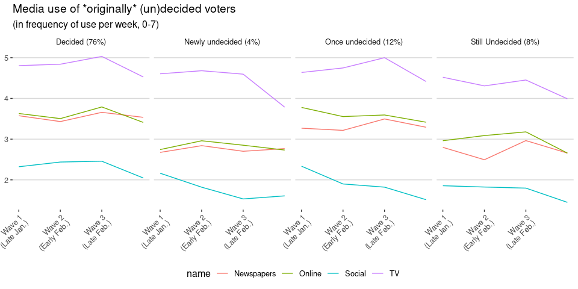
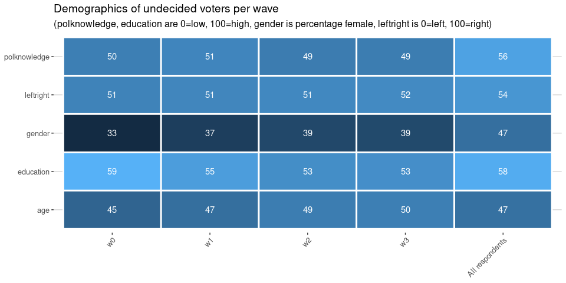

Visibility of parties
=====================

\[Download data: [Visibility of parties in the
media](Visibility_of_parties_in_the_media.csv)\]

Overall visibility on traditional media (including online) favours
coalition parties VVD, VDA, D66 followed by the main opposition parties.
This overall pattern is especially striking on TV, where these parties
are each mentioned in about 60% of news and current affairs shows. Over
time, CDA and D66 gradually increase their share across all media, while
VVD remains mostly constant.

In the final weeks, most parties increase in visiblity, especially on
TV, as their are more opportunities for all party leaders to appear on
TV.

Forum starts out with low visibility, but quickly climbs to being
mentioned in 20-40% of all political news. Social media also show a very
clear picture: although many parties are somewhat active on social
media, FvD wins hands down in terms of their activity, and FvD and PVV
are the only parties with substantial engagement on social media (likes,
shares, mentions)

Does the voter take notice?
===========================

 \[Download data: [Media performance according to
respondents](Media_performance_according_to_respondents.csv)\]

Looking at whether respondents noticed the various parties, overall we
see that VVD, PVV and FvD are most noticed. The latter two are
interesting since they are less visible in the mainstream media. So,
either they are more noticeable when they are present, or the notice is
(also) based on social media presence.

Most parties are not evaluated particularly positive or negative, with a
clear exception for PVV, FvD and Denk, whose media performance is
evaluated very negatively by the respondents. This confirms the
possibility that PVV and FvD are more noticeable when present, but
clearly mostly in a negative way.

Looking at change over time, we see that PvdA and GL become less
noticeable, matching their decreasing visibility on TV. D66 and CDA on
the other hand are increasingly noticed.

PvdA and 50+ are evaluated more positively in February, but loses this
edge in the final weeks. CDA gradually decreases in favourability from
5.8 at the start of the campaign to 5.2 near the end. The other parties
remain fairly constant.

Does notice depend on alignment of repondent?
---------------------------------------------

 

\[Download data: [Media performance by
alignment](Media_performance_by_alignment.csv)\]

Notice of parties (visibility) does not really depend on the ideological
alignment of the respondent.

Evaluation of their media performance does differ: leftist voters are
overall more critical of rightist parties, especially of PVV and FvD,
while rightist voters are more critical of GL, SP, D66 and PvdA

The Undecided Voter
===================

The number of undecided voters (and non-voters) is becoming smaller as
the election draws near:

<table>
<thead>
<tr class="header">
<th style="text-align: left;">name</th>
<th style="text-align: right;">January</th>
<th style="text-align: right;">Early February</th>
<th style="text-align: right;">Late February</th>
<th style="text-align: right;">Early March</th>
</tr>
</thead>
<tbody>
<tr class="odd">
<td style="text-align: left;">Not</td>
<td style="text-align: right;">1.3</td>
<td style="text-align: right;">1.7</td>
<td style="text-align: right;">1.2</td>
<td style="text-align: right;">1.4</td>
</tr>
<tr class="even">
<td style="text-align: left;">Undecided</td>
<td style="text-align: right;">23.5</td>
<td style="text-align: right;">16.9</td>
<td style="text-align: right;">14.4</td>
<td style="text-align: right;">12.5</td>
</tr>
</tbody>
</table>

Very importantly, the group of undecided voters is also changing. Of the
undecided voters at the start, only 41% is still undecided. Conversely,
of the current undecided voters, 35% did have a preference at the start.

Media use of undecided voters
-----------------------------

Last month, we saw that undecided voters were on average less interested
in news and politics. If we look at the group of voters that were
undecided at the start of the campaign, how did their media use change?

\[Download data: [Media use of (un)decided
voters](Media_use_of_un_decided_voters.csv)\]

This figure shows the TV, online, newspaper, and social media
consumption of voters over time, split into four groups: + *Decided*
voters are voters who had a party preference both now and at the start
of the campaign. This group uses more media than the other groups,
although there is a drop in all media use in the last weeks, possibly
because of campaign fatigue or the improved weather. + *Newly undecided*
are voters who had a preference at the start of the campaign, but are
now undecided. This is the smallest group, and they show the largest
drop in TV and social media consumption at the end. + *Once undecided*
are voters who were undecided at the start of the campaign, but who now
have a party preference. These voters started using more newspaper and
TV content, with a drop in the last period. They resemble the decided
voters group most strongly. + *Still undecided* are voters who were
undecided at the start of the campaign, and still did not make up their
mind. These voters used less media than the rest across the board.

Who are the undecided voters?
-----------------------------

As undecided voters make up their mind, and other voters start doubting
their choices, the group of undecided voters changes. Let’s look at some
of the demographics:

The table above shows average score on left-right self placement,
political knowledge, education, age, and gender. This shows a clear
shift in who those voters are: The original undecided voters were
younger, more often male, higher educated and slighyly more leftist than
average. In constrast, the current undecided voters are centrist and
older than the average respondent. Interestingly, even though this group
has a slightly lower overall education, they score better on political
knowledge, probably as a result of being older.

Where do undecided voters go to and come from?
----------------------------------------------

\[Download data: [Undecided Voters](Undecided_Voters.csv)\]

On the left hand side, the figure above shows where undecided voters go
to when they make up their mind. Similarly, the middle columns show
where new undecided voters go to. Finally, the rightmost two columns
show the difference between the two: was a party able to attract more
undecided voters they lost? All cells are expressed as virtual seats,
that is, as a percentage of total respondents in that wave multiplied by
150.

We see that there is a lot of exchange between non-voters and undecided
voters, with slightly more non-voters becoming undecided. Overall, many
parties were able to profit from the undecided voters in early February
(w0-w1), corresponding the the relatively large drop of undecided voters
in that period. After that period, CDA, PvdA and GL were less attractive
to undecided voters, while PVV became more attractive. VVD was very
attractive to undecided voters in both early February and early March,
while in late February relatively more VVD voters became undecided.
