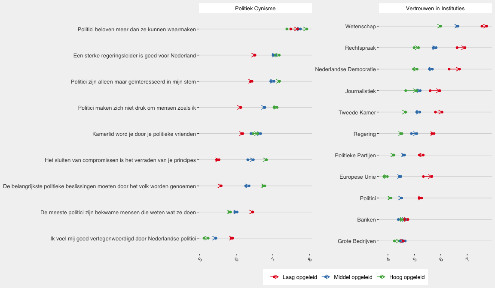

---
title: 'Pakhuis de Zwijger: Wederzijds Wantrouwen'
author: "Mariken van der Velden"
permalink: reports/wederzijds-wantrouwen/
output: 
  md_document:
    toc: yes
    preserve_yaml: yes
--- 

-   [Vertrouwen: Mannen en Vrouwen](#vertrouwen-mannen-en-vrouwen)
-   [Vertrouwen: Leeftijdsgroepen](#vertrouwen-leeftijdsgroepen)
-   [Vertrouwen: Opleidingsniveau](#vertrouwen-opleidingsniveau)
-   [Vertrouwen: Werkzame en Werkloze
    Bevolking](#vertrouwen-werkzame-en-werkloze-bevolking)

Vertrouwen: Mannen en Vrouwen
=============================

Instituties hoog gewaardeerd ondanks (sterk) gevoel van politiek cynisme
bij zowel mannen en vrouwen – geen grote verschillen.

Instituties: - Nederlandse democratie krijgt een 6 van de vrouw, en een
6- van de man – allebei hebben de democratie een beetje hoger gescoord
na de verkiezingen. - Tweede Kamer krijgt een hogere score dan de
regering, politieke partijen en politici: 5.5 voor de verkiezingen en
een 6- na de verkiezingen van zowel mannen als vrouwen.

Cynisme - Net voldoende gevoel van vertegenwoordiging: een rapportcijfer
van 5.5. - Groot gevoel dat politici corrupt zijn: vriendjespolitiek
(rapportcijfer 6 (m)/ 6.5 (v) – toegenomen na de verkiezingen), en
politici beloven meer dan ze waar kunnen maken (rapportcijfer 7.5) -
Volk moet meer voor het zeggen hebben (rapportcijfer 6), terwijl we ook
een sterkere leider willen (rapportcijfer van 7)

Download data: \[[Vertrouwen-Gender](Vertrouwen_Gender.csv)\]

Vertrouwen: Leeftijdsgroepen
============================

Instituties: - Nederlandse democratie hoogst gewaardeerd door 70 jarige
en ouder (rapport cijfer van 7), en het laagst gewaardeerd door 31-50
jarige voor de verkiezingen (rapportcijfer van 5.5) en door 51-70 jarige
na de verkiezingen (6-). - De 70 jarigen en ouder zin ook positiiefst
over de regering, en positiever na dan voor de verkeizingen. - Jongeren
(18-30) meest positief over EU en politieke partijen - “Boomers” minste
vertrouwen in instituties in het algemeen

Cynisme - Jongeren laagste niveau van poltiek cynisme, boomers hoogste
vorm - Hoe oudeer, hoe liever je een sterke leider wil, hoe meer je een
sterkere stem voor het volk wil, hoe negatiever over compromissen, en
hoe meer je denkt dat kamerlid worden door vriendjespolitiek bepaald
wordt: kortom hoe meer populistisch attitudes

Download data: \[[Vertrouwen-Leeftijd](Vertrouwen_Leeftijd.csv)\]

Vertrouwen: Opleidingsniveau
============================

-   Laagopgeleiden: hoogste vertrouwen in de instituties en minst
    politiek cynisch
-   Hoogopgeleiden: minste vertrouwen in de instituties en meest
    politiek cynisch

Download data:
\[[Vertrouwen-Opleidingsniveau](Vertrouwen_Opleidingsniveau.csv)\]

Vertrouwen: Werkzame en Werkloze Bevolking
==========================================

Download data: \[[Vertrouwen-Werk](Vertrouwen_Werk.csv)\]

Download data: \[[Vertrouwen-Regios](Vertrouwen_Regios.csv)\]
