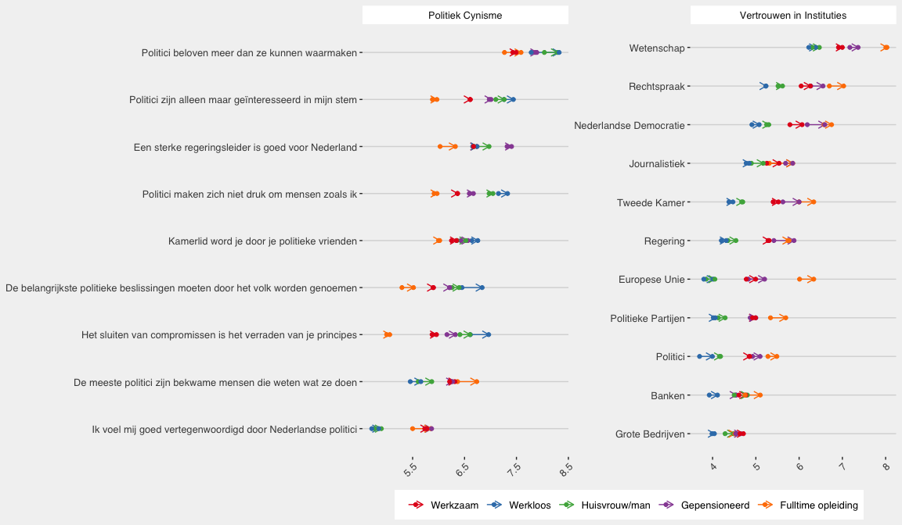

---
title: 'Pakhuis de Zwijger: Wederzijds Wantrouwen'
author: "Mariken van der Velden"
permalink: reports/wederzijds-wantrouwen/
output: 
  md_document:
    toc: yes
    preserve_yaml: yes
--- 

-   [Vertrouwen: Mannen en Vrouwen](#vertrouwen-mannen-en-vrouwen)

Vertrouwen: Mannen en Vrouwen
=============================

Instituties hoger gewaardeerd dan de legitimeit van democractie.

Instituties: - Nederlandse democratie krijgt een 6 van de vrouw, en een
6- van de man – allebei hebben de democratie een beetje hoger gescoord
na de verkiezingen. - Tweede Kamer krijgt een hogere score dan de
regering, politieke partijen en politici: 5.5 voor de verkiezingen en
een 6- na de verkiezingen van zowel mannen als vrouwen.

Legitimiteit - Zeer laag gevoel van vertegenwoordiging: een
rapportcijfer van 3. - Toch groot gevoel dat politici

Download data: \[[Vertrouwen-Gender](Vertrouwen_Gender.csv)\]

Download data: \[[Vertrouwen-Leeftijd](Vertrouwen_Leeftijd.csv)\]

Download data:
\[[Vertrouwen-Opleidingsniveau](Vertrouwen_Opleidingsniveau.csv)\]

Download data: \[[Vertrouwen-Werk](Vertrouwen_Werk.csv)\]

Download data: \[[Vertrouwen-Regios](Vertrouwen_Regios.csv)\]
