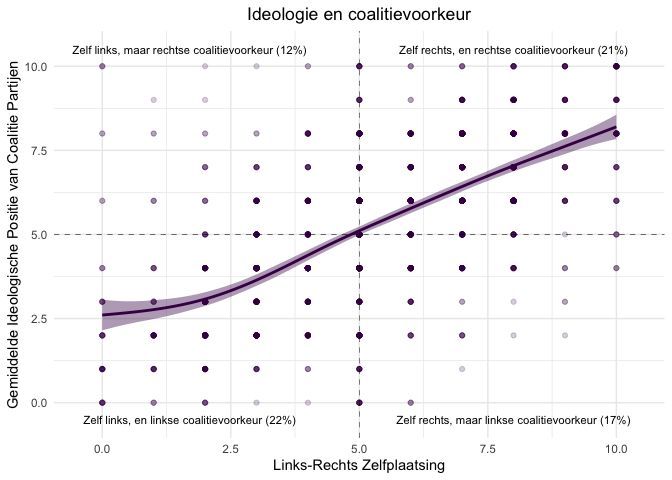

Wat willen kiezers na 17 maart? - Blog StukRoodVlees 10/2/2021
================
Mariken van der Velden

Op 17 maart zijn er verkiezingen voor de Tweede Kamer. In de aanloop
naar de verkiezingen, zullen dit jaar de campagnes veelal via de media
gespeeld worden, omdat campagne voeren “in het land” door de huidige
Corona maatregelen niet mogelijk is. Afgelopen dinsdag 8 februari was de
aftrap hiervan. Het het eerste lijsttrekkers debat vond plaats: [het
Lijsttrekkersdebat over het
Noorden](https://www.dvhn.nl/extra/Kijk-hier-live-Lijsttrekkersdebat-over-het-Noorden-met-Wilders-Klaver-Marijnissen-en-anderen-26478305.html).
Naast over het voetlicht brengen waar de eigen partijen voor staan,
waren er ook een aantal politieke partijen die samenwerking bepleiten.
Rob Jetten van D66 begon bijvoorbeeld over samenwerking als het gaat om
de [Lelylijn](https://www.lelylijn.nl/).

Het benadrukken van samenwerken is ongewoon tijdens de Nederlandse
campagneperioden. Waar coalitielanden zoals Duitsland een traditie
hebben van de zogenoemde coalitiesignalen \[here, here and here\], waar
politieke partijen aangeven met wie ze graag willen regeren, kent
Nederland deze traditie niet. Sterker nog: in een uitzending van [De
Wereld Draait
Door](https://www.bnnvara.nl/dewerelddraaitdoor/videos/248604) tijdens
de 2012 verkiezingscampagne, stelde Rutte dat de samenwerkingsvraag na
de verkiezingen niet voor de verkiezingen op tafel moet komen te liggen,
omdat de kiezer dan wordt overgeslagen. De uitspraak van Rutte staat
haaks op wetenschappelijk onderzoek. Dat laat zien dat het duidelijk
uitspreken van met wie je samen wil regeren, zorgt ervoor dat kiezers
hun stem hierop kunnen aanpassen (zie bijvoorbeeld het onderzoek
[hier](https://www.sciencedirect.com/science/article/pii/S0261379420300500?casa_token=VsGzhsmJrewAAAAA:QYCSj5r3L1bFcv_GiMmYxZ4q0tFGl9a7Qg_zjQWgVEQp9gVZ5hTGHzPLyXih5TmXvF5PpeG6ZQ#sec2)).
Uit onderzoek van onder andere [Tom van der
Meer](https://stukroodvlees.nl/author/tom-van-der-meer/) weten we ook
dat ook Nederlandse kiezers vaak meerdere partijen sympathiek vinden en
een (klein) groepje van partijen als stemkeuze overwegen. Deze
strategie, voorzichtig geprobeerd door Jetten in het Lijsttrekkersdebat
van het Noorden, is dus nog niet zo’n gek idee: coalitiepolitiek is in
Nederland een essentieel onderdeel van de politiek. Spreek uit met wie
je samenwerkt, dat helpt de kiezer in haar overwegingen\!

Als onderdeel van de verkiezingsstudie van [Politieke Communicatie
onderzoeksgroep aan de Vrije Universiteit
Amsterdam](https://fsw.vu.nl/en/departments/communication-science/research/political-communication-and-media-monitoring/index.aspx),
brengen wij in kaart hoe Nederlanders denken over een nieuwe regering.
De linkerzijde van Figuur 1 laat zien dat een relatieve meerheid van
ongeveer 35% het liefst drie partijen in een nieuwe regering samen ziet.
Slechts 13% van de mensen ziet idealiter een regering van vier partijen;
afgaand op de peilingen geen onrealistisch scenario. Nog meer partijen
die samen de regering moeten vormen is al helemaal niet in trek. In de
rechterzijde van Figuur 1 zien we dat de drie traditionele
regeringspartijen - de VVD, het CDA en de PvdA - het vaakst genoemd
worden, maar ook D66, Groenlinks, SP en PVV worden door ruim 20% van de
ondervraagden genoemd als een
voorkeurscoalitiepartij.

Hoe realistisch zijn deze voorkeuren eigenlijk? Omdat er geen grote
middenpartijen meer zijn in het Nederlandse partijlandschap, zal het
vormen van de regering na de verkiezing hoogstwaarschijnlijk niet
gemakkelijk gaan. Dit is overigens een trend die overal in Eurpa
waargenomen wordt (voor meer informatie hierover, zie [dit
boek](https://press.princeton.edu/books/hardcover/9780691194752/political-entrepreneurs)
van collega’s Catherine de Vries en Sarah Hobolt). Als we de
coalitiepartijvoorkeuren van mensen afzetten tegen recente polls van
[IPSOS politieke
barometer](https://www.ipsos.com/nl-nl/politieke-barometer), dan laten
de gele staven in Figuur 2 zien dat een minderheid van de ondervraagden
een voorkeur voor een regering heeft die op dit moment een meerderheid
in de peilingen heeft. Zo heeft bijvoorbeeld slechts zes procent van de
37 ondervraagden die de VVD in een nieuwe regering wil, een voorkeur
voor een regering met de VVD die op dit moment een meerderheid heeft.
Mensen die graag 50Plus, Partij van de Dieren of Forum voor Democratie
in een nieuwe regering zouden willen, hebben een ideale regering voor
zich die op dit moment niet op een meerderheid kan
rekenen.

Waar komen de voorkeuren voor een coalitiepartij vandaan? Politicologen
hebben verschillende theorieën waarmee zij proberen te verklaren wie
welk vakje rood kleurt in het stemhokje. Een belangrijke theorie om
stemkeuze te verklaren gaat over ideologische afstand tussen partij en
kiezer (voor het orgineel, zie
[hier](https://www.amazon.com/Economic-Theory-Democracy-Anthony-Downs/dp/0060417501)).
In Figuur 3 laat de lijn, die bijna perfect van linksonder naar
rechtsboven in loopt, zien dat iemands ideologische positie sterk
samenhangt met de ideologische positie van de partijen die degenen als
voorkeurscoalitie aangeeft. Hoe donkerder paars de punten in de grafiek,
des te meer ondervraagden zich op dat coordinaat bevinden. Figuur 3 laat
ook zien dat de kwadranten linksonder en rechtsboven het dichts bevolkt
zijn. Het lijkt er dus op dat ideologie zowel voor stemkeuze als
coalitievoorkeur belangrijk
is.

Een andere belangrijke theorie over hoe mensen hun keuze in het
stemhokje maken gaat over het evalueren van de prestaties van de
regering (voor een overzicht van het toepassen van deze theoretische
stroming, zie
[hier](https://www.annualreviews.org/doi/abs/10.1146/annurev-polisci-032211-212920)).
In Figuur 4 laat ik zien dat dit niet de beste verklaring is voor welke
partijen men graag opnieuw in de regering ziet. De eerste gele balk
geeft aan 95% van de mensen die de VVD als voorkeurspartij heeft
varieert tussen redelijk tevreden (score hoger dan 5) en ietwat
ontevereden (score van 3), gemiddeld beoordeeld deze groep de VVD als
ontevreden (score van 4). Als je de VVD graag terugziet in de regering,
maar er niet zelf op gaat stemmen (groene balk), beoordeel je de
prestaties van de VVD gemiddeld niet positiever of negatiever dan mensen
die niet op de VVD stemmen én de VVD niet terugwillen zien in de
regering (paarse balk). De spreiding in de “groene groep” is wel groter:
sommige vinden dat de VVD redelijk gepresteerd heeft (scores tussen 5 en
6), andere zijn een hele andere mening toegedaan (scores tussen de 1 en
2). Een vergelijkbaar patroon zien we de ChristenUnie. Voor het CDA en
D66 laat Figuur 4 zien dat het helemaal niet uitmaakt of het de
voorkeurspartij is, ze graag terugziet in de regering of geen van beide,
je bent ongeveer even negatief over de prestaties van respectievelijk
het CDA en
D66.

Tot slot, een derde belangrijke verklaring van waarom mensen voor een
partij stemmen is omdat ze de partij associëren met een bepaald
onderwerp en het eens zijn met de positie van de partij op dit
onderwerp. We zien ook regelmatig dat politici successen op bepaalde
onderwerpen op eigen conto proberen te schrijven. Zo zagen we dat Wopke
Hoekstra zich alvast te positioneren als de man die staat voor de
familie [door te pleiten dat de scholen weer open
moeten](https://nos.nl/video/2366487-hoekstra-kans-dat-scholen-opengaan-is-zeer-groot.html),
en Sigrid Kaag herinnerde de kiezer weer dat D66 dé onderwijspartij is
[door ook te stellen dat de scholen weer open
moeten](https://www.nporadio1.nl/binnenland/29314-kabinet-wil-basisscholen-openen-op-8-februari-maar-kan-dat-veilig).

Wie associaeert welke partij met welk onderwerp? En maakt het uit of je
die partij graag in de regering (terug) ziet? Over het algemeen zien we
dat mensen die de partij graag in de regering zien (in het paars) en
mensen die deze partij niet als voorkeurscoalitiepartij hebben (in het
geel) niet verschillen: ze associeren dezelfde onderwerpen met de
politieke partij en zijn het ook evenveel (on)eens met de positie van de
partij op dit onderwerpen. Opvallend is dat dit voor twee partijen niet
opgaat. Voor Denk en Forum voor Democratie zien we dat mensen die deze
partij niet als voorkeurspartij voor een nieuwe regering hebben, zij het
onderwerp asielzoekers en immigratie met de partij associeren. Als je
Denk wél in de regering wil terugzien, heb je een positieve associate
met het voorgestelde beleid over vrijheidsrechten, zoals vrijheid van
meningsuiting, discriminatieverbod, tolerantie. Voor Forum geldt dat als
je de partij terug wil zien in de regering, je Forum vooral positief
associeert met het coronabeleid dat zij
voorstaan.

Of dit overzicht Mark Rutte overtuigd van het belang om coalitiepolitiek
al in de campagnetijd mee te nemen weet ik niet, maar het laat wel zien
dat elementen die belangrijk zijn voor politieke partijen ná de
verkiezingen, zoals ideologische afstand van elkaar en ministersposten
kunnen bezetten op onderwerpen die binnen het profiel van de partij
vallen, óók voor de kierzer een overweging zijn bij de keuze voor een
nieuwe regering. Dus, mijn oproep aan de campagnevoerende politici: wees
niet bang je uit te spreken over mogelijke samenwerking. De kiezer weet
dat dit onvermijdelijk is in het Nederlandse politieke landschap.

### *Methodologische informatie*

*De figuren in deze blog zijn gebaseerd op data van de eerste wave van
verkiezingsstudie opgezet door de Politieke Communicatie onderzoeksgroep
aan de Vrije Universiteit. Op dit moment zijn we nog bezig met het
verzamelen van opvolgende waves (6 in totaal tot aan na de
verkiezingen). Deze data zullen zodra ze beschikbaar zijn opengesteld
worden. Mocht je meer willen weten, kan je
[hier](https://www.dropbox.com/s/lyu6r949gtt0wk3/codebook.md?dl=0)
alvast een kijkje nemen in het codeboek waarin de vragen van de eerste
wave beschreven staan.*
