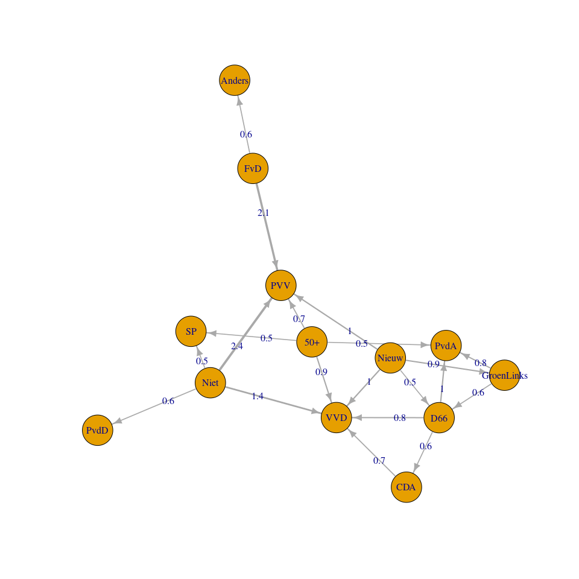

VU 2021 Election Study: Analysis of pre-wave
================
Wouter van Atteveldt

  - [Data](#data)
  - [Vote intention](#vote-intention)
      - [Overrepresentation E1 wrt actual distribution
        TK2017](#overrepresentation-e1-wrt-actual-distribution-tk2017)
      - [Overall changes in voting](#overall-changes-in-voting)
      - [How do voters move between
        parties?](#how-do-voters-move-between-parties)

# Data

``` r
d = read_csv(here("data/intermediate/VUElectionPanel2021_wave0.csv"))
```

# Vote intention

``` r
votes = d %>% select(iisID, A2, E1) %>% 
  mutate(A2=recode_parties(label(A2, "A2")), E1=recode_parties(label(E1, "E1")))
rep = votes %>% pivot_longer(A2:E1, names_to="when", values_to="party") %>% 
  group_by(party, when) %>% summarize(n=n()) %>% ungroup() %>% 
  pivot_wider(names_from="when", values_from="n") %>% 
  filter(!is.na(party), !party %in% c("Niet", "Nieuw", "Weet niet")) %>% 
  mutate(A2=A2/sum(A2)*150, E1=E1/sum(E1)*150) %>% 
  left_join(read_csv(here("data/raw/tk2017.csv"))) %>% replace_na(list(tk=0)) %>% 
  mutate(overrep=E1 - tk)
```

## Overrepresentation E1 wrt actual distribution TK2017

Note: A mismatch between self-reported votes and actual distribution can
be caused by unrepresentative sample (esp. since our data is unweighted)
and misremembering by respondents (e.g. accidentally remembering their
provincial vote)

``` r
rep %>% arrange(-abs(overrep)) %>% select(-A2)
```

| party        |    E1 | tk | overrep |
| :----------- | ----: | -: | ------: |
| FvD          | 10.12 |  0 |   10.12 |
| 50+          |  7.15 |  0 |    7.15 |
| D66          | 12.02 | 19 |  \-6.98 |
| CDA          | 12.18 | 19 |  \-6.82 |
| PvdD         |  6.09 |  0 |    6.09 |
| VVD          | 28.39 | 33 |  \-4.61 |
| ChristenUnie |  8.37 |  5 |    3.37 |
| SP           | 16.82 | 14 |    2.82 |
| Denk         |  0.84 |  3 |  \-2.16 |
| PvdA         | 11.11 |  9 |    2.11 |
| PVV          | 18.80 | 20 |  \-1.20 |
| Anders       |  1.14 |  0 |    1.14 |
| GroenLinks   | 13.85 | 14 |  \-0.15 |
| SGP          |  3.12 |  3 |    0.12 |

## Overall changes in voting

``` r
rep %>% mutate(change=A2-E1) %>% select(party, E1, A2, change) %>% arrange(-abs(change))
```

| party        |    E1 |   A2 | change |
| :----------- | ----: | ---: | -----: |
| PVV          | 18.80 | 26.1 |   7.29 |
| VVD          | 28.39 | 34.3 |   5.95 |
| FvD          | 10.12 |  4.8 | \-5.36 |
| 50+          |  7.15 |  3.6 | \-3.58 |
| GroenLinks   | 13.85 | 10.8 | \-3.06 |
| D66          | 12.02 |  9.1 | \-2.93 |
| PvdA         | 11.11 | 12.7 |   1.55 |
| Anders       |  1.14 |  2.4 |   1.24 |
| ChristenUnie |  8.37 |  7.7 | \-0.72 |
| Denk         |  0.84 |  1.4 |   0.52 |
| SP           | 16.82 | 16.4 | \-0.42 |
| PvdD         |  6.09 |  5.8 | \-0.31 |
| CDA          | 12.18 | 12.0 | \-0.19 |
| SGP          |  3.12 |  3.1 |   0.02 |

## How do voters move between parties?

``` r
library(igraph)
gdf = votes %>% 
  
  filter(A2 != "Weet niet", E1 != "Weet niet") %>% 
  group_by(A2, E1) %>% summarize(n=n()) %>% na.omit() %>% filter(A2 != E1)

g = full_join(gdf, gdf, by=c("A2"="E1", "E1"="A2")) %>% replace_na(list("n.x"=0, "n.y"=0)) %>% mutate(n=n.x - n.y) %>% select(E1, A2, n) %>% filter(n>0) %>% 
  filter(n>5) %>% graph_from_data_frame()

E(g)$width = 1+E(g)$n/10 
E(g)$label = round((E(g)$n / 1783) * 150, 1)
E(g)$arrow.size=E(g)$width/2

plot(g)
```

<!-- -->
