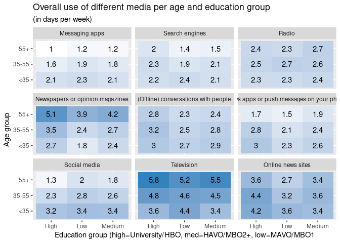
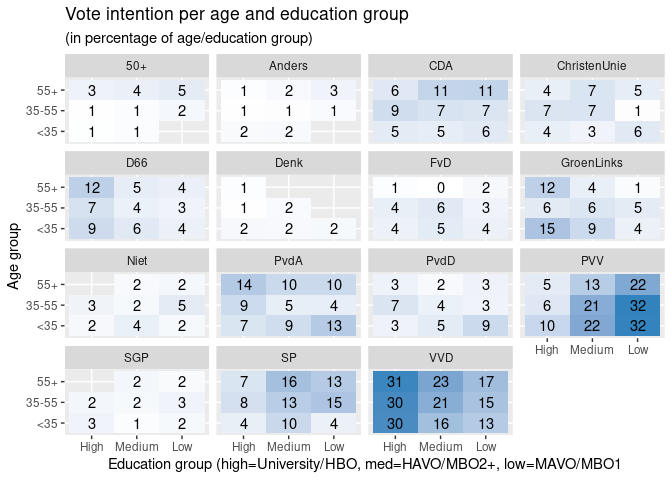
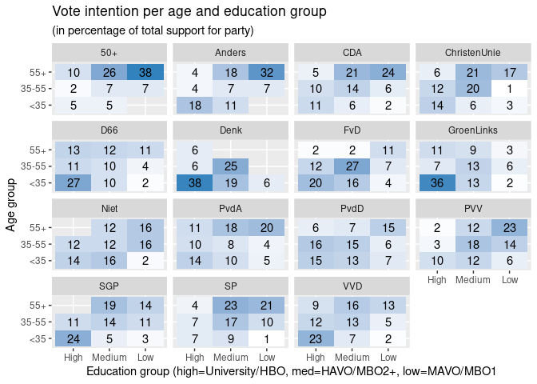
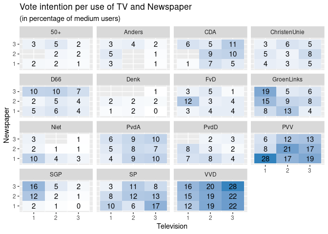
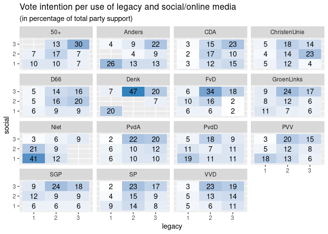
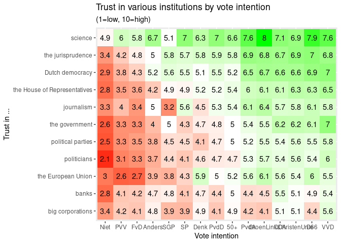
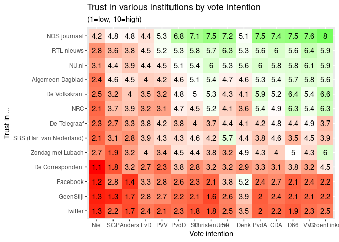
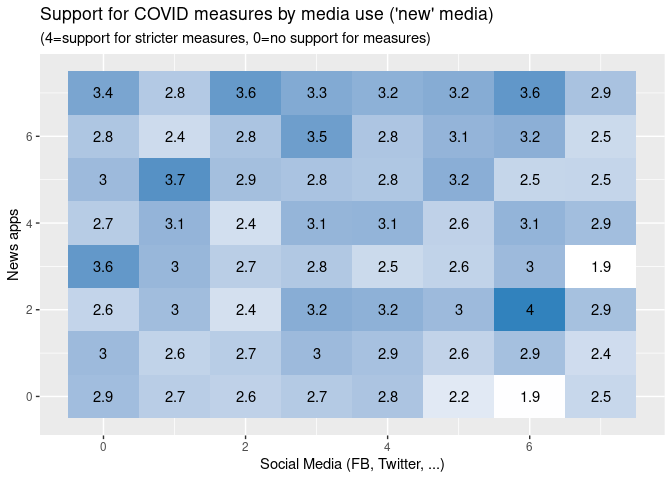
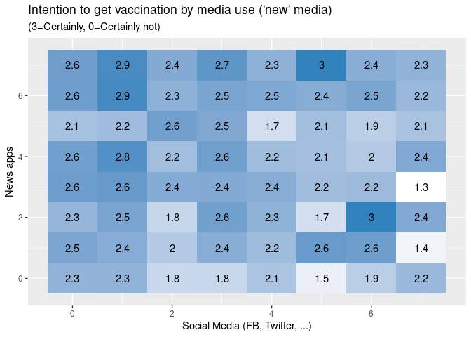

VU 2021 Election Study: Analysis of pre-wave
================
Wouter van Atteveldt, Mariken van der Velden, Nel Ruigrok

  - [Data](#data)
  - [Vote intention](#vote-intention)
      - [Overrepresentation E1 wrt actual distribution
        TK2017](#overrepresentation-e1-wrt-actual-distribution-tk2017)
      - [Overall changes in voting](#overall-changes-in-voting)
      - [How do voters move between
        parties?](#how-do-voters-move-between-parties)
  - [Media usage](#media-usage)
      - [Data](#data-1)
      - [Overall use of various media per
        age/education](#overall-use-of-various-media-per-ageeducation)
      - [Vote intention per
        age/education](#vote-intention-per-ageeducation)
  - [Vote intention by media use](#vote-intention-by-media-use)
      - [Newspaper vs TV](#newspaper-vs-tv)
      - [“Old” vs “New”](#old-vs-new)
  - [Trust in Insitutions](#trust-in-insitutions)
      - [Trust in Media](#trust-in-media)
  - [Corona](#corona)
      - [Support for measures and Vaccination intention by media
        use](#support-for-measures-and-vaccination-intention-by-media-use)

# Data

``` r
d = read_csv(here("data/intermediate/VUElectionPanel2021_wave0.csv"))
```

# Vote intention

``` r
votes = d %>% select(iisID, A2, E1) %>% 
  mutate(A2=recode_parties(label(A2, "A2")), E1=recode_parties(label(E1, "E1")))
rep = votes %>% pivot_longer(A2:E1, names_to="when", values_to="party") %>% 
  group_by(party, when) %>% summarize(n=n()) %>% ungroup() %>% 
  pivot_wider(names_from="when", values_from="n") %>% 
  filter(!is.na(party), !party %in% c("Niet", "Nieuw", "Weet niet")) %>% 
  mutate(A2=A2/sum(A2)*150, E1=E1/sum(E1)*150) %>% 
  left_join(read_csv(here("data/raw/tk2017.csv"))) %>% replace_na(list(tk=0)) %>% 
  mutate(overrep=E1 - tk)
```

## Overrepresentation E1 wrt actual distribution TK2017

Note: A mismatch between self-reported votes and actual distribution can
be caused by unrepresentative sample (esp. since our data is unweighted)
and misremembering by respondents (e.g. accidentally remembering their
provincial vote)

``` r
rep %>% arrange(-abs(overrep)) %>% select(-A2)
```

| party        |    E1 | tk | overrep |
| :----------- | ----: | -: | ------: |
| FvD          | 10.12 |  0 |   10.12 |
| 50+          |  7.15 |  0 |    7.15 |
| D66          | 12.02 | 19 |  \-6.98 |
| CDA          | 12.18 | 19 |  \-6.82 |
| PvdD         |  6.09 |  0 |    6.09 |
| VVD          | 28.39 | 33 |  \-4.61 |
| ChristenUnie |  8.37 |  5 |    3.37 |
| SP           | 16.82 | 14 |    2.82 |
| Denk         |  0.84 |  3 |  \-2.16 |
| PvdA         | 11.11 |  9 |    2.11 |
| PVV          | 18.80 | 20 |  \-1.20 |
| Anders       |  1.14 |  0 |    1.14 |
| GroenLinks   | 13.85 | 14 |  \-0.15 |
| SGP          |  3.12 |  3 |    0.12 |

## Overall changes in voting

``` r
rep %>% mutate(change=A2-E1) %>% select(party, E1, A2, change) %>% arrange(-abs(change))
```

| party        |    E1 |   A2 | change |
| :----------- | ----: | ---: | -----: |
| PVV          | 18.80 | 26.1 |   7.29 |
| VVD          | 28.39 | 34.3 |   5.95 |
| FvD          | 10.12 |  4.8 | \-5.36 |
| 50+          |  7.15 |  3.6 | \-3.58 |
| GroenLinks   | 13.85 | 10.8 | \-3.06 |
| D66          | 12.02 |  9.1 | \-2.93 |
| PvdA         | 11.11 | 12.7 |   1.55 |
| Anders       |  1.14 |  2.4 |   1.24 |
| ChristenUnie |  8.37 |  7.7 | \-0.72 |
| Denk         |  0.84 |  1.4 |   0.52 |
| SP           | 16.82 | 16.4 | \-0.42 |
| PvdD         |  6.09 |  5.8 | \-0.31 |
| CDA          | 12.18 | 12.0 | \-0.19 |
| SGP          |  3.12 |  3.1 |   0.02 |

## How do voters move between parties?

``` r
library(igraph)
gdf = votes %>% 
  
  filter(A2 != "Weet niet", E1 != "Weet niet") %>% 
  group_by(A2, E1) %>% summarize(n=n()) %>% na.omit() %>% filter(A2 != E1)

g = full_join(gdf, gdf, by=c("A2"="E1", "E1"="A2")) %>% replace_na(list("n.x"=0, "n.y"=0)) %>% mutate(n=n.x - n.y) %>% select(E1, A2, n) %>% filter(n>0) %>% 
  filter(n>5) %>% graph_from_data_frame()

E(g)$width = 1+E(g)$n/10 
E(g)$label = round((E(g)$n / 1783) * 150, 1)
E(g)$arrow.size=E(g)$width/2

plot(g)
```

<!-- -->

# Media usage

## Data

``` r
# TODO moved to lib
library(glue)
result = list()
for (var in str_c("I", 1:7)) 
  result[[var]] = d %>% select(iisID, starts_with(var), -contains("_other")) %>% pivot_longer(-iisID, names_to="medium") %>% 
    mutate(medium=label(as.numeric(str_remove(medium, glue("^{var}_"))), var)) %>% filter(!is.na(value))
newsuse = bind_rows(result, .id="question") %>% mutate(medium=str_remove_all(medium, " \\(.*"))

resp = d %>% select(iisID, age, education) %>% 
  mutate(age=label(age, "age"), education=label(education, "education"))
overall = newsuse %>% filter(question=="I1") %>% inner_join(resp) %>% 
  mutate(age2=case_when(age %in% c("<24" ,"25-34") ~ "<35",
                        age %in% c("55-64", ">64") ~ "55+",
                        T ~ "35-55"))
```

## Overall use of various media per age/education

``` r
news_agg = overall %>% group_by(age2, education, medium) %>% summarize(value=mean(value), n=n())
news_agg %>% filter(education!="Don't know") %>% mutate(medium=fct_reorder(medium, value)) %>% 
  ggplot(aes(x=education, y=age2, label=round(value, 1), fill=value)) + 
  geom_tile()+ geom_text()+
  facet_wrap("medium") + 
  ggtitle("Overall use of different media per age and education group", "(in days per week)")  + 
  xlab("Education group (high=University/HBO, med=HAVO/MBO2+, low=MAVO/MBO1") + ylab("Age group") +
  scale_fill_gradient(low="white", high="#3182bd", guide=F)
```

<!-- -->

## Vote intention per age/education

``` r
d %>% select(iisID, age, education, A2) %>% 
  mutate(age=label(age, "age"), 
         education=label(education, "education"), 
         party=recode_parties(label(A2, "A2")),
         age2=case_when(age %in% c("<24" ,"25-34") ~ "<35",
                        age %in% c("55-64", ">64") ~ "55+",
                        T ~ "35-55")) %>% 
  filter(education!="Don't know", !is.na(party), party!="Weet niet") %>% 
  group_by(age2, education, party) %>% summarize(n=n()) %>% mutate(zetels=n/sum(n)*100) %>% 
  ggplot(aes(x=education, y=age2, label=round(zetels), fill=zetels)) +
  geom_tile()+ geom_text()+
  facet_wrap("party") + 
  ggtitle("Vote intention per age and education group", "(in percentage of age/education group)")  + 
  xlab("Education group (high=University/HBO, med=HAVO/MBO2+, low=MAVO/MBO1") + ylab("Age group") +
  scale_fill_gradient(low="white", high="#3182bd", guide=F)
```

<!-- -->

``` r
d %>% select(iisID, age, education, A2) %>% 
  mutate(age=label(age, "age"), 
         education=label(education, "education"), 
         party=recode_parties(label(A2, "A2")),
         age2=case_when(age %in% c("<24" ,"25-34") ~ "<35",
                        age %in% c("55-64", ">64") ~ "55+",
                        T ~ "35-55")) %>% 
  filter(education!="Don't know", !is.na(party), party!="Weet niet") %>% 
  group_by(age2, education, party) %>% summarize(n=n()) %>% 
  group_by(party) %>% mutate(zetels=n/sum(n)*100) %>% 
  ggplot(aes(x=education, y=age2, label=round(zetels), fill=zetels)) +
  geom_tile()+ geom_text()+
  facet_wrap("party") + 
  ggtitle("Vote intention per age and education group", "(in percentage of total support for party)")  + 
  xlab("Education group (high=University/HBO, med=HAVO/MBO2+, low=MAVO/MBO1") + ylab("Age group") +
  scale_fill_gradient(low="white", high="#3182bd", guide=F)
```

<!-- -->

# Vote intention by media use

## Newspaper vs TV

``` r
n = newsuse %>% filter(question=="I1", medium %in% c("Television", "Newspapers or opinion magazines")) %>%
  mutate(value=case_when(value<2~1, value<5~2, T~3)) %>% 
  pivot_wider(names_from="medium") %>% rename(Newspaper=`Newspapers or opinion magazines`)

d %>% select(iisID, age, education, A2)  %>% 
  mutate(age=label(age, "age"), 
         education=label(education, "education"), 
         party=recode_parties(label(A2, "A2")),
         age2=case_when(age %in% c("<24" ,"25-34") ~ "<35",
                        age %in% c("55-64", ">64") ~ "55+",
                        T ~ "35-55")) %>% 
  inner_join(n) %>%   
  filter(education!="Don't know", !is.na(party), party!="Weet niet") %>% 
  group_by(Television, Newspaper, party) %>% summarize(n=n()) %>% 
  #group_by(party) %>% 
  mutate(zetels=n/sum(n)*100) %>% 
  ggplot(aes(x=Television, y=Newspaper, label=round(zetels), fill=zetels)) +
  geom_tile()+ geom_text()+
  facet_wrap("party") +
  ggtitle("Vote intention per use of TV and Newspaper", "(in percentage of medium users)")  + 
  scale_fill_gradient(low="white", high="#3182bd", guide=F)
```

<!-- -->

## “Old” vs “New”

``` r
n = newsuse %>% filter(question=="I1", 
                       medium %in% c("Television", "Newspapers or opinion magazines", "Social media", "News apps or push messages on your phone", "Online news sites")) %>%
  pivot_wider(names_from="medium") %>% 
  mutate(legacy=`Newspapers or opinion magazines`+Television,
         social=`Online news sites` + `News apps or push messages on your phone` + `Social media`)  %>% 
  select(iisID, legacy, social) %>% 
  mutate(legacy=case_when(legacy<5~1, legacy<10~2, T~3),
         social=case_when(social<5~1, social<10~2, T~3)) 
  
d %>% select(iisID, age, education, A2)  %>% 
  mutate(age=label(age, "age"), 
         education=label(education, "education"), 
         party=recode_parties(label(A2, "A2")),
         age2=case_when(age %in% c("<24" ,"25-34") ~ "<35",
                        age %in% c("55-64", ">64") ~ "55+",
                        T ~ "35-55")) %>% 
  inner_join(n) %>%   
  filter(education!="Don't know", !is.na(party), party!="Weet niet") %>% 
  group_by(legacy, social, party) %>% summarize(n=n()) %>% 
  group_by(party) %>% 
  mutate(zetels=n/sum(n)*100) %>% 
  ggplot(aes(x=legacy, y=social, label=round(zetels), fill=zetels)) +
  geom_tile()+ geom_text()+
  facet_wrap("party") +
  ggtitle("Vote intention per use of legacy and social/online media", "(in percentage of total party support)")  + 
  scale_fill_gradient(low="white", high="#3182bd", guide=F)
```

<!-- -->

# Trust in Insitutions

``` r
resp = d %>% select(iisID, age, education, A2)  %>% 
  mutate(age=label(age, "age"), 
         education=label(education, "education"), 
         A2=recode_parties(label(A2, "A2")),
         age2=case_when(age %in% c("<24" ,"25-34") ~ "<35",
                        age %in% c("55-64", ">64") ~ "55+",
                        T ~ "35-55"))  %>% 
    filter(education!="Don't know", !is.na(A2), A2!="Weet niet") 
  
long_mc() %>% filter(question=="F2") %>% inner_join(resp) %>% 
  mutate(A2=fct_reorder(A2, value, mean),
         medium=fct_reorder(medium, value, mean)) %>% 
  group_by(A2, medium) %>% summarize(value=mean(value))  %>% 
  ggplot(aes(x=A2, y=medium, label=round(value,1), fill=value)) + 
  geom_tile() + geom_text()  + 
  xlab("Vote intention")   + ylab("Trust in ...") +
  ggtitle("Trust in various institutions by vote intention", "(1=low, 10=high)")  + 
  scale_fill_gradient2(low="red", mid="white", high="green", guide=F, midpoint=5)
```

<!-- -->

## Trust in Media

``` r
long_mc() %>% filter(question=="I8") %>% inner_join(resp) %>% 
  mutate(A2=fct_reorder(A2, value, mean),
         medium=fct_reorder(medium, value, mean)) %>% 
  group_by(A2, medium) %>% summarize(value=mean(value))  %>% 
  ggplot(aes(x=A2, y=medium, label=round(value,1), fill=value)) + 
  geom_tile() + geom_text()  + 
  xlab("Vote intention")   + ylab("Trust in ...") +
  ggtitle("Trust in various institutions by vote intention", "(1=low, 10=high)")  + 
  scale_fill_gradient2(low="red", mid="white", high="green", guide=F, midpoint=5)
```

<!-- -->

# Corona

## Support for measures and Vaccination intention by media use

``` r
resp = d %>% select(iisID, age, education, A2, H3, H7)  %>% 
  mutate(age=label(age, "age"), 
         education=label(education, "education"), 
         A2=recode_parties(label(A2, "A2")),
         age2=case_when(age %in% c("<24" ,"25-34") ~ "<35",
                        age %in% c("55-64", ">64") ~ "55+",
                        T ~ "35-55"))  %>% 
    filter(education!="Don't know", !is.na(A2), A2!="Weet niet") 

x = newsuse %>% filter(question=="I1", 
                       medium %in% c("Television", "Newspapers or opinion magazines")) %>%
  pivot_wider(names_from="medium") %>% 
  rename(Newspapers="Newspapers or opinion magazines") %>% 

  select(-question) %>% inner_join(resp) %>% 
    group_by(Television, Newspapers) %>% summarize(H3=5-mean(H3), H7=4-mean(H7)) 

ggplot(x, aes(x=Television, y=Newspapers, label=round(H3, 1), fill=H3)) +
  geom_tile()+ geom_text()+
  #facet_wrap("party") +
  ggtitle("Support for COVID measures by media use (traditional)", "(4=support for stricter measures, 0=no support for measures)")  + 
  scale_fill_gradient(low="white", high="#3182bd", guide=F)
```

<!-- -->

``` r
ggplot(x, aes(x=Television, y=Newspapers, label=round(H7, 1), fill=H7)) +
  geom_tile()+ geom_text()+
  #facet_wrap("party") +
  ggtitle("Intention to get vaccination by media use (traditional)", "(3=Certainly, 0=Certainly not)")  + 
  scale_fill_gradient(low="white", high="#3182bd", guide=F)
```

<!-- -->

``` r
x = newsuse %>% filter(question=="I1", 
                       medium %in% c("Social media", "News apps or push messages on your phone")) %>%
  pivot_wider(names_from="medium") %>% 
  rename(Social="Social media", Apps="News apps or push messages on your phone") %>% 

  select(-question) %>% inner_join(resp) %>% 
    group_by(Social, Apps) %>% summarize(H3=5-mean(H3), H7=4-mean(H7)) 

ggplot(x, aes(x=Social, y=Apps, label=round(H3, 1), fill=H3)) +
  geom_tile()+ geom_text()+
  #facet_wrap("party") +
  ggtitle("Support for COVID measures by media use ('new' media)", "(4=support for stricter measures, 0=no support for measures)")  + 
  xlab("Social Media (FB, Twitter, ...)") + ylab("News apps") + 
  scale_fill_gradient(low="white", high="#3182bd", guide=F)
```

<!-- -->

``` r
ggplot(x, aes(x=Social, y=Apps, label=round(H7, 1), fill=H7)) +
  geom_tile()+ geom_text()+
  #facet_wrap("party") +
  ggtitle("Intention to get vaccination by media use ('new' media)", "(3=Certainly, 0=Certainly not)")  + 
  xlab("Social Media (FB, Twitter, ...)") + ylab("News apps") + 
  scale_fill_gradient(low="white", high="#3182bd", guide=F)
```

<!-- -->
